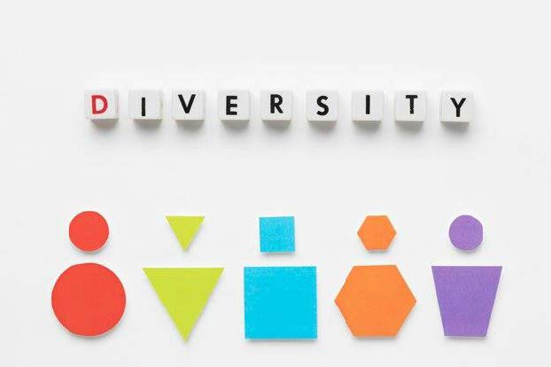
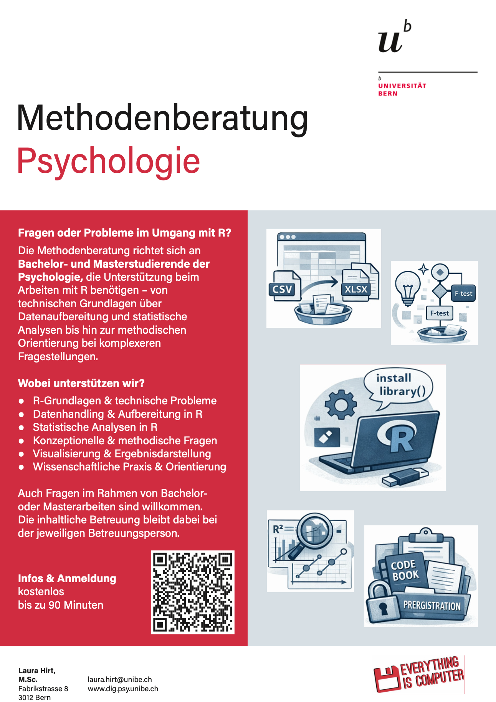

## R u Ready? Reproduzierbare Datenaufbereitung und -analyse

FS 2026<br><br><br> **LV-Leitung**: Dr. Sandra Grinschgl / MSc. Laura Hirt<br> **Tutor**: BSc. Lars Schilling<br><br><br>**1. Einheit**, 18.02.2026

{fig-align="center" width="306"}

<br>

------------------------------------------------------------------------

## LV-Leitung

::::: columns
::: {.column width="70%"}
### *Dr. Sandra Grinschgl (sie/ihr)*

-   Dozentur für «Mensch in digitaler Transformation»\
-   Arbeitsbereich Psychologie der Digitalisierung\
-   Fabrikstrasse 8, Raum D 262\
-   sandra.grinschgl\@unibe.ch\
-   Sprechstunde nach Vereinbarung\
-   Fun Fact: ist fasziniert davon, wie sich Schweizer:innen den Zahnarzt leisten können\
:::

::: {.column width="30%"}
{fig-align="center" width="200"}
:::
:::::

------------------------------------------------------------------------

## LV-Leitung *(2)*

::::: columns
::: {.column width="80%"}
### *Laura Hirt (sie/ihr) (MSc. Psychologie)*

-   Lehrassistenz R you Ready / Methodenberatung\

-   Fabrikstrasse 8, Raum A 263\

-   Sprechstunde/Methodenberatung nach Vereinbarung\

-   laura.hirt\@unibe.ch

-   Weiss nie, ob ich 'R' Englisch oder Deutsch aussprechen soll.
:::

::: {.column width="20%"}
{fig-align="center" width="332"}
:::
:::::

------------------------------------------------------------------------

## LV-Leitung (3)

::::: columns
::: {.column width="80%"}
### *Lars Schilling (er/ihm)(BSc. Psychologie)*

-   Tutor R you Ready\

-   Fabrikstrasse 8, D266\

-   Sprechstunde nach Vereinbarung\

-   lars.schilling\@unibe.ch

-   Traut seinem mit RStudio selbstgeschriebenem Spotify-Wrapped nicht
:::

::: {.column width="20%"}
{fig-align="center" width="267"}
:::
:::::

------------------------------------------------------------------------

## Barrierefreiheit!

Bitte melde dich auf einem für dich angemessenem Weg bei uns, wenn dir in dieser Lehrveranstaltung Barrieren begegnen, die auszugleichen sind.

[{fig-align="center"}](https://www.unibe.ch/unibe/portal/content/e1006/e1061/e106351/e1427734/UniBE_Icon_001_ger.png)

------------------------------------------------------------------------

## Pronomen/Namen

Bitte gebt uns auch Bescheid, falls wir euch falsch ansprechen!

{fig-align="center" width="460"}

Wir hoffen es ist für alle in Ordnung wenn wir uns Duzen!

------------------------------------------------------------------------

## Österreichisch vs. Berndeutsch

Bitte gebt mir/uns auch Bescheid, solltet ihr etwas nicht verstehen! Seht es uns nach, falls wir etwas nicht verstehen und nachfragen!

::::: columns
::: {.column width="50%"}
{width="350"}
:::

::: {.column width="50%"}
{width="353"}
:::
:::::

------------------------------------------------------------------------

## Organisatorisches

-   🕝 Immer Mittwochs um 12:15 (Gruppe Laura) / 16:15 (Gruppe Sandra)

-   📍Fabrikstrasse 8, Raum B101

-   💻 Eigener Laptop mit R-Studio notwendig

-   📁Unterlagen auf ILIAS und [Website](https://r-you-ready.quarto.pub)

-   📅 14 Einheiten

-   🛫 Maximal 2 unentschuldigte Fehltermine

::: notes
Keine Pause - Selbstständig wenn nötig.
:::

------------------------------------------------------------------------

## Website: Navigation und Inhalte

-   Auf **Quarto Website**:

    -   Alle Präsentationen

        -   Auch als PDF verfügbar (PDF-Mode) –\> Download über "Drucken"

    -   Alle Hands On Übungen & R Hausübungen

    -   Muddiest Points & FAQ

    -   Administrative Infos, z. B. Details zum Leistungsnachweis

-   Auf **ILIAS**

    -   Downloads

    -   Uploads (d.h. Abgaben)

    -   Forum für Fragen und Peer Feedback

    -   Umfragen

------------------------------------------------------------------------

## Themen der Lehrveranstaltung

**Ziele**

-   Methodenkenntnisse in R auffrischen & festigen

-   Transfer von Statistik-Bachelorwissen auf Datenaufbereitung & -analyse

-   Erwerb konzeptueller & praktischer Kompetenzen

**Ablauf**

-   Datenanalyseplan & Codebook

-   R Basics

-   Reproduzierbare Datenaufbereitung (u.a. mit tidyverse)

-   Reproduzierbare Datenanalyse (u.a. mit tidyverse)

**Format**

-   Präsenz: Input & Anwendung

-   Hausübungen & Abschlussprojekt

::: notes
Kontinuierlicher Lernaufwand während dem Semester - dafür keine Prüfung
:::

------------------------------------------------------------------------

## Lernziele

-   **Konzeptionell**: Schritte der Datenaufbereitung und -analyse im Analyseplan begründen **(WAS muss ich tun & WARUM)**

-   **Praktisch**: Reproduzierbare Datenaufbereitung (**WIE** Daten in ein analysierbares Format bringen)

-   **Praktisch**: Reproduzierbare Datenanalyse (**WIE** Fragestellungen und Hypothesen testen)

**Nach dem Seminar können Studierende**

-   Grundkenntnisse in R / RStudio anwenden

-   Notwendige Schritte für reproduzierbare Datenaufbereitung und -analyse überblicken und praktisch umsetzen

-   Selbständig neue Analyse-Herausforderungen bewältigen und passende Ressourcen nutzen

------------------------------------------------------------------------

## Was das Seminar nicht leisten kann:

-   Keine Auffrischung der Statistikvorlesungen

-   Kein "Schritt-für-Schritt Kochbuch" für die Analyse der Masterarbeit

::: notes
Masterarbeit bleibt eine individuelle Leistung, und es gibt keine One-Size-Fits all Lösung. Das Seminar soll helfen, die Grundlagen aufzufrischen, die ihr für eine erfolgreiche Datenaufbereitung und Auswertung braucht.
:::

------------------------------------------------------------------------

## Leistungsbeurteilung

-   Mitarbeit: 14 Punkte

-   Regelmässige Hausübungen: 8x, gesamt 32 Punkte

-   Abschlussprojekt: 54 Punkte

    -\> Total 100 Punkte

-   Genauere Informationen zum Leistungsnachweis hier: [Leistungsnachweis Website](https://r-you-ready.quarto.pub/leistungsnachweis.html)

    –\> Update im Laufe des Semesters

-   **Kontinuierliche Arbeit während dem Semester!**

-   **Aufwand**: 5ECTS für erfolgreichen Abschluss des Seminars -\> +- 9h pro Woche

    ```{r}
    #| echo: TRUE

    ECTS <- 25 

    Wochen_semester <- 14

    aufwand_semester <- 5*ECTS

    aufwand_pro_woche <- mean(aufwand_semester/Wochen_semester)

    aufwand_pro_woche

    ```

------------------------------------------------------------------------

## Leistungsnachweis: Mitarbeit (14 Punkte)

... kann unterschiedlich ausfallen zum Beispiel:

-   Wortmeldungen im Plenum

-   Aktive Teilnahme an den Hands On Sessions

-   Beteiligung an Online-Foren & Error Hunt

**Punktevergabe:**

-   7 Punkte durch LV-Leitung

-   7 Punkte durch Selbstevaluation

------------------------------------------------------------------------

## Leistungsnachweis: Hausübungen (32 Punkte)

-   8 Hausübungen - 4 oder 8 Punkte pro Hausübung

-   Bewertungsrelevant: Auseinandersetzung mit dem Stoff/den aufgetragenen Aufgaben.

-   Korrektheit zweitrangig.

::: notes
Bei Problemen die ihr nicht lösen könnt und keine Ressourcen findet, könnt ihr euch auch ans Forum wenden und eure Frage posten.
:::

------------------------------------------------------------------------

## Leistungsnachweis: Abschlussprojekt (54 Punkte)

-   Vorgegebenes Paper aber individuelle, simulierte Datensätze

-   Datenanalyseplan überarbeiten/ergänzen

-   Kontinuierliche Führung/Überarbeitung eines Codebooks

-   Reproduzierbare Datenaufbereitung und Analyse mit Quarto

Abgabe: Datenanalyseplan, Codebook, Datenfiles, Analyseskript(e) nach vorgegebener Ordnerstruktur

**Deadline: 14.06.2026**

-\> Weitere Informationen im Verlauf des Semesters

------------------------------------------------------------------------

## Fehlerkultur

<br>

*"Ich verliere nie. Entweder ich gewinne oder ich lerne"* - Nelson Mandela

<br>

*"Auch Umwege erweitern unseren Horizont"* - Ernst Ferstl

<br>

*"Wege entstehen dadurch dass wir sie gehen"* - Franz Kafka

<br>

*"Failure is not the opposite of success, its part of it"* - Karamo Brown in Queer Eye

<br>

*"Den grössten Fehler, den man im Leben machen kann, ist, immer Angst zu haben einen Fehler zu machen"* - Dietrich Bonhoeffer

::: notes
Wir sind hier um Fehler zu machen; auch bei uns ist vieles Trial-und-Error. Das darf und soll auch so sein! Bei Hausübungen sind Fehler erlaubt! Es geht ums das Mitarbeiten und sich bemühen, dann kriegt man auch mit Fehlern die Punkte Klar machen, dass man laufend dran sein muss um zu Lernen & HÜs wichtig sind Auch ich selbst weiß vieles nicht auswendig, muss googlen…
:::

------------------------------------------------------------------------

## Syllabus

::: {style="width:100%; height:80vh; background:#777; padding:20px; box-sizing:border-box; border-radius:10px; overflow:auto; "}

```{=html}
<embed
    src="../../PDFs/Syllabus.pdf#view=FitH&navpanes=0&toolbar=0"
    type="application/pdf"
    style="width:100%; height:220vh; border:0; display:block; background:white;"
  >
```
:::

------------------------------------------------------------------------

## Begleitende Literatur

-   [Kurswebsite: FAQ und weitere Informationen](https://r-you-ready.quarto.pub)

-   Wickham, H., Cetinkaya-Rundel, & Grolemund, G., &. (2023). R for Data Science. O’Reilly Media. <https://r4ds.hadley.nz/>

-   Ellis, A., & Mayer, B. (2024). Einführung in R. <https://methodenlehre.github.io/einfuehrung-in-R/>

-   Weitere nützliche Ressourcen:

    -   Tidyverse cheat sheets <https://posit.co/resources/cheatsheets/>

    -   Luhmann, M. (2020). R für Einsteiger. Beltz.

------------------------------------------------------------------------

## Unterstützungsangebote

-   Mit vorhanden Ressourcen arbeiten: Unterlagen aus dem Bachelor + Online-Ressourcen (auch LLMs)

-   Online-Forum für Peer-to-Peer und Peer-to-Teacher Fragen; Mitarbeitspunkte für Code-Error-Hunt

-   Sprechstunde für «R Troubles» mit Lars –\> vor/nach/während den Einheiten + bei Bedarf

-   Erhebung & Besprechung der «Muddiest Points»

-   Musterlösungen zu Übungen werden blockweise auf der Kurswebsite ergänzt

------------------------------------------------------------------------

## Anwesenheit prüfen / Kennenlernen

::: notes
Ja/Nein Fragen - bei Ja aufstehen:

-   Ich hatte schon mal Angst vor Statistik.

-   Ich habe schon einmal R geöffnet.

-   Ich glaube, ich bin „nicht der Programmier-Typ“.

-   Ich vertraue KI bei methodischen Fragen.

-   Ich freue mich auf dieses Seminar.

    2te Runde:

-   Namen sagen

-   Wo im Master (zb schon an Masterarbeit)
:::

------------------------------------------------------------------------

## Warum R?

-   Es gibt viele Gründe die für R sprechen:

    -   R kann mehr

    -   R ist aktuell

    -   R ist ansprechbar

    -   R schläft nicht

    -   R ist nachgefragt

    -   R ist Open Source & somit kostenlos

    Quelle: Luhmann, 2019.

::: notes
-   R bietet viele funktionen die in programmen nicht vorhanden ist
-   R wird auch ständig weiterentwicklet, auch mit funktionen die erst jahre später in andere programme übernommmen werden
-   R die programmierer einzelner packages sind oft erreichbar und antworten auch auf fragen usw.
-   R R nutzer auf der ganzen welt, auch in sozialen medien unterwegs (z.B auch R-Ladies https://rladies.org/about-us/mission/)
-   R ist nachgefragt, eröffnet jobmöglichkeiten in und ausserhalb der wissenschaft

R erhöhrt auch die transparenz!! --\> Open science Block nächste Woche
:::

------------------------------------------------------------------------

## Jetzt: Hands On!

**Übungen auf der [Website](https://r-you-ready.github.io/Webseite_FS26_Seminar/scripts/02_excercises/hands_on_1.html)!**

-   In eigenem Tempo arbeiten, nicht stressen lassen!

-   Helft euren Sitznachbar:innen

-   Meldet euch bei uns!

-   Für die sehr schnellen Personen —\> Bedarfsanalyse auf ILIAS (siehe Sitzung 1).

::: notes
Mit Block anfangen; Lars und ich gehen rum, und beantworten Fragen. Wenn ihr nicht fertig werdet ist das kein Problem.
:::

------------------------------------------------------------------------

## Bedarfsanalyse

Bitte reflektiere das im Bachelor erworbene Wissen und überlege wo Aufholbedarf im Bezug auf die Datenaufbereitung und -analyse mit R besteht. Du kannst die zentralen Unterlagen des Bachelor-Studiums (z.B. zu den Statistikvorlesungen) im Ilias Kurs "Masterarbeit Psychologie" einsehen.

**Anonyme Umfrage um**

-   Präferenz für das Peer-Pairing zu erfragen

-   Vorkenntnisse zu erfassen

-   Bedarf an R-Unterstützung zu erfassen

Umfrage in ILIAS, Deadline **Sonntag 22.02., 23:55**

------------------------------------------------------------------------

## Heute haben wir...

-   R bzw. RStudio und wichtige Pakte darin installiert

-   Uns mit der Oberfläche von R-Studio bekannt gemacht

-   Erste Operationen in R ausgeführt:

    -   Einfache Rechnungen

    -   Erste Zuweisungen mit `<-`

    -   Vektoren erstellt

-   Erste Funktionen aufgerufen ( z.b. `sum()`

-\> Fortsetzung in EH 2

------------------------------------------------------------------------

## Methodenberatung

[Methodenberatung](https://www.dig.psy.unibe.ch/tools__services/methodenberatung_psychologie/index_ger.html)

{fig-align="center"}

------------------------------------------------------------------------

## Bis nächste Woche!

-   Bedarfsanalyse auf ILIAS (Sitzung 1) bis Sonntag ausfüllen!

    {width="268"}
