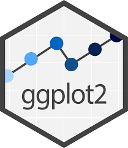

```{r, echo = FALSE, message=FALSE, warning=FALSE}
library(tidyverse)
library(palmerpenguins)
library(apaTables)

penguins <- palmerpenguins::penguins

bfi_10_data <- read_delim("raw/bfi_10_data.csv", delim = ";", escape_double = FALSE, trim_ws = TRUE)

dat_full <- read_csv("raw/dat_full.csv")

dat_full_long <- dat_full |>
      pivot_longer(
        cols = c(pre1, pre4),
        names_to = "time_rating",
        values_to = "rating"
      )
```

## R u Ready? Reproduzierbare Datenaufbereitung und -analyse mit R

FS 2026<br><br><br> **LV-Leitung**: Dr. Sandra Grinschgl / MSc. Laura Hirt<br> **Tutor**: BSc. Lars Schilling<br><br><br>**10. Einheit**, 29.04.2026

------------------------------------------------------------------------

## Heute:

::: {style="width:100%; height:80vh; background:#777; padding:20px; box-sizing:border-box; border-radius:10px; overflow:auto; "}
```{=html}
<embed
    src="../../PDFs/Syllabus.pdf#view=FitH&navpanes=0&toolbar=0"
    type="application/pdf"
    style="width:100%; height:220vh; border:0; display:block; background:white;"
  >
```
:::

------------------------------------------------------------------------

## Inhalte heute

<br>

-   Besprechung der Muddiest Points II

-   Check-in: Hands-on Block 5

-   Datenvisualisierung: Tabellen & Abbildungen

------------------------------------------------------------------------

## {data-background-iframe="../../PDFs/Muddiest_Points_II.pdf#view=FitH&navpanes=0&toolbar=0" data-background-interactive=""}

------------------------------------------------------------------------

## Check-in: Hands-on Block 5

Haben alle einen Long Datensatz (e.g. dat_full_long) mit 318 Zeilen = 2 Zeilen pro Versuchsperson?

Wenn nicht:

```{r echo = TRUE}
dat_full_long <- dat_full |> 
  pivot_longer(cols = c(pre1, pre4),
               names_to = "time_rating",         
               values_to = "rating")
```

❗Falls ihr bis Ende Lektion noch nicht den LONG Datensatz erstellt und gespeichert habt - meldet euch bei uns

------------------------------------------------------------------------

## Datenvisualisierung: Tabellen

<br>

Es gibt die Möglichkeit, APA-konforme Tabellen direkt in R zu erstellen

<br>

**Schritt 1: Deskriptive Tabelle erstellen mit `summarize`**

*Ziel: Deskriptive Kennwerte (Mean, Min und Max der Körpermasse) pro Gruppe berechnen*

```{r echo=TRUE}
penguins_full <- drop_na(penguins)

penguins_summary <- penguins_full |> 
  group_by(species) |>
  summarize(mean_body_mass = mean(body_mass_g),
            min_body_mass = min(body_mass_g),
            max_body_mass = max(body_mass_g)
            )

penguins_summary
```

------------------------------------------------------------------------

## Datenvisualisierung: Tabellen

**Schritt 2: `kable` auf deskriptive Tabelle anwenden**

*Ziel: Deskriptive Tabelle formatieren und beschriften*

```{r, echo = TRUE}
library(knitr)

penguins_summary |>
  kable(
    caption = "Summary of penguin body mass by species",
    digits = 1,
    col.names = c("Species", "Mean body mass (g)", "Min", "Max")
  )
```

<br>

Weitere Formatierungsmöglichkeiten in der Hilfefunktion ersichtlich!

------------------------------------------------------------------------

## [`apaTables`](https://dstanley4.github.io/apaTables/articles/apaTables.html): APA-Tabellen für statistische Analysen

<br>

**Warum apaTables?** Für inferenzstatistische Ergebnisse (z.B. Korrelationen) benötigen wir APA-konforme Tabellen.

→ Auch anwendbar auf Regressionen und ANOVAs

<br>

**Schritt 1: Relevante Variablen für die Korrelation auswählen**

*Beispiel: drei metrische Variablen für eine Korrelationsanalyse auswählen*

```{r, echo = TRUE, eval = TRUE}
penguins_subset <- penguins |>
  select(bill_length_mm, bill_depth_mm, flipper_length_mm)
```

------------------------------------------------------------------------

## [`apaTables`](https://dstanley4.github.io/apaTables/articles/apaTables.html): APA-Tabellen für statistische Analysen

<br>

**Schritt 2: Korrelationstabelle für ausgewählte Variablen erstellen**

*Berechnet Korrelationen, Mittelwerte und Standardabweichungen und formatiert diese im APA-Stil*

```{r, echo = TRUE, eval = TRUE}
library(apaTables)
apa.cor.table(penguins_subset)
```

------------------------------------------------------------------------

## Datenvisualisierung: Abbildungen (Fortsetzung in EH 11)

{fig-align="center" width="186"}

-   ggplot2 ist das zentrale Paket für Datenvisualisierung in R

-   Ermöglicht die Erstellung von z.B. Scatterplots, Balkendiagrammen und Liniengrafiken

------------------------------------------------------------------------

## Visualisierungen: Reproduktion der Abbildungen aus Grinschgl et al. (2021)

```{r echo=FALSE}
dat_full <- dat_full |>    
  mutate(
    mmq_mean = rowMeans(
      across(starts_with("question"), .names = "{col}"),
      na.rm = TRUE
    )
  )

group_summary <- dat_full %>%
  group_by(group_all) %>%
  summarize(
    mean_mmq = mean(mmq_mean, na.rm = TRUE),
    se_mmq = sd(mmq_mean, na.rm = TRUE) / sqrt(sum(!is.na(mmq_mean)))
  )

```

```{r, echo = FALSE}
ggplot(group_summary, aes(x = group_all, y = mean_mmq)) +
  geom_col(fill = "gray", color = "black") + 
  geom_errorbar(
    aes(ymin = mean_mmq - se_mmq, ymax = mean_mmq + se_mmq),  
    width = 0.2,
    color = "black"
  ) +
  labs(
    x = "Group",
    y = "Mean MMQ",
    title = "Group Means of Mean MMQ with SE Error Bars"
  ) +
  theme_minimal() +
  ylim(0, 4)
```

→ Solche publizierten Grafiken können wir mit ggplot2 selbst erstellen!

------------------------------------------------------------------------

## Visualisierungen: Reproduktion der Abbildungen aus Grinschgl et al. (2021)

```{r, echo=FALSE}
descriptives <- dat_full_long |> 
  group_by(group_all, time_rating) |> 
  summarize(N = length(rating),
               mean_d = mean(rating),
               sd_d   = sd(rating),
               se_d   = sd_d / sqrt(N)
)

descriptives$group_all <- factor(descriptives$group_all, c("above", "control", "below"))

rate_plot <- descriptives |> 
  ggplot(aes(x = time_rating, 
             y = mean_d, 
             group = group_all)) 

rate_plot +
  geom_line(aes(color = group_all, linetype = group_all), size = 1.2) +
  geom_errorbar(aes(ymin = mean_d - se_d, ymax = mean_d + se_d), width = .1) +
  scale_color_manual(values = c("green4", "red", "black")) +
  theme_classic() +
  labs(title = "Subjective Performance Ratings ") +
  ylab("Percentile Rank") +
  xlab("Time") +
  theme(plot.title = element_text(hjust = 0.5, size = 12, face = "bold"), 
        axis.text = element_text(size = 11), axis.title = element_text(size = 14)) +
  labs(colour = "Feedback Group", linetype = "Feedback Group", shape = "Feedback Group") 
```

→ Auch komplexe Grafiken können wir mit ggplot2 schrittweise reproduzieren

------------------------------------------------------------------------

## `ggplot2()`: Eine Grammatik für Grafiken

<br>

-   Plots werden **schrittweise aufgebaut**

-   Jede Grafik besteht aus:

    -   Daten

    -   Mapping → *Was wird dargestellt?*

    -   Darstellung → *Wie wird es dargestellt?*

------------------------------------------------------------------------

## Argumente von `ggplot()`

<br>

**Schritt 1: ggplot() + Daten**

-   Wir starten immer mit einem Datensatz

-   Es passiert noch nichts sichtbar!

```{r, echo = TRUE, eval = TRUE}
library(ggplot2)

ggplot(data = penguins)
```

::: notes
With ggplot2, you begin a plot with the function ggplot(), defining a plot object that you then add layers to. The first argument of ggplot() is the dataset to use in the graph and so ggplot(data = penguins) creates an empty graph that is primed to display the penguins data, but since we haven’t told it how to visualize it yet, for now it’s empty. This is not a very exciting plot, but you can think of it like an empty canvas you’ll paint the remaining layers of your plot onto.
:::

------------------------------------------------------------------------

## Argumente von `ggplot()`

<br>

**Schritt 2: aes() - Was wird geplottet?**

-   `aes()` = Aesthetic mappings

-   Variablen werden den Achsen zugewiesen

```{r, echo = TRUE, eval = TRUE}
ggplot(penguins,
       aes(x = body_mass_g, y = bill_length_mm))
```

::: notes
Next, we need to tell ggplot() how the information from our data will be visually represented. The mapping argument of the ggplot() function defines how variables in your dataset are mapped to visual properties (aesthetics) of your plot. The mapping argument is always defined in the aes() function, and the x and y arguments of aes() specify which variables to map to the x and y axes. For now, we will only map flipper length to the x aesthetic and body mass to the y aesthetic. ggplot2 looks for the mapped variables in the data argument, in this case, penguins.
:::

------------------------------------------------------------------------

## Argumente von `ggplot()`

<br>

**Schritt 3: geoms() - Wie wird es dargestellt?**

-   `geom_*()` bestimmt die Darstellungsform

-   z.B.: Punkte, Linien, Balken

```{r, echo = TRUE, eval = TRUE}
ggplot(penguins,aes(x = body_mass_g, y = bill_length_mm)) +
  geom_point()
```

::: notes
To do so, we need to define a geom: the geometrical object that a plot uses to represent data. These geometric objects are made available in ggplot2 with functions that start with geom\_. People often describe plots by the type of geom that the plot uses. For example, bar charts use bar geoms (geom_bar()), line charts use line geoms (geom_line()), boxplots use boxplot geoms (geom_boxplot()), scatterplots use point geoms (geom_point()), and so on.
:::

------------------------------------------------------------------------

## Argumente von `ggplot()`

<br>

**Das wichtigste Prinzip: + fügt Layer hinzu**

-   Jede neue Zeile = ein neuer Layer

-   Die Grafik wird schrittweise erweitert

```{r, echo = TRUE, eval = TRUE}
ggplot(penguins,aes(x = body_mass_g, y = bill_length_mm)) +
  geom_point() +
  geom_smooth()
```

------------------------------------------------------------------------

## Argumente von `ggplot()`

<br>

**aes(): global vs. im Layer**

-   Mapping kann:

    -   **für alles gelten (global)**

    -   nur für einzelne Layer gelten

```{r, echo = TRUE, eval = TRUE}
#| fig-height: 3
#| fig-width: 5
# global
ggplot(penguins, aes(x = body_mass_g, y = bill_length_mm)) +
  geom_point()
```

------------------------------------------------------------------------

## Argumente von `ggplot()`

<br>

**aes(): global vs. im Layer**

-   Mapping kann:

    -   für alles gelten (global)

    -   **nur für einzelne Layer gelten**

```{r, echo = TRUE, eval = TRUE}
#| fig-height: 3
#| fig-width: 5
# im Layer
ggplot(penguins) + 
  geom_point(aes(x = body_mass_g, y = bill_length_mm))
```

------------------------------------------------------------------------

## Argumente von `ggplot()`

<br>

**Welche geom für welche Daten?**

-   Je nach Art der Daten und der gewünschten Darstellungsart auszuwählen:

    -   1 kategoriale Variable: `geom_bar()`

    -   1 kontinuierliche Variable: `geom_histogram()`

    -   2 kategoriale Variablen: `geom_count()`

    -   2 metrische Variablen: `geom_point()`, `geom_line()`

    -   1 kategoriale + 1 metrische Variable: `geom_boxplot()`, `geom_violin()`

------------------------------------------------------------------------

## Argumente von `ggplot()`

<br>

**Weitere Layer: Labels, Design, Modelle**

-   Der Plot wird Schritt für Schritt erweitert

-   Inhalt vs. Darstellung trennen

```{r, echo = TRUE, eval = FALSE}
+ labs(
  title = "Relationship Between Body Mass and Bill Length",
  x = "Body Mass (g)",
  y = "Bill Length (mm)")
+ theme_classic()
+ geom_smooth(method = "lm")
```

→ Mit `theme_` können [verschiedene Formatierungen](https://ggplot2.tidyverse.org/reference/ggtheme.html) gewählt werden. `theme_classic` wird typischerweise für APA7 passende Formatierungen gewählt.

------------------------------------------------------------------------

## Argumente von `ggplot()`

<br>

**Ein vollständiger ggplot**

```{r, echo = TRUE, eval = TRUE}
ggplot(penguins,aes(x = body_mass_g, y = bill_length_mm)) +
  geom_point() +
  geom_smooth(method = "lm") +
  theme_classic() +
  labs(
    title = "Relationship Between Body Mass and Bill Length",
    x = "Body Mass (g)",
    y = "Bill Length (mm)"
    )
```

------------------------------------------------------------------------

## Argumente von `ggplot()`

<br>

**Komplexere Kombinationen**

-   Kombination von verschiedenen Layers/Geoms

```{r, echo = TRUE, eval = TRUE}
penguins_plot <- ggplot(penguins, aes(x = island, y = body_mass_g, color = island, shape = sex)) +
  geom_boxplot() +
  geom_jitter(alpha = 0.5) +
  theme_classic() +
  labs(title = "Body Mass Per Island and Species", x = "Island", y = "Body Mass (g)")

penguins_plot
```

------------------------------------------------------------------------

## Abbildungen speichern

```{r, echo = TRUE, eval=FALSE}

ggsave(filename = "my_first_plot.png", plot = penguins_plot)
```

------------------------------------------------------------------------

## Weitere Ressourcen zu ggplot2:

**Zum Nachschlagen**

-   [**ggplot2 Cheatsheet**](https://posit.co/wp-content/uploads/2022/10/data-visualization-1.pdf)\
    Überblick über häufige Funktionen, Geoms und Einstellungen

-   [**Auflistung von Argumenten**](https://ggplot2.tidyverse.org/reference/index.html)\
    Hilfreich, wenn ihr wissen wollt, welche Optionen eine Funktion hat

**Zum Vertiefen**

-   **R for Data Science – Kapitel „[Exploratory data analysis](https://r4ds.hadley.nz/EDA.html)“**\
    Einführung in die Grundlogik von ggplot2

-   **R for Data Science – Kapitel „[Layers](https://r4ds.hadley.nz/layers)“**\
    Vertiefung zu Layern, Geoms, Mappings und Themes

**Für Inspiration**

-   [**Top 50 ggplot2 Visualizations**](https://r-statistics.co/Top50-Ggplot2-Visualizations-MasterList-R-Code.html#Waffle%20Chart)\
    Beispiele für unterschiedliche Plot-Typen

------------------------------------------------------------------------

## Heute haben wir:

-   Muddiest Points besprochen

-   Basics der Datenvisualisierungen kennengelernt

    -   Erstellung von Tabellen

    -   `ggplot()`

**Reminder: Beim Abschlussprojekt müsst ihr 1 Tabelle oder Abbildung nach Wahl zu den simulierten Daten abgeben.**

------------------------------------------------------------------------

## R-Hausübung 2

Abgabe bis Freitag **08.05.2026, 23:55**

Peerfeedback bis Mittwoch **13.05.2026 (vor der Einheit)**

**Achtung: Einhalten der Namensvorgaben!**

::: notes
Namenseinhaltung für Abgabe der Files (da wir diese via R-Funktion öffnen)
:::
