```{r, echo = FALSE, message = FALSE, warning = FALSE}

library(tidyverse)
library(palmerpenguins)
library(apaTables)
penguins <- palmerpenguins::penguins

bfi_10_data <- read_delim("raw/bfi_10_data.csv", delim = ";", escape_double = FALSE, trim_ws = TRUE)

dat_full <- read_csv("raw/dat_full.csv")

dat_full_long <- dat_full |>
      pivot_longer(
        cols = c(pre1, pre4),
        names_to = "time_rating",
        values_to = "rating"
      )
```

## R u Ready? Reproduzierbare Datenaufbereitung und -analyse mit R

FS 2026<br><br><br> **LV-Leitung**: PD Dr. Sandra Grinschgl / MSc. Laura Hirt<br> **Tutor**: BSc. Lars Schilling<br><br><br>**11. Einheit**, 06.05.2026

------------------------------------------------------------------------

## Heute:

::: {style="width:100%; height:80vh; background:#777; padding:20px; box-sizing:border-box; border-radius:10px; overflow:auto; "}
```{=html}
<embed
    src="../../PDFs/Syllabus.pdf#view=FitH&navpanes=0&toolbar=0"
    type="application/pdf"
    style="width:100%; height:220vh; border:0; display:block; background:white;"
  >
```
:::

------------------------------------------------------------------------

## Inhalte heute

<br>

-   Fragen Hands on Block 5 & R Hausübung 1

-   Repetition: `ggplot()`

-   Inferenzstatistik: Korrelation & Regression

------------------------------------------------------------------------

## Fragen zu Hands On Block 5 & HÜ 1?

{fig-align="center" width="411"}

::: notes
zu HÜ sollten jetzt alle Feedback bekommen haben. Bei uns melden, falls etwas unklar ist.

Häufige Fehler:

-   absoluter Pfad

-   Unnötiges Laden von Paketen

-   "weder noch" bei Big 5 Items falsch umgewandelt
:::

------------------------------------------------------------------------

## Repetition: Wie ist ein ggplot aufgebaut?

<br>

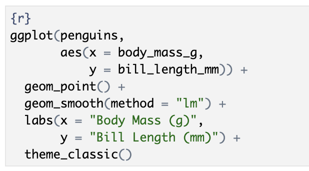{fig-align="center" width="380"}

<br>

➡️ *Ein ggplot besteht aus mehreren Bestandteilen, die wir Schritt für Schritt hinzufügen.*

------------------------------------------------------------------------

## Repetition: Wie ist ein ggplot aufgebaut?

<br>

::::: columns
::: {.column width="50%"}
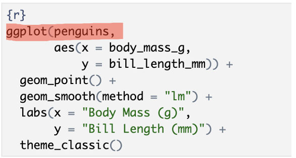
:::

::: {.column width="50%"}

:::
:::::

<br>

➡️ Wir starten immer mit einem Datensatz – ohne Daten keine Grafik.

------------------------------------------------------------------------

## Repetition: Wie ist ein ggplot aufgebaut?

<br>

::::: columns
::: {.column width="50%"}
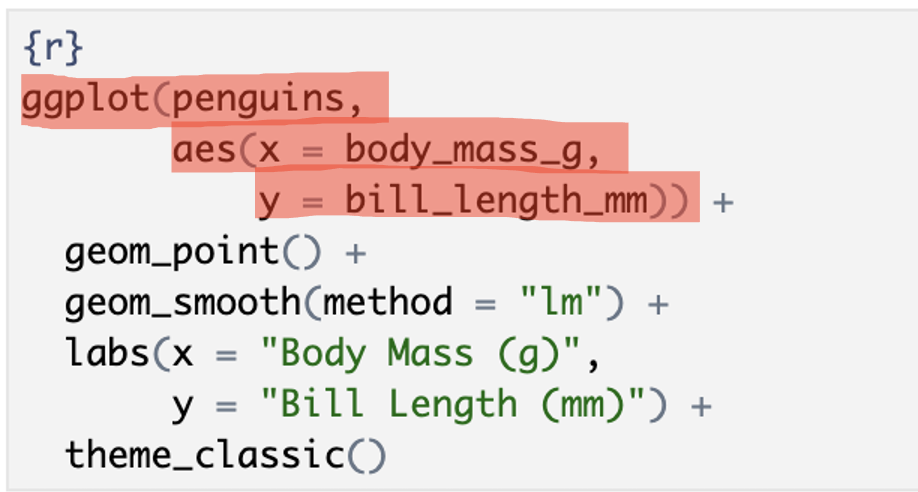
:::

::: {.column width="50%"}
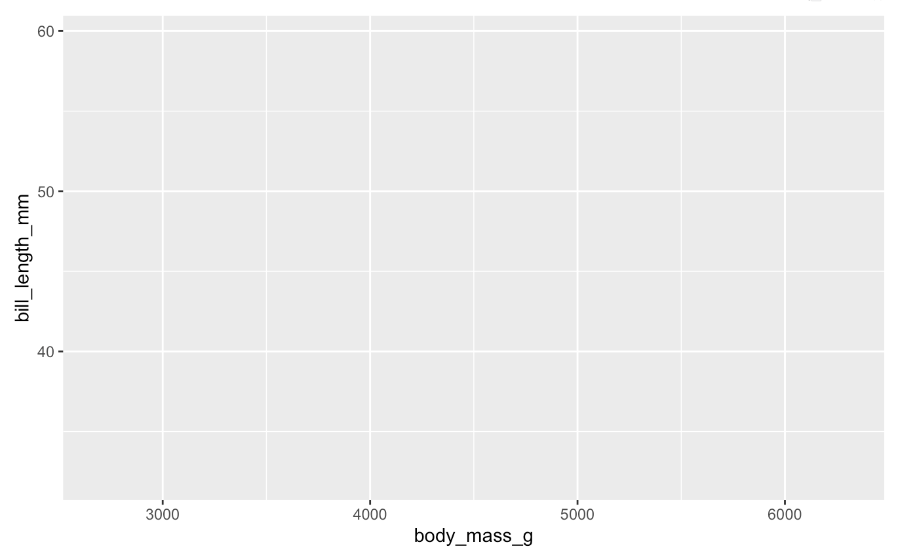
:::
:::::

<br>

➡️ `aes()` legt fest, welche Variablen auf den Achsen dargestellt werden.

------------------------------------------------------------------------

## Repetition: Wie ist ein ggplot aufgebaut?

<br>

::::: columns
::: {.column width="50%"}
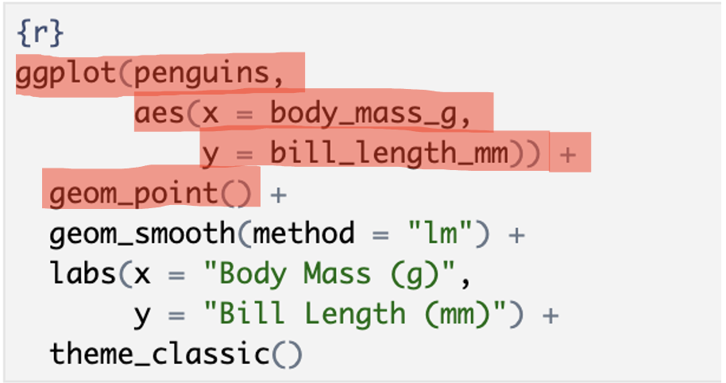
:::

::: {.column width="50%"}
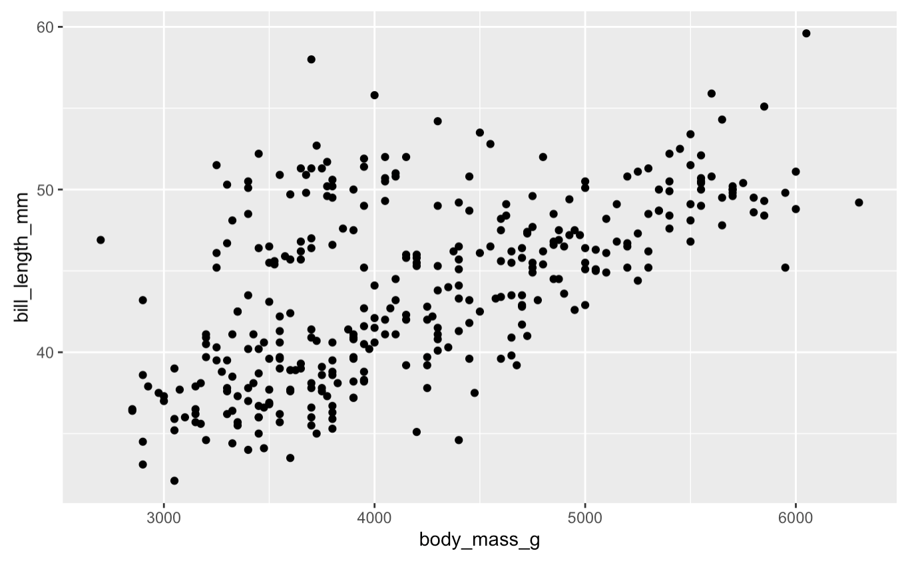
:::
:::::

<br>

➡️ `geom()` bestimmt, wie die Daten dargestellt werden (z.B. Punkte).

------------------------------------------------------------------------

## Repetition: Wie ist ein ggplot aufgebaut?

<br>

::::: columns
::: {.column width="50%"}
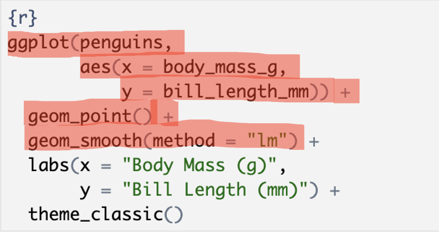
:::

::: {.column width="50%"}
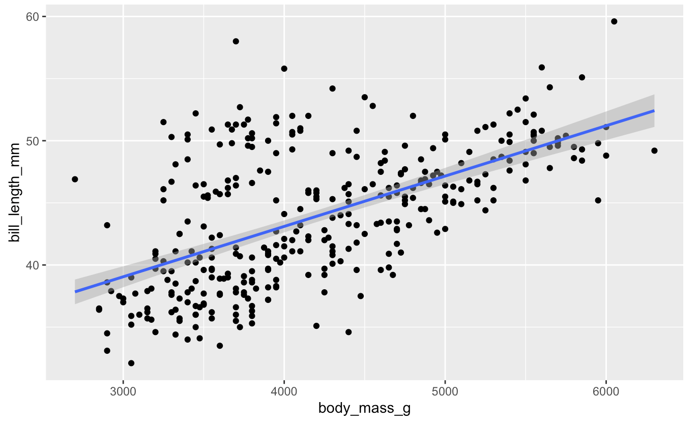
:::
:::::

<br>

➡️ Mit + fügen wir weitere Layer hinzu (z.B. eine Regressionslinie).

------------------------------------------------------------------------

## Repetition: Wie ist ein ggplot aufgebaut?

<br>

::::: columns
::: {.column width="50%"}
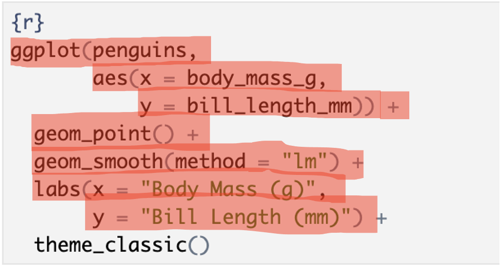
:::

::: {.column width="50%"}
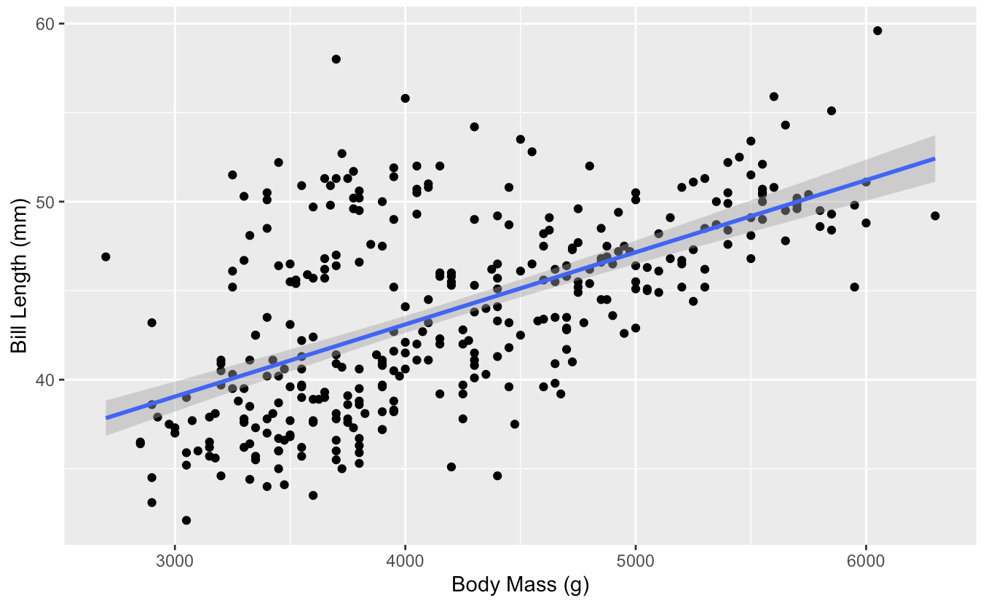
:::
:::::

<br>

➡️ `labs()` fügt Beschriftungen hinzu und macht die Grafik verständlich.

------------------------------------------------------------------------

## Repetition: Wie ist ein ggplot aufgebaut?

<br>

::::: columns
::: {.column width="50%"}
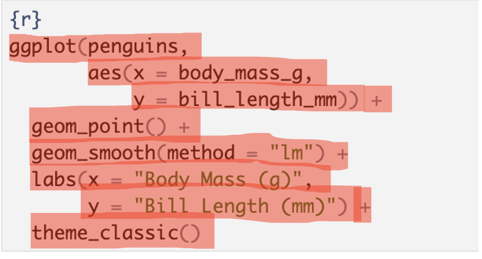
:::

::: {.column width="50%"}
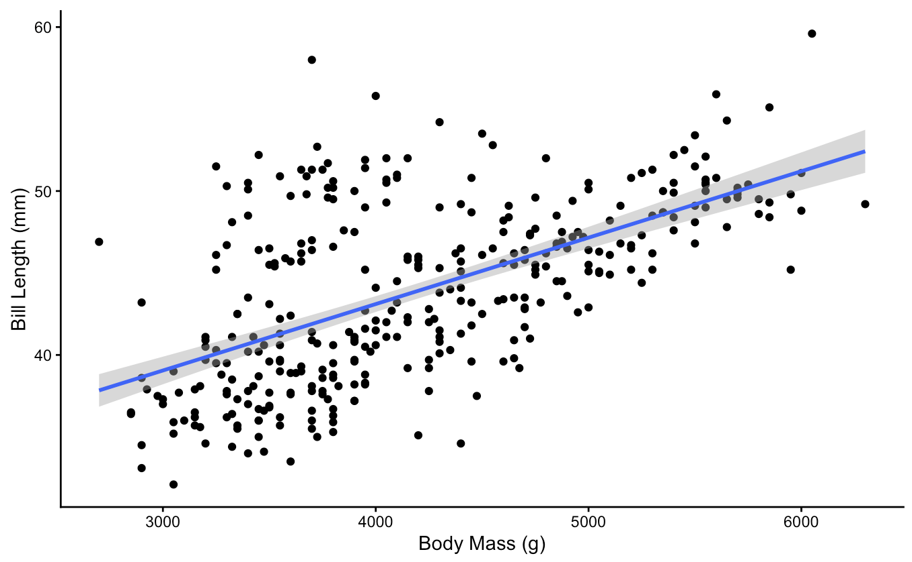
:::
:::::

<br>

➡️ `theme()` verändert das Aussehen der Grafik (Design).

------------------------------------------------------------------------

# Inferenzstatistik

<br>

**Ist das ein statistisch signifikanter Effekt – oder nur Zufall?**

------------------------------------------------------------------------

## Von der Visualisierung zur Inferenz (1)

<br>

Wir können Daten visualisieren...

→ z.B. einen Zusammenhang im Plot erkennen

<br>

👉 **Aber:**

→ Ist dieser Zusammenhang wirklich belastbar oder bloss ein Zufall in unseren Daten?

------------------------------------------------------------------------

## Von der Visualisierung zur Inferenz (2)

<br>

**Genau diese Frage beantwortet die Inferenzstatistik!**

<br>

Sie hilft uns:

-   von einer Stichprobe auf die Population zu schliessen

-   zu überprüfen, ob Effekte **statistisch signifikant sind**

-   fundierte Entscheidungen auf Basis von Daten zu treffen

<br>

➡️ Dafür nutzen wir statistische Testverfahren.

------------------------------------------------------------------------

## Wie wählen wir den richtigen Test?

<br>

Die Wahl des statistischen Tests hängt ab von, z.B.:

-   unserer Fragestellung

-   der Art der Variablen (z.B. metrisch vs. kategorial)

<br>

👉 Diese Überlegungen habt ihr bereits im Datenanalyseplan gemacht.

👉 Durch das Festlegen von Analysen in einer Präregistrierung oder einem Datenanalyseplan spart man sich nun Arbeit und Zeit!

------------------------------------------------------------------------

## Hilfe bei der Wahl des Tests

<br>

[Entscheidungsbaum statistischer Testverfahren](https://etools.fernuni.ch/entscheidungsbaum/main.html)

(fernuni.ch)

<br><br>

[Entscheidungsbaum UZH](https://www.methodenberatung.uzh.ch/de/datenanalyse_spss.html)

(methodenberatung.uzh.ch)

<br>

👉 Diese helfen euch, den passenden Test systematisch auszuwählen. Es gibt aber noch viele weitere statistische Analyseverfahren, die in diesen Entscheidungbäumen nicht abgebildet sind!

------------------------------------------------------------------------

## Diese Verfahren nutzen wir im Seminar

<br>

Wir konzentrieren uns auf vier zentrale Verfahren:

-   **Korrelation** → Zusammenhang zwischen Variablen

-   **Regression** → Vorhersage von Variablen

-   **t-Test** → Unterschiede zwischen zwei Gruppen

-   **One-Way und Mixed ANOVA** → Unterschiede zwischen mehreren Gruppen

<br>

➡️ Diese schauen wir uns jetzt Schritt für Schritt an.

------------------------------------------------------------------------

## Korrelationen

<br>

Wir untersuchen:

➡️ **Gibt es einen (linearen) Zusammenhang zwischen zwei Variablen?**

<br>

-   Positive Korrelation

→ hohe Werte gehen mit hohen Werten einher (z.B. Körpergrösse & Schuhgrösse)

<br>

-   Negative Korrelation

→ hohe Werte gehen mit niedrigen Werten einher (z.B. Lernzeit & Anzahl Fehler)

------------------------------------------------------------------------

## Korrelationen interpretieren

<br>

**Korrelationskoeffizient r** (Stärke des Zusammenhangs):

-   r ≈ 0 → kein Zusammenhang

-   r \> 0 → positiver Zusammenhang

-   r \< 0 → negativer Zusammenhang

<br>

➡️ Werte zwischen -1 und +1

👉 Je näher r an ±1, desto stärker der Zusammenhang

------------------------------------------------------------------------

## Voraussetzungen der Korrelation

<br>

Damit wir eine **Pearson-Korrelation** sinnvoll interpretieren können:

-   linearer Zusammenhang zwischen den Variablen

-   keine starken Ausreisser

-   Variablen sind metrisch

<br>

👉 Wenn diese Voraussetzungen nicht erfüllt sind:

**Spearman-Korrelation** als nicht-parametrische Alternative

------------------------------------------------------------------------

## Korrelation in R

<br>

```{r, echo = TRUE}

cor.test(penguins$bill_length_mm,
         penguins$body_mass_g)
```

<br>

• r ≈ 0.60 → mittelstarker positiver Zusammenhang\
• p \< .001 → statistisch signifikant

------------------------------------------------------------------------

## Regressionen

<br>

Wir untersuchen:

➡️ Kann eine Variable durch eine oder mehrere andere Variablen vorhergesagt werden?

-   **Abhängige Variable (AV):** Was wollen wir vorhersagen?

    → y

-   **Prädiktor/en (UVs):** Womit wollen wir vorhersagen?

    → x, x1, x2, ...

<br>

👉 Regressionen prüfen Zusammenhänge - aber mit einer gerichteten Fragestellung.

------------------------------------------------------------------------

## Korrelation vs. Regression

<br>

**Korrelation:**

➡️ Wie stark hängen zwei Variablen zusammen?

-   Beispiel: Hängen Lernzeit und Leistung zusammen?

<br>

**Regression:**

➡️ Wie gut lässt sich eine Variable durch andere Variable(n) vorhersagen?

-   Sagt Lernzeit die Leistung vorher?

<br>

⚠️ Auch Regression erlaubt keine Kausalaussagen ohne geeignetes Studiendesign!

⚠️ Einfache lineare Regressionen sind identisch zu Korrelationen!

------------------------------------------------------------------------

## Einfache lineare Regression

<br>

Eine abhängige Variable (AV) wird durch einen Prädiktor (UV) vorhergesagt.

<br>

```{r, echo=TRUE}

model_1 <- lm(mean_rl_all ~ cvstm_propcorrect,
              data = dat_full)

summary(model_1)
```

⚠️Identisch zur Korrelation: r = sqrt(r_squared)

------------------------------------------------------------------------

## Multiple lineare Regression

<br>

Eine abhängige Variable (AV) wird durch mehrere Prädiktoren (UVs) vorhergesagt.

<br>

```{r}
model_2 <- lm(mean_rl_all ~ cvstm_propcorrect + vp_propcorrect,
              data = dat_full)

summary(model_2)
```

➡️ Jeder Prädiktor wird geprüft, während die anderen Prädiktoren im Modell kontrolliert werden.

Dadurch können wir untersuchen, ob ein Prädiktor zusätzlich zur Vorhersage beiträgt.

------------------------------------------------------------------------

## Regression: Output verstehen

<br>

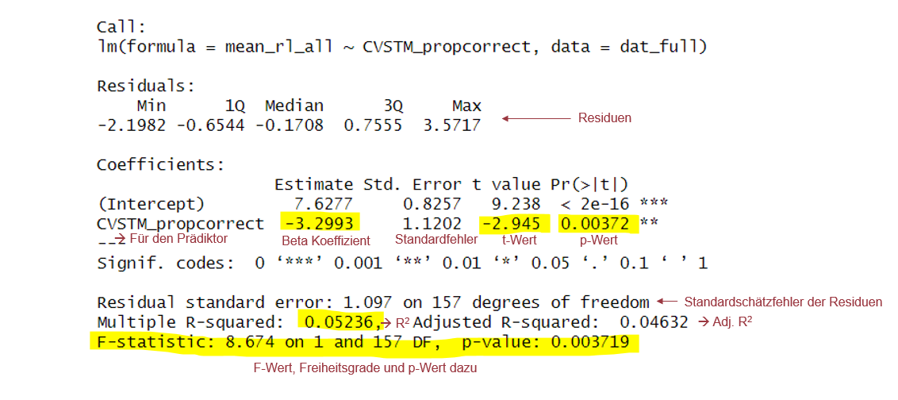{fig-align="center"}

::: notes
Hier eine **sehr kurze, punktuelle Zusammenfassung**:

-   **Intercept (7.63)**: Ausgangswert von *mean_rl_all*, wenn cvstm_propcorrect = 0.

-   **Steigung (-3.30)**: Hoeherer cvstm_propcorrect sagt niedrigeren mean_rl_all voraus (negativer Zusammenhang

-   **p = .0037**: Zusammenhang ist **signifikant**.

-   **Residuen**: Durchschnittliche Abweichung vom Modell ca. 1.10.

-   **R² = 0.052**: Modell erklaert **5% der Varianz** → kleiner Effekt.

-   **F-Test p = .0037**: Das Gesamtmodell ist signifikant.

**Kurz:** Höhere cvstm_propcorrect-Werte gehen mit niedrigeren mean_rl_all-Werten einher, aber das Modell erklaert nur wenig Varianz.
:::

------------------------------------------------------------------------

## Voraussetzungen der linearen Regression

<br>

Damit wir eine lineare Regression sinnvoll interpretieren können:

-   linearer Zusammenhang zwischen Prädiktor(en) und abhängiger Variable

-   normalverteilte Residuen (siehe Hands On 5)

-   Homoskedastizität

-   keine starken Ausreisser

-   bei multipler Regression: keine starke Multikollinearität

<br>

👉 Die Voraussetzungen prüfen wir über Diagnostikplots und Kennwerte.

------------------------------------------------------------------------

### **Nützliche Funktionen für Regressionen und verwandte Analysen in R**

| Funktion | Beschreibung |
|------------------------------------|------------------------------------|
| `lm(y ~ x)` | Einfache lineare Regression mit einer abhängigen Variablen *y* und einem Prädiktor *x*. |
| `lm(y ~ x1 + x2)` | Multiple Regression mit einer abhängigen Variablen *y* und zwei Prädiktoren *x1* und *x2*. |
| `summary()` | Gibt die Ergebnisse der Regressionsanalyse für ein Regressionsmodell aus. |
| `confint()` | Konfidenzintervalle für die Regressionskoeffizienten. |

------------------------------------------------------------------------

| Funktion | Beschreibung |
|------------------------------------|------------------------------------|
| `fitted()` | Vorhergesagte Werte des Regressionsmodells. |
| `resid()` | Residuen des Regressionsmodells. |
| `predict()` | Vorhergesagte Werte für neue Werte der Prädiktorvariablen. |
| `anova(model1, model2)` | Vergleicht die Determinationskoeffizienten zweier Regressionsmodelle mit einem F-Test. |
| `vif()` \* | Variance Inflation Factors (VIF) für jeden Prädiktor; aus dem **car**-Paket. |

\* aus zusätzlichen Paketen

------------------------------------------------------------------------

## Hierarchische Regression

<br>

Bei der hierarchischen Regression vergleichen wir mehrere Modelle.

```{r, echo=TRUE, eval=FALSE}
model_1 <- lm(y ~ x1,
              data = data)

model_2 <- lm(y ~ x1 + x2,
              data = data)

model_3 <- lm(y ~ x1 + x2 + x3,
              data = data)

anova(model_1, model_2, model_3)
```

Fragestellung:

➡️ Erklärt das komplexere Modell zusätzliche Varianz?

👉 Wir prüfen also, ob neue Prädiktoren die Vorhersage verbessern.

<br>

Siehe hier: [**Lineare Regression mit R (einfach, multiple, hierarchisch)**](https://www.youtube.com/watch?v=JzcIKIW6mfc)

------------------------------------------------------------------------

## Hands On - Block 6!

-   Visualisierungen mit `ggplot2`

-   Korrelationen

-   Regressionen

------------------------------------------------------------------------

## Heute haben wir:

-   Aufbau von `ggplot()` repetiert

-   Korrelationen und Regressionen in R kennengelernt

**Reminder: R Übung bis Freitag 08.05., Peer Feedback über ILIAS bis 13.05.**

------------------------------------------------------------------------

## Peer Feedback:

--siehe Datei im Ordner Abgaben—
