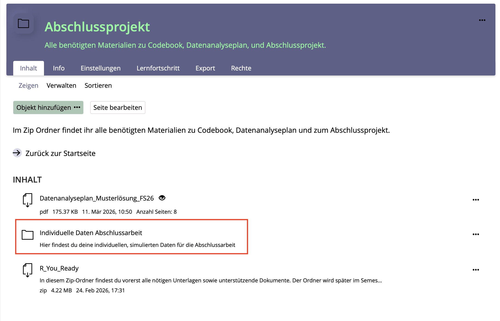
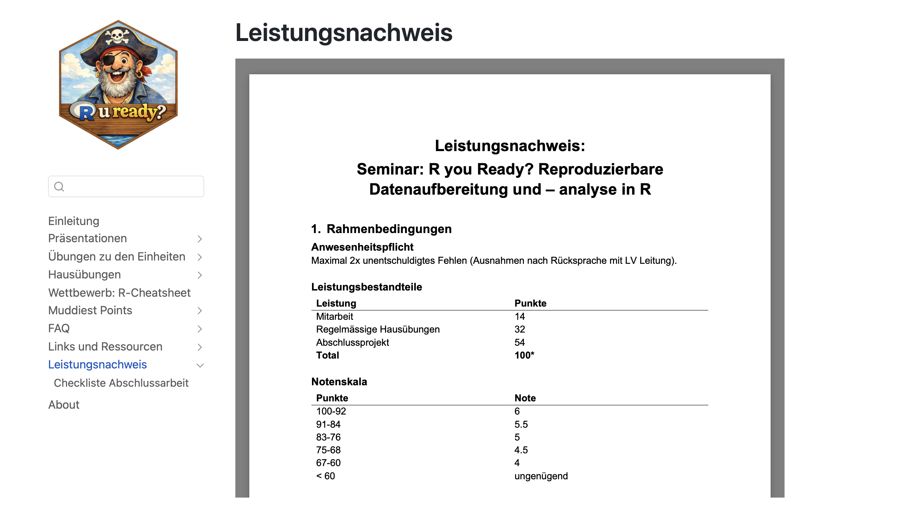

```{r, echo = FALSE, message=FALSE, warning=FALSE}

options(scipen = 999)

library(tidyverse)
library(palmerpenguins)
library(apaTables)

penguins <- palmerpenguins::penguins

bfi_10_data <- read_delim("raw/bfi_10_data.csv", delim = ";", escape_double = FALSE, trim_ws = TRUE)

dat_full <- read_csv("raw/dat_full.csv")

dat_full_long <- dat_full |>
      pivot_longer(
        cols = c(pre1, pre4),
        names_to = "time_rating",
        values_to = "rating"
      )

dat_full <- dat_full |>
  mutate(pre1 = pre1*10,
         pre2 = pre2*10,
         pre3 = pre3*10,
         pre4 = pre4*10)
```

## R u Ready? Reproduzierbare Datenaufbereitung und -analyse mit R

FS 2026<br><br><br> **LV-Leitung**: PD Dr. Sandra Grinschgl / MSc. Laura Hirt<br> **Tutor**: BSc. Lars Schilling<br><br><br>**12. Einheit**, 13.05.2026

------------------------------------------------------------------------

## Heute:

::: {style="width:100%; height:80vh; background:#777; padding:20px; box-sizing:border-box; border-radius:10px; overflow:auto; "}
```{=html}
<embed
    src="../../PDFs/Syllabus.pdf#view=FitH&navpanes=0&toolbar=0"
    type="application/pdf"
    style="width:100%; height:220vh; border:0; display:block; background:white;"
  >
```
:::

------------------------------------------------------------------------

## Inhalte heute

<br>

-   Fragen zur R-Hausübung 2

-   Erinnerung: R-Cheatsheet-Wettbewerb

-   Informationen zur Abschlussarbeit

    -   Simulierte Datensätze

    -   Checkliste: Datenaufbereitung & Inferenzstatistik

-   Inferenzstatistik: t-Test

------------------------------------------------------------------------

## Fragen zur R-Hausübung 2?

{fig-align="center" width="411"}

------------------------------------------------------------------------

## Erinnerung: R-Cheatsheet-Wettbewerb

<br>

**Aufgabe:** Erstellt ein persönliches R-Cheatsheet als kompaktes Nachschlagewerk.

<br>

**Wichtigste Infos:**

-   Teilnahme ist freiwillig

-   Vorlage und Abgabeordner auf **ILIAS**

-   Inhalte: zentrale R-Befehle, Analyse-Workflows, Beispiele

-   Mindestkriterien: strukturiert, verständlich erklärt, praktisch nützlich, übersichtlich gestaltet

-   **2 Extrapunkte** bei erfüllten Mindestkriterien

-   **+2 Extrapunkte** für das beste Cheatsheet durch Kursabstimmung

**Deadline:** EH13, **20.05.**\
**Abstimmung:** EH14, 27.05.\
**Maximal:** 4 Extrapunkte

------------------------------------------------------------------------

## Informationen zur Abschlussarbeit

<br>

**Simulierte Datensätze**

Auf ILIAS findet ihr im Ordner *Individuelle Daten Abschlussarbeit* einen Ordner mit eurem Namen. Dieser ist nach dem PsychDS-System strukturiert und enthält im Unterordner *raw* eure persönlichen, simulierten Datensätze für die Abschlussarbeit.

{fig-align="center" width="400"}

------------------------------------------------------------------------

## Informationen zur Abschlussarbeit

<br>

**Informationen auf der Webseite**

{fig-align="center" width="400"}

------------------------------------------------------------------------

## Informationen zur Abschlussarbeit

### **Simulierte Datensätze**

<br>

-   Vorgehen: Eine Funktion simuliert eine oder mehrere Populationen und zieht daraus zufällig Datenpunkte. Diese Zufälligkeit der Ziehung führt dazu, dass sich eure **Datensätze** **unterscheiden**!

<br>

-   Dadurch ergeben sich Unterschiede in den **Hypothesentests und deskriptiven Statistiken**.

<br>

-   Deshalb können Mittelwerte, Korrelationen, t-Tests etc. nicht bei allen exakt gleich ausfallen.

<br>

-   **Wichtig:** Die Ergebnisse sollten aber insgesamt in einem vergleichbaren Bereich liegen.

------------------------------------------------------------------------

## Inferenzstatistik: t-Test

### **Worum geht es?**

<br>

Mit einem t-Test prüfen wir, ob sich Mittelwerte statistisch bedeutsam voneinander unterscheiden.

<br>

**Typische Fragestellungen:**

-   Unterscheidet sich eine Gruppe von einem festen Vergleichswert?

-   Unterscheiden sich zwei unabhängige Gruppen voneinander? (between-subjects)

-   Verändert sich eine Variable innerhalb derselben Personen über zwei Messzeitpunkte? (within-subjects)

<br>

**In dieser Einheit:**

Wir fokussieren auf den t-Test für unabhängige Stichproben.

------------------------------------------------------------------------

## Inferenzstatistik: t-Test

### **Beispiel Abschlussarbeit: Erwartete PCT-Leistung**

<br>

**Fragestellung:** Unterscheiden sich Personen in der `above`- und `below`-Gruppe darin, wie sie ihre kommende Leistung im Pattern Copy Task einschätzen?

**Variablen:**

-   Gruppierungsvariable: `group_all`

    -   `above`

    -   `below`

-   Abhängige Variable: `pre4`

    -   Rating der erwarteten eigenen PCT-Leistung (im Vergleich zu anderen Studierenden)

    -   nach drei vorherigen Fake-Feedbacks

**Hypothesentest**

Wir vergleichen die Mittelwerte von `pre4` zwischen zwei unabhängigen Gruppen.

------------------------------------------------------------------------

## Inferenzstatistik: t-Test

### **Hypothesen beim t-Test**

<br>

**Nullhypothese H0**

Es gibt keinen Mittelwertsunterschied zwischen den Gruppen.

-   H₀: μ_above = μ_below

-   H₀: Die beiden Gruppen unterscheiden sich nicht in ihrer erwarteten PCT-Leistung.

<br>

**Alternativhypothese H1**

Es gibt einen Mittelwertsunterschied zwischen den Gruppen.

-   H₁: μ_above ≠ μ_below

-   H₁: Die beiden Gruppen unterscheiden sich in ihrer erwarteten PCT-Leistung.

------------------------------------------------------------------------

## Inferenzstatistik: t-Test

### **Grundidee des t-Tests**

<br>

Der t-Test prüft, ob ein beobachteter Mittelwertsunterschied **grösser ist, als man aufgrund zufälliger Schwankungen erwarten würde.**

<br>

Dafür vergleicht er:

-   den **Unterschied zwischen den Gruppen** mit der **Streuung innerhalb der Gruppen**

**Intuition:**

-   Unterschied gross, Streuung klein → spricht eher für einen systematischen Gruppenunterschied

-   Unterschied klein, Streuung gross → könnte gut durch Zufall erklärbar sein

**Merke:**\
Der t-Wert setzt den Mittelwertsunterschied ins Verhältnis zur Unsicherheit.\
Der p-Wert zeigt, wie plausibel ein solcher Unterschied wäre, wenn H₀ wahr ist.

------------------------------------------------------------------------

## Inferenzstatistik: t-Test

### **Varianten des t-Tests**

| Situation | Fragestellung | R-Funktion |
|----|----|----|
| Ein-Stichproben-t-Test | Unterscheidet sich ein Mittelwert von einem festen Vergleichswert? | `t.test(av, mu = x)` |
| t-Test für unabhängige Stichproben | Unterscheiden sich zwei unabhängige Gruppen? –\> between-subjects Vergleich | `t.test(av ~ uv, data = dat)` |
| Gepaarter t-Test | Unterscheiden sich zwei Messzeitpunkte derselben Personen? –\> within-subjects Vergleich | `t.test(av1, av2, paired = TRUE)` |

------------------------------------------------------------------------

## Inferenzstatistik: t-Test

### **Vorbereitung in R**

<br>

Für den Vergleich betrachten wir nur die Gruppen `above` und `below`.

```{r, echo=TRUE}
dat_full_below_above <- dat_full |> 
  filter(group_all != "control")
```

<br>

Danach stellen wir sicher, dass die Gruppierungsvariable als Faktor gespeichert ist.

```{r, echo=TRUE}
dat_full_below_above$group_all <- 
  as.factor(dat_full_below_above$group_all)
```

------------------------------------------------------------------------

## Inferenzstatistik: t-Test

### **Vor dem t-Test: Gruppen beschreiben**

Bevor wir einen Hypothesentest durchführen, sollten wir die Gruppen deskriptiv anschauen.

```{r, echo=TRUE}
dat_full_below_above |> 
  group_by(group_all) |> 
  summarise(
    n = n(),
    mean_pre4 = mean(pre4, na.rm = TRUE),
    sd_pre4 = sd(pre4, na.rm = TRUE)
  )
```

<br>

**Warum ist das wichtig?**

-   Wir sehen, wie viele Personen pro Gruppe vorhanden sind.

-   Wir sehen, welche Gruppe höhere Werte aufweist.

-   Wir können den späteren t-Test inhaltlich besser interpretieren.

------------------------------------------------------------------------

## Inferenzstatistik: t-Test

### **Voraussetzungen prüfen**

<br>

-   **Unabhängigkeit der Beobachtungen**

    -   Jede Person kommt nur einmal im Datensatz vor.

    -   Die Gruppen sind unabhängig voneinander.

-   **Metrische abhängige Variable**

    -   `pre4` sollte als numerische Variable vorliegen.

-   **Verteilung und Ausreisser**

    -   Die AV sollte innerhalb der Gruppen keine stark problematische Verteilung aufweisen.

-   **Varianzhomogenität**

    -   Relevant für den klassischen t-Test mit `var.equal = TRUE`.

    -   Beim Welch-t-Test weniger kritisch.

------------------------------------------------------------------------

## Inferenzstatistik: t-Test

### **Voraussetzung: Varianzhomogenität**

<br>

Varianzhomogenität bedeutet: Die Streuung der AV ist in beiden Gruppen ungefähr gleich gross.

<br>

**Prüfung mit Levene-Test**

```{r, echo = TRUE}
library(car)

leveneTest(pre4 ~ group_all, data = dat_full_below_above)
```

**Interpretation**

-   p ≥ .05: kein statistischer Hinweis auf unterschiedliche Varianzen (klassischer t-Test möglich, `var.equal = TRUE`)

-   p \< .05: Hinweis auf unterschiedliche Varianzen (Welch-t-Test verwenden, `var.equal = FALSE`)

------------------------------------------------------------------------

## Inferenzstatistik: t-Test

### **Welcher t-Test in R?**

<br>

Bei unabhängigen Stichproben berechnet R standardmässig den **Welch-t-Test.**

```{r, echo=TRUE, eval=FALSE}
t.test(pre4 ~ group_all, 
       data = dat_full_below_above)
```

<br>

Der Welch-t-Test erlaub unterschiedliche Varianzen in den Gruppen.

<br>

Der **klassische t-Test** setzt Varianzhomogenität voraus:

```{r, echo=TRUE, eval=FALSE}
t.test(pre4 ~ group_all, 
       data = dat_full_below_above, 
       var.equal = TRUE)
```

<br>

**Praktische Empfehlung:**\
Wenn ihr unsicher seid, verwendet den Welch-t-Test. Er ist bei ungleichen Varianzen robuster. Am besten schaut ihr euch die Varianzhomogenität aber mit den Levene Test an.

------------------------------------------------------------------------

## Inferenzstatistik: t-Test

### **Unser Beispiel**

<br>

**Für unser Beispiel:**

t-Test für unabhängige Stichproben

```{r, eval=TRUE, echo=TRUE}
t.test(pre4 ~ group_all, data = dat_full_below_above)
```

------------------------------------------------------------------------

## Inferenzstatistik: t-Test

### Wichtige Bestandteile im Output

<br>

Ein typischer t-Test-Output enthält:

-   `t`: Teststatistik (7.985)

-   `df`: Freiheitsgrade (104)

-   `p-value`: Signifikanztest (\< .001)

-   `confidence interval`: Konfidenzintervall des Mittelwertsunterschieds \[20.25; 22.64\]

-   `sample estimates`: Mittelwerte der Gruppen (50.66 vs. 32.72)

------------------------------------------------------------------------

## Inferenzstatistik: t-Test

### Interpretation des t-Tests

<br>

**Statistisches Ergebnis**

t(104) = 7.98, p \< .001

Der Gruppenunterschied ist statistisch signifikant.

<br>

**Inhaltliche Interpretation**

Personen in der Gruppe `above` schätzen ihre kommende Leistung im Pattern Copy Task höher ein als Personen in der Gruppe `below`.

<br>

**Aber:**\
Der p-Wert sagt noch nicht, wie gross der Unterschied ist. Dafür brauchen wir zusätzlich eine Effektgrösse.

------------------------------------------------------------------------

## Inferenzstatistik: t-Test

### Effektgrösse: Cohen's d

<br>

Ein signifikanter p-Wert zeigt, dass ein Unterschied statistisch nachweisbar ist.

Er sagt aber nicht, wie gross dieser Unterscheid ist.

<br>

Deshalb berechnen wir zusätzlich Cohen's d.

```{r, echo=TRUE, eval=FALSE}
effsize::cohen.d(pre4 ~ group_all, 
                 data = dat_full_below_above)
```

<br>

**Grobe Orientierung**

-   d ≈ 0.20: kleiner Effekt

-   d ≈ 0.50: mittlerer Effekt

-   d ≈ 0.80: grosser Effekt

------------------------------------------------------------------------

## Inferenzstatistik: t-Test

### Interpretation von Cohen's d

<br>

```{r, echo=TRUE, eval=TRUE}
effsize::cohen.d(pre4 ~ group_all, 
                 data = dat_full_below_above)
```

**Interpretation**

Der Gruppenunterschied ist gross.

-   Cohen’s d = 1.55, 95%-KI \[1.12, 1.99\]

**Inhaltlich:**\
Die Gruppen unterscheiden sich nicht nur statistisch signifikant, sondern auch deutlich in ihrer erwarteten PCT-Leistung.

------------------------------------------------------------------------

## **Heute haben wir...**

... uns die simulierten Datensätze für die Abschlussarbeit angeschaut.

...Korrelationen, Regressionen und *t*-Tests gerechnet.

------------------------------------------------------------------------

## Hausübung

R-Übung III bis 27.05.26 –\> auf diese letzte Hausübung gibt es kein Feedback
