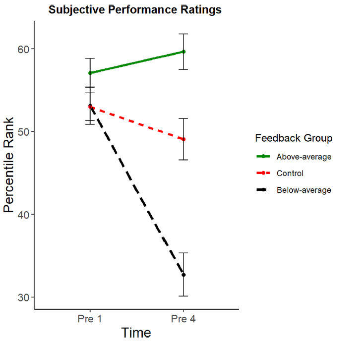
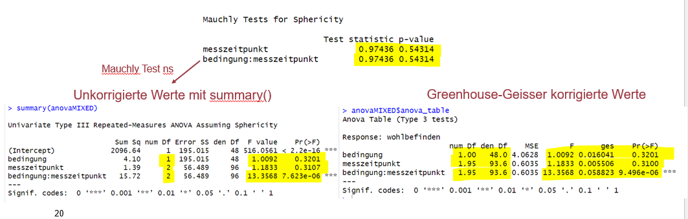

```{r, echo = FALSE, message=FALSE, warning=FALSE}

options(scipen = 999)
library(tidyverse)
library(palmerpenguins)
library(apaTables)
library(car)
library(afex)
library(emmeans)
library(effectsize)

penguins <- drop_na(palmerpenguins::penguins)

bfi_10_data <- read_delim("raw/bfi_10_data.csv", delim = ";", escape_double = FALSE, trim_ws = TRUE)

dat_full <- read_csv("raw/dat_full.csv")

dat_full_long <- dat_full |>
      pivot_longer(
        cols = c(pre1, pre4),
        names_to = "time_rating",
        values_to = "rating"
      )

dat_full$group_all <- as.factor(dat_full$group_all)

dat_full <- dat_full |>
  mutate(pre1 = pre1*10,
         pre2 = pre2*10,
         pre3 = pre3*10,
         pre4 = pre4*10)
```

## R u Ready? Reproduzierbare Datenaufbereitung und -analyse mit R

FS 2026<br><br><br> **LV-Leitung**: PD Dr. Sandra Grinschgl / MSc. Laura Hirt<br> **Tutor**: BSc. Lars Schilling<br><br><br>**13. Einheit**, 20.05.2026

------------------------------------------------------------------------

## Heute:

::: {style="width:100%; height:80vh; background:#777; padding:20px; box-sizing:border-box; border-radius:10px; overflow:auto; "}
```{=html}
<embed
    src="../../PDFs/Syllabus.pdf#view=FitH&navpanes=0&toolbar=0"
    type="application/pdf"
    style="width:100%; height:220vh; border:0; display:block; background:white;"
  >
```
:::

------------------------------------------------------------------------

## Inhalte heute

<br>

-   Fragen zur Abschlussarbeit

-   Gruppe Sandra: WH Regressionen & t-Tests

-   **Inferenzstatistik: ANOVA**

    -   Von t-Tests zu ANOVAs

    -   One-Way ANOVA und Mixed ANOVA

    -   ANOVA-Output, Effektstärken und Post-hoc-Tests

    -   Voraussetzungen, Verletzungen und Alternativen

------------------------------------------------------------------------

## Von t-Tests zu ANOVAs

<br>

**Kernidee:**

-   Ein t-Test vergleicht Mittelwerte zwischen zwei Gruppen.

-   Eine ANOVA erweitert diese Idee auf Designs mit:

    -   mehr als zwei Gruppen

    -   mehr als einem Faktor

    -   Messwiederholungen

    -   Kombinationen aus Between- und Within-Subject-Faktoren

<br>

**Beispiel:**

Statt nur zu fragen: Unterscheidet sich Gruppe A von Gruppe B?...

... fragen wir bei einer ANOVA: Unterscheiden sich die Mittelwerte zwischen drei oder mehr Gruppen?

------------------------------------------------------------------------

## ANOVA - Analysis of Variance (1)

<br>

Die ANOVA testet, ob sich **Mittelwerte zwischen Gruppen oder Bedingungen** systematisch unterscheiden.

Dabei wird vereinfacht gefragt: Ist die Variation zwischen Gruppen grösser als die Variation innerhalb der Gruppen?

<br>

**Grundidee**

-   Gruppen unterscheiden sich stark voneinander\
    → spricht gegen H₀

-   Werte innerhalb der Gruppen streuen stark\
    → Unterschied wird unsicherer

-   Der **F-Wert** setzt diese beiden Informationen ins Verhältnis

------------------------------------------------------------------------

## ANOVA - Analysis of Variance (2)

<br>

**Nullhypothese**

Alle Gruppenmittelwerte stammen aus Populationen mit gleichem Mittelwert.

H0: μ1=μ2=μ3

<br>​

**Alternativhypothese**

Mindestens ein Mittelwert unterscheidet sich von mindestens einem anderen.

------------------------------------------------------------------------

## Welche ANOVA bei welchem Design?

<br>

| Design | Fragestellung | Beispiel |
|------------------------|------------------------|------------------------|
| **One-Way ANOVA** | Ein Faktor mit mehreren Gruppen | Unterscheiden sich drei Feedbackgruppen? |
| Mehrfaktorielle ANOVA | Zwei oder mehr Faktoren (UVs) | Gibt es Effekte von Feedbackgruppe und Geschlecht? |
| **Mixed ANOVA** | Kombination aus Within-Subject- und Between-Subject-Faktoren | Verändert sich ein Rating über die Zeit je nach Feedbackgruppe? |
| MANOVA | Mehrere abhängige Variablen | Gruppenunterschiede in allen drei Cognitive Offloading Variablen |
| ANCOVA | Gruppenvergleich mit Kovariate | Gruppenvergleich im Offloading-Verhalten unter Kontrolle von Performance Rating |

<br>

------------------------------------------------------------------------

## Voraussetzungen der ANOVA

<br>

Damit die Ergebnisse einer klassischen ANOVA sinnvoll interpretierbar sind, sollten bestimmte Voraussetzungen ungefähr erfüllt sein:

-   **Unabhängigkeit der Beobachtungen**\
    Messwerte verschiedener Personen sollten unabhängig voneinander sein.

-   **Normalverteilung der abhängigen Variable(n)**\
    Besonders relevant bei kleinen Stichproben. (z.B. Schiefe und Kurtosis anschauen)

-   **Varianzhomogenität**\
    Die Streuung sollte in den Gruppen ähnlich gross sein.\
    → Prüfung z.B. mit dem **Levene-Test** (wie bei t-Test)

-   **Sphärizität bei Messwiederholungen**\
    Relevant bei Within-Subject-Faktoren mit mindestens drei Stufen.\
    → Prüfung z. B. mit dem **Mauchly-Test** (wird automatisch durchgeführt bei entsprechendem Design)

::: notes
Sphärizität (auch *Zirkularität*) ist eine zusätzliche Annahme, die bei statistischen Verfahren mit Messwiederholung gemacht werden muss. Ist Sphärizität gegeben, so sind die [Varianzen](#0) der Differenzen aller Messpaare (daher aller Stufen der unabhängigen Variablen) der Messungen gleich, ähnlich [Homoskedastizität](#0). Sphärizität kann gemessen werden, wenn drei oder mehr Stufen der unabhängigen Variablen existieren.
:::

------------------------------------------------------------------------

## One-Way ANOVA: Beispiel

<br>

**Fragestellung**

Unterscheiden sich die drei Feedbackgruppen darin, wie häufig sie im PCT das Modellfenster öffnen?

<br>

**Abhängige Variable:** `mean_rl_all`\
= durchschnittliche Anzahl der Modellfenster-Öffnungen über 20 Testdurchgänge

**Unabhängige Variable:** `group_all`\
= Feedbackgruppe (`below`, `control`, `above`)

<br>​

Die ANOVA prüft zunächst nur:

**Gibt es irgendwo einen Mittelwertsunterschied zwischen den Gruppen?**

→ Welche Gruppen sich genau unterscheiden, wird erst mit **Post-hoc-Tests** geprüft.

------------------------------------------------------------------------

## One-Way ANOVA mit `afex`

<br>

1.  **Vorbereitung: Varianzhomogenität prüfen mit Levene-Test**

```{r, echo=TRUE, eval=TRUE}
leveneTest(mean_rl_all ~ group_all, data = dat_full)
```

→ Levene-Test nicht signifikant; keinen Hinweis auf verletzte Varianzhomogenität.

<br>

2.  **ANOVA berechnen**

```{r, echo=TRUE}
model_1 <- aov_4(mean_rl_all ~ group_all + (1 | code),
                 data = dat_full
)
```

**Fixed Effekt:** `group_all`

→ Dieser Effekt interessiert uns

**Random Intercept:** `(1 | code)`

→ Irrelevant bei One-Way ANOVA, wird aber von der Funktion `afex` verlangt.

:::: notes
::: notes
Der Random Intercept (1 \| code) ist bei einer einfaktoriellen One-Way ANOVA irrelevant, weil jede Person nur einen einzigen Messwert für die AV hat. Die Personenvariabilität wird vom Residuum aufgefangen. Wäre nur relevant bei multilevel strukturen oder messwiederholungen. AFEX ist aber für mixed designs gebaut, und verangt deshalb einen random Intercept obwohl dieser keinemn effekt hat.
:::
::::

------------------------------------------------------------------------

## Output One-Way ANOVA interpretieren

<br>

```{r, echo=TRUE}
model_1 <- aov_4(mean_rl_all ~ group_all + (1 | code),
                 data = dat_full
)

summary(model_1)
```

-   `num Df`, `den Df` = Freiheitsgrade

-   `F` = Teststatistik

-   `Pr(>F)` = p-Wert

-   `ges` = Effektstärke

**Interpretation**

→ Es gibt keinen Hinweis darauf, dass sich die Feedbackgruppen in der durchschnittlichen Anzahl an Modellfenster-Öffnungen unterscheiden.

→ Deswegen werden auch keine Post-hoc-Tests durchgeführt!

------------------------------------------------------------------------

## Gleiche ANOVA, andere Packages

<br>

Eine One-Way ANOVA kann in R mit verschiedenen Funktionen berechnet werden.

**Base R**

```{r, echo=TRUE}
model_aov <- aov(mean_rl_all ~ group_all, data = dat_full)
summary(model_aov)
```

<br>

**aov_ez**

```{r, echo=TRUE}
model_aov_ez <- aov_ez(
  id = "code",
  dv = "mean_rl_all",
  between = "group_all",
  data = dat_full
)

summary(model_aov_ez)
```

::: notes
**Wichtig**

Die Ausgabe sieht unterschiedlich aus, aber die zentralen Ergebnisse sind gleich:

-   gleicher F-Wert

-   gleicher p-Wert

-   gleiche inhaltliche Schlussfolgerung

    Wir empfehlen euch `afex` zu verwenden, da dies bei uns auch in Statistik zu unterrichtet wird.
:::

------------------------------------------------------------------------

## Effektstärken bei ANOVAs

<br>

**Ein signifikanter *p*-Wert sagt nur:** Unter H₀ wäre ein solches Ergebnis unwahrscheinlich.

<br>

Er sagt aber nicht, wie gross oder relevant der Effekt ist!

Dafür brauchen wir **Effektstärken**.

<br>

Bei ANOVAs werden häufig Varianten von η2 berichtet.

<br>

**Grundidee**

$$
\eta^2 = \frac{\text{erklärte Varianz}}{\text{gesamte Varianz}}
$$

**Inhaltliche Frage**

Wie viel Varianz in der abhängigen Variable wird durch den Faktor erklärt?

------------------------------------------------------------------------

## Generalisiertes und partielles η²

<br>

Beide Masse beschreiben den Anteil erklärter Varianz, unterscheiden sich aber darin, welche Varianz als Vergleichsbasis verwendet wird.

**Generalisiertes η² (`ges`)**

-   berücksichtigt die gesamte relevante Varianz im Modell

-   ist dadurch oft konservativer / kleiner

-   gut vergleichbar über verschiedene Designs hinweg

→ Wie gross ist der Effekt im Verhältnis zur gesamten Modellvarianz?

<br>

**Partielles η² (`pes`)**

-   bezieht den Effekt nur auf die Varianz, die für diesen Effekt noch „übrig“ ist

-   fällt deshalb häufig grösser aus

→ Wie gross ist der Effekt, wenn andere Effekte herausgerechnet werden?

------------------------------------------------------------------------

## Effektstärken in R berechnen

<br>

Mit dem Package `effectsize` können Effektstärken direkt aus dem Modell berechnet werden.

<br>

**Generalisiertes η²**

```{r}
eta_squared(model_1, generalized = TRUE)
```

→ Die Gruppenzugehörigkeit erklärt ungefähr 1% der Varianz in der durchschnittlichen Anzahl an Modellfenster-Öffnungen.

<br>

**Partielles η²**

```{r}
eta_squared(model_1, partial = TRUE)
```

------------------------------------------------------------------------

## Mixed ANOVA: Gruppenvergleiche über die Zeit

<br>

**AV** = Rating der erwarteten Leistung

**Between Subjects Faktor** = Feedbackgruppe (`below` vs. `control` vs. `above`)

**Within Subjects Faktor:** Messzeitpunkt (Messwiederholter Faktor, `pre 1` vs. `pre 4`)

→ **Zentrale Frage:** Gibt es eine Interaktion zwischen Feedbackgruppe und Messzeitpunkt?

{fig-align="center"}

------------------------------------------------------------------------

## Mixed ANOVA mit `afex`

<br>

Für eine Mixed ANOVA brauchen wir die Daten im **Long Format**.

<br>

**Modellstruktur**

```{r, echo=TRUE}
mixed_anova <- aov_4(
  rating ~ group_all + (time_rating | code),
  data = dat_full_long
)
```

-   `rating` = AV

-   `group_all` = Between-Subject-Faktor

-   `time_rating` = Within-Subject-Faktor

-   `code` = Personen-ID

**Wichtig**

Der Within-Subject-Faktor steht innerhalb der Klammer mit der Personen-ID:

```{r, echo=TRUE, eval=FALSE}
(time_rating | code)
```

Das zeigt: Jede Person hat mehrere Messwerte über die Zeit.

------------------------------------------------------------------------

## Mixed ANOVA: Drei zentrale Effekte

<br>

Eine 2 × 3 Mixed ANOVA liefert typischerweise drei Effekte:

**1. Haupteffekt Gruppe**

Unterscheiden sich die Feedbackgruppen insgesamt (gemittelt über die verschiedenen Zeitpunkte) voneinander?

```{r, echo=TRUE, eval=FALSE}
group_all
```

<br>

**2. Haupteffekt Zeit**

Verändern sich die Ratings insgesamt (gemittelt über die verschiedenen Gruppen) von pre 1 zu pre 4?

```{r, echo=TRUE, eval=FALSE}
time_rating
```

<br>

**3. Interaktion Gruppe × Zeit**

Verändert sich das Rating über die Zeit unterschiedlich je nach Feedbackgruppe?

```{r, echo=TRUE, eval=FALSE}
group_all:time_rating
```

→ Die Interaktion ist zentral, weil sie zeigt, ob sich die Veränderung der Ratings je nach Feedbackgruppe unterscheidet.

------------------------------------------------------------------------

## Mixed ANOVA: Output interpretieren

```{r, echo=TRUE, eval=TRUE}
mixed_anova <- aov_4(
  rating ~ group_all + (time_rating | code),
  data = dat_full_long
)

summary(mixed_anova)
```

**Interpretation**

-   Die Feedbackgruppen unterscheiden sich insgesamt.

-   Die Ratings verändern sich insgesamt über die Zeit.

-   Die Veränderung über die Zeit hängt von der Feedbackgruppe ab.

→ Die Feedbackgruppen entwickeln sich zwischen pre 1 und pre 4 unterschiedlich.

------------------------------------------------------------------------

## Mixed ANOVA: mit Effektstärken

<br>

**Gleiche Ergebnisse, zusätzlich Effektstärken**

```{r, echo=TRUE}
mixed_anova$anova_table
```

<br>

→ Das generalisierte η² zeigt, dass die Interaktion einen relevanten Anteil der Varianz erklärt.

------------------------------------------------------------------------

## Vergleich mit @grinschgl2021

<br>

Im Paper wurde nur das **reine** **η2** berichtet.

Dieses wurde mit `eta_squared()` aus dem Package `effectsize` berechnet:

```{r}
eta_squared(mixed_anova, partial = FALSE)
```

<br>

**Bericht im Paper**

We observed a main effect of the factor **“feedback group”, F(2, 156) = 19.74, p \< 0.001, η2 = 0.12**, as well as a main effect of the factor “time of pre-rating”, **F(1, 156) = 22.67, p \< 0.001, η2 = 0.04**. Most importantly, we also found a significant interaction between these factors, **F(2, 156) = 20.09, p \< 0.001, η2 = 0.07**.

→ Die Ergebnisse aus unserer Analyse entsprechen inhaltlich den berichteten Ergebnissen im Paper.

------------------------------------------------------------------------

## Post-hoc-Tests: Welche Gruppen unterscheiden sich?

<br>

Eine ANOVA mit mehr als zwei Gruppen beantwortet zuerst nur die globale Frage:

→ Gibt es irgendwo einen Unterschied zwischen den Gruppen?

→ Um bei einem signifikanten Ergebnis zu prüfen, welche Gruppen sich konkret voneinander zu unterscheiden, brauchen wir **Post-hoc-Tests** oder geplante Kontraste.

<br>

**Wichtig:** Je mehr Tests berechnet werden, desto höher wird das Risiko für falsch-positive Ergebnisse.

→ Deshalb sollte man sich überlegen, ob p-Werte für multiples Testen korrigiert werden sollen.

------------------------------------------------------------------------

## Post-hoc-Tests: Zwei Möglichkeiten (1)

<br>

Ihr könnt grundsätzlich wählen zwischen:

<br>

**Möglichkeit 1: Klassische t-Tests**

-   Einzelne Paarvergleiche wie im Paper und in EH 12

-   Effektstärken müssen über eine extra Funktion (`cohen.d`) berechnet werden

-   Korrektur für multiples Testen muss bewusst festgelegt werden

------------------------------------------------------------------------

## Post-hoc-Tests: Zwei Möglichkeiten (2)

<br>

**Möglichkeit 2: Modellbasierte Vergleiche mit `pairs()`**

```{r, echo=TRUE}
pairs(emmeans(model_1, ~ group_all))
```

<br>

-   basiert direkt auf dem ANOVA-Modell

-   berechnet alle Paarvergleiche gleichzeitig

-   korrigiert p-Werte automatisch, hier mit **Tukey-Korrektur**

-   praktisch und schnell, aber ohne Effektstärken, diese müssen wieder extra berechnet werden

<br>

**Optimal**

Vorab festlegen, welche Post-hoc-Tests berechnet werden und wie für multiples Testen korrigiert wird.

------------------------------------------------------------------------

## Mixed ANOVA: Post-hoc-Tests

<br>

In der Mixed ANOVA haben wir drei Effekte getestet:

1.  den Haupteffekt von `group_all` (Between-Subject)

2.  den Haupteffekt von `time_rating` (Within-Subject)

3.  die Interaktion `group_all:time_rating`

<br>

Die ANOVA sagt uns zunächst aber nur, **dass** sich die zeitliche Veränderung zwischen den Gruppen unterscheidet. Sie sagt uns aber noch nicht genau, **welche Gruppen sich unterscheiden** oder **wo** diese Unterschiede auftreten.

<br>

→ Dafür benötigen wir Post-hoc-Analysen bzw. geplante Kontraste.

------------------------------------------------------------------------

## Mixed ANOVA: Drei mögliche Post-hoc-Fragen

<br>

Bei unserer 2x3 Mixed ANOVA können wir mindestens drei verschiedene Fragen stellen:

| Frage | Vergleich |
|------------------------------------|------------------------------------|
| Unterscheiden sich die Gruppen innerhalb eines Zeitpunkts? | Gruppenvergleiche bei `pre1` und bei `pre4` |
| Verändert sich jede Gruppe über die Zeit? | `pre1` vs. `pre4` innerhalb jeder Gruppe |
| **Zusatz:** Unterscheiden sich die Veränderungen zwischen den Gruppen? | Veränderungsscores zwischen den Gruppen vergleichen |

------------------------------------------------------------------------

## Vorbereitung mit `emmeans()`

<br>

Zuerst berechnen wir die **geschätzten margninalen Mittelwerte** für jede Kombination aus Messzeitpunkt und Feedbackgruppe.

```{r,echo=TRUE, eval=TRUE}
results <- emmeans(
  object = mixed_anova,
  specs = ~ time_rating * group_all
)
```

<br>

`emmeans()` nimmt unser fertiges ANOVA-Modell und berechnet daraus die modellbasierten Mittelwerte für alle Kombinationen.

Im nächsten Schritt vergleichen wir diese Mittelwerte paarweise, um herauszufinden, **wo** die Unterschiede liegen.

------------------------------------------------------------------------

## Möglichkeit 1: Gruppenunterschiede innerhalb jedes Zeitpunkts

<br>

Damit werden folgende Fragen beantwortet:

-   Unterscheiden sich die Feedbackgruppen bei `pre1`?

-   Unterscheiden sich die Feedbackgruppen bei `pre4`?

```{r, echo=TRUE, eval=TRUE}
pairs(
  results,
  simple = "group_all",
  adjust = "bonferroni"
)
```

→ Es werden also Gruppenvergleiche getrennt pro Messzeitpunkt berechnet.

------------------------------------------------------------------------

## Bezug zu @grinschgl2021

<br>

@grinschgl2021 haben nach der 2x3 Mixed ANOVA genau diese Logik verwendet:

Sie haben **Post-hoc *t*-Tests für unabhängige Stichproben zwischen den Feedbackgruppen** berechnet.

Dies wurde getrennt für die beiden Messzeitpunkte gemacht:

-   `pre1`: keine signifikanten Gruppenunterschiede

-   `pre4`: alle Gruppen unterschieden sich signifikant voneinander

<br>

**Wichtig:** `simple = "group_all"` testet nicht direkt die Interaktion!

------------------------------------------------------------------------

## Möglichkeit 2: Zeitunterschiede innerhalb jeder Gruppe (1)

<br>

Damit werden folgende Fragen beantwortet:

-   Verändert sich jede Gruppe von `pre1` zu `pre4`?

→ Es werden also Zeitvergleiche getrennt für jede Feedbackgruppe berechnet.

```{r, echo=TRUE, eval=TRUE}
pairs(
  results,
  simple = "time_rating",
  adjust = "bonferroni"
)
```

------------------------------------------------------------------------

## Möglichkeit 2: Zeitunterschiede innerhalb jeder Gruppe (2)

<br>

**Vorsicht bei der Interpretation**

Angenommen:

-   Gruppe A verändert sich signifikant.

-   Gruppe B verändert sich nicht signifikant.

→ Daraus darf man **nicht automatisch** schliessen, dass sich Gruppe A signifikant stärker verändert als Gruppe B.

→ Wir haben damit noch keinen direkten Vergleich der Veränderung zwischen den Gruppen durchgeführt!

------------------------------------------------------------------------

## Zusatz: Möglichkeit 3: Direkter Vergleich der Veränderungen (1)

<br>

Die direkteste Frage zur Interaktion lautet:

**Unterschieden sich die Gruppen in ihrer Veränderung von `pre1` zu `pre4`?**

<br>

Dafür brauchen wir zuerst pro Gruppe die Veränderung:

```{r, echo=TRUE, eval=TRUE}
emm_time_by_group <- emmeans(
  object = mixed_anova,
  specs = ~ time_rating | group_all
)
```

Dies berechnet die geschätzten Mittelwerte für `time_rating`, getrennt nach `group_all`.

------------------------------------------------------------------------

## Zusatz: Möglichkeit 3: Direkter Vergleich der Veränderungen (2)

<br>

Nun berechnen wir die Veränderung von `pre1` zu `pre4` innerhalb jeder Gruppe:

```{r, echo=TRUE, eval=TRUE}
change_by_group <- contrast(
  emm_time_by_group,
  method = "revpairwise"
)

change_by_group
```

Dies sagt uns nun also, wie stark sich jede Gruppe verändert, aber noch nicht, ob sich diese Veränderungen signifikant voneinander unterscheiden.

------------------------------------------------------------------------

## Zusatz: Möglichkeit 3: Direkter Vergleich der Veränderungen (3)

<br>

Im letzten Schritt vergleichen wir die Veränderungswerte zwischen den Gruppen:

```{r, echo=TRUE, eval=TRUE}
pairs(
  change_by_group,
  by = NULL,
  adjust = "bonferroni"
)
```

Mit `by = NULL` sagen wir, dass die Veränderungskontraste zwischen den Gruppen verglichen werden sollen.

------------------------------------------------------------------------

## Voraussetzungen und Alternativen (1)

<br>

**Was tun bei verletzten Voraussetzungen?**

ANOVAs sind teilweise robust, aber Verletzungen sollten nicht ignoriert werden.

<br>

**Normalverteilung (One-Way ANOVA)**

Bei starken Verletzungen,

-   robuste Verfahren nutzen, z.B.

    Kruskal-Wallis-Test bei One-Way Designs als einfache Alternative

<br>

**Varianzhomogenität**

Bei ungleichen Varianzen:

-   Welch-ANOVA statt klassischer One-Way ANOVA

------------------------------------------------------------------------

## Voraussetzungen und Alternativen (2)

<br>

**Messwiederholung / Sphärizität**

Bei Verletzung der Sphärizität (mind. drei Within-Stufen):

-   Greenhouse-Geisser-korrigierte Werte interpretieren

-   robuste ANOVA-Verfahren prüfen (`WRS2` Paket)

-   Multilevel-Modell als flexiblere Alternative (mit `lme4`)

<br>

Bei @grinschgl2021 wurde dies aber ausser Acht gelassen. Auf jeden Fall sollte man sich im Vorfeld der Datenerhebung überlegen, ob und wie man Voraussetzungen überprüft und wie man bei potenziellen Verletzungen vorgeht.

------------------------------------------------------------------------

## Sphärizität bei Messwiederholungen (1)

<br>

**In R mit `afex`:**

-   `summary(model)` zeigt zunächst die unkorrigierten Werte

-   `model$anova_table` enthält die korrigierten Werte

<br>

{fig-align="center"}

::: notes
Sphärizität in der Statistik ist eine Annahme für Varianzanalysen mit Messwiederholung (Repeated Measures ANOVA) und bedeutet, dass die Varianzen der Differenzen zwischen allen Paaren von Messzeitpunkten gleich sind, was eine Art „Homogenität der Differenzen“ darstellt. Bei zwei Zeitpunkten gibt es nur eine differenz, also muss sphärizität gegeben sein (weil es keine zweite oder dritte differenz gibt mit der man vergleichen könnte).

Greenhouse–Geisser verkleinert die Freiheitsgrade, um p-Werte zu korrigieren, wenn Sphärizität verletzt ist.\
Je stärker die Verletzung, desto konservativer die Korrektur.
:::

------------------------------------------------------------------------

## Heute haben wir gelernt...:

-   ANOVAs erweitern t-Tests auf Designs mit mehr als 2 Gruppen oder Faktoren.

-   Eine ANOVA prüft, ob sich Gruppenmittelwerte unterscheiden.

-   Post-hoc-Tests zeigen, welche Gruppen genau sich unterscheiden.

------------------------------------------------------------------------

## Bis nächste Woche:

-   **Muddiest Points 3**

    -   Bis am Sonntag, 24.05.

    -   ILIAS Ordner Sitzung 13

-   **Abgabe R-Hausübung 3**

    -   Bis nächsten Mittwoch, 27.05.

------------------------------------------------------------------------
