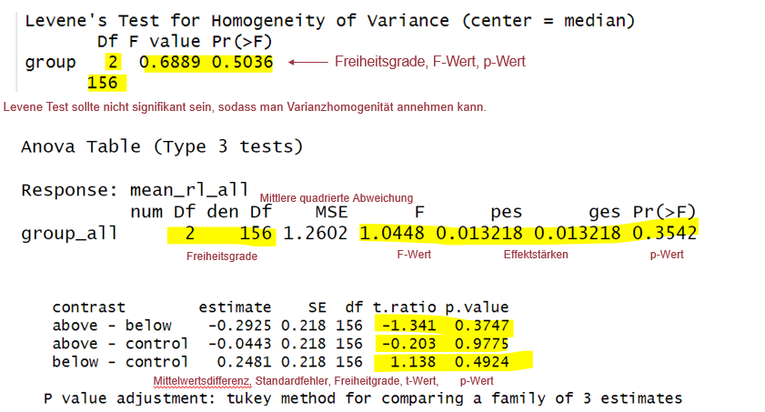
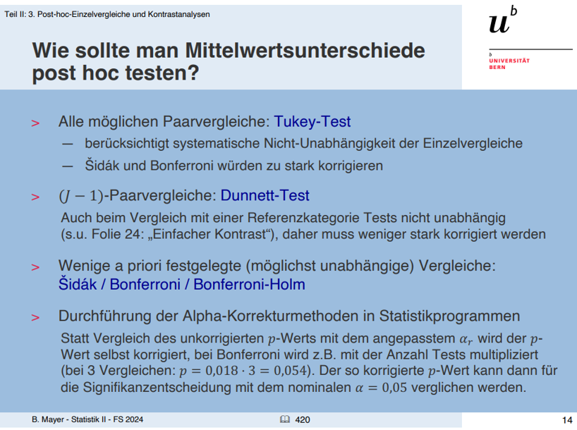
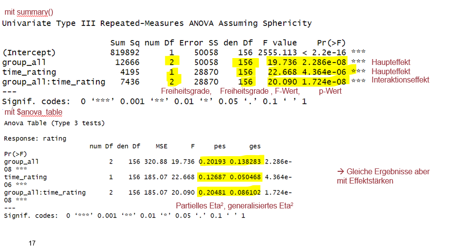

```{r, echo = FALSE, message=FALSE, warning=FALSE}


options(scipen = 999)
library(tidyverse)
library(palmerpenguins)
library(apaTables)
library(car)
library(afex)
library(emmeans)

library(effectsize)


penguins <- drop_na(palmerpenguins::penguins)


bfi_10_data <- read_delim("raw/bfi_10_data.csv", delim = ";", escape_double = FALSE, trim_ws = TRUE)

dat_full <- read_csv("raw/dat_full.csv")

dat_full_long <- dat_full |>
      pivot_longer(
        cols = c(pre1, pre4),
        names_to = "time_rating",
        values_to = "rating"
      )


dat_full$group_all <- as.factor(dat_full$group_all)

dat_full <- dat_full |>
  mutate(pre1 = pre1*10,
         pre2 = pre2*10,
         pre3 = pre3*10,
         pre4 = pre4*10)
```

## R u Ready? Reproduzierbare Datenaufbereitung und -analyse mit R

FS 2026<br><br><br> **LV-Leitung**: Dr. Sandra Grinschgl / MSc. Laura Hirt<br> **Tutor**: BSc. Lars Schilling<br><br><br>**13. Einheit**, 20.05.2026

------------------------------------------------------------------------

## Heute:

```{=html}
<embed 
  src="../../PDFs/Syllabus.pdf" 
  type="application/pdf"
  style="width:100%; height:90vh;"
>
```

------------------------------------------------------------------------

## ANOVA - Analysis of Variance

Testet, ob sich Mittelwerte in mehreren Gruppen unterscheiden

**Verschiedene Arten**

-   **One-Way ANOVA (einfaktoriell):**\
    Ein Faktor (eine UV) mit mehr als zwei Stufen.

-   **Mehrfaktorielle ANOVA:**\
    Zwei oder mehr Faktoren (UVs).

-   **Mixed ANOVA:**\
    Kombination aus Within-Subject-Faktoren (Messwiederholung) und Between-Subject-Faktoren.

-   **Multivariate ANOVA (MANOVA):**\
    Mindestens zwei abhängige Variablen.

-   **ANCOVA:**\
    Kontrolle für eine zusätzliche Drittvariable (Kovariate).

------------------------------------------------------------------------

## Voraussetzungen

-   **Normalverteilung der abhängigen Variablen**
-   **Varianzhomogenität (Levene-Test)**
-   **Sphärizität (Mauchly Test) bei Mixed ANOVA**

------------------------------------------------------------------------

## Einfaktorielle ANOVA

**Unterscheiden sich die Mittelwerte der drei Gruppen voneinander?**

**AV**: `mean_rl_all`

**Fixed Effekt:** `group_all` 👉 Dieser Effekt interessiert uns

**Random Intercept:** `(1 | code)` 👉 Irrelevant bei One-Way ANOVA wird aber von der Funktion `afex` verlangt.

<br>

```{r, echo = TRUE}
leveneTest(mean_rl_all ~ group_all, data = dat_full)

```

```{r, echo= TRUE, eval = TRUE}
model_1 <- aov_4(mean_rl_all ~ group_all + (1 | code), data = dat_full)
```

::: notes
Der Random Intercept (1 \| code) ist bei einer einfaktoriellen One-Way ANOVA irrelevant, weil jede Person nur einen einzigen Messwert fuer die AV hat. Die Personenvariabilität wird vom Residuum aufgefangen. Wäre nur relevant bei multilevel strukturen oder messwiederholungen. AFEX ist aber für mixed designs gebaut, und verangt deshalb einen random Intercept obwohl dieser keinemn effekt hat.
:::

------------------------------------------------------------------------

## Output One-Way ANOVA (Beispiel)

```{r, echo= TRUE,, eval=FALSE}
model_1 <- aov_4(mean_rl_all ~ group_all + (1 | code), data = dat_full)

summary(model_1)
```

{fig-align="center"}

------------------------------------------------------------------------

## ANOVA: Different Package - same result

**BASE-R**

<br>

```{r, echo=TRUE}

model_aov <- aov(mean_rl_all ~ group_all, data = dat_full)
summary(model_aov)
```

<br>

**aov_ez**

```{r, echo=TRUE}

model_aov_ez <- aov_ez(
  id = "code",
  dv = "mean_rl_all",
  between = "group_all",
  data = dat_full
)

summary(model_aov_ez)


```

------------------------------------------------------------------------

## ANOVA: Effektstärken

generalisiertes **`η2`** & partielles **`η2`** - Wie viel Varianz wird durch die Gruppenzugehörigkeit erklärt?

```{r, echo=TRUE}

eta_squared(model_1, generalized = TRUE)

eta_squared(model_1, partial = TRUE)

```

------------------------------------------------------------------------

## Unterschiede generalisiertes und partielles η²

<br>

-   Das generalisierte und `partielle` `η²`sind beides Masse, welche den **Anteil an erklärter Varianz** einer **abhängigen Variable** angeben.

<br>

-   Das `generalisierte η²` berechnet den Anteil der erklärten Varianz einer abhängigen Variable unter **Einbezug der gesamten Varianz, also aller Effekte.**

<br>

-   Das `partielle η²` beachtet bei der Berechnung des Anteils an erklärter Varianz für die **abhängige Variable nicht die gesamte Varianz**, sondern nur jene, welche dem **zuvor definierten Effekt** zugeschrieben werden kann.

::: notes
> **Partielles Eta-Quadrat:** Wie gross ist der Effekt dieses Faktors, wenn ich alle anderen Einfluessen ignoriere? Wenn eine Kovariate hinzugefuegt wird und weitere Varianz erklaert, vergroessert sich das partielle Eta-Quadrat tendenziell, da der verbleibende Fehleranteil kleiner wird.
>
> **Generalisertes Eta-Quadrat:** Wie gross ist der Effekt im gesamten Datensatz, also unter Beruecksichtigung aller anderen Quellen der Varianz?
:::

------------------------------------------------------------------------

## Post-Hoc t-Tests mit `pairs`

**Verschiedene Möglichkeiten**

-   Klassische t-Tests, wie im Paper und in EH 12

<br>

-   Schneller mit `pairs()`, womit alle möglichen Vergleiche simultan berechnet werden (aber ohne Effektstärken) –\> Ergänzung für Fortgeschrittene im Hands-On!

<br>

```{r, echo=FALSE, eval = TRUE}
posthoc_tests <- emmeans(object = model_1, specs = ~ group_all)
pairs(posthoc_tests)
```

-   Optimalerweise: Präregistrieren, welche Post-Hoc-Tests berechnet werden und wie diese korrigiert werden sollen

------------------------------------------------------------------------

## Korrektur für multiples Testen:

{fig-align="center"}

------------------------------------------------------------------------

## Reminder 2x3 ANOVA

**AV** = Rating

**Between Subjects Faktor** = Feedbackgruppe (`below` vs. `control` vs. `above`)

**Within Subjects Faktor:** Messzeitpunkt (Messwiederholter Faktor, `pre 1` vs. `pre 4`)

{fig-align="center"}

------------------------------------------------------------------------

## 2x3 mixed ANOVA: Vorbereitungen

***Mixed-ANOVA mit `afex`***

<br>

**AV** = Rating

<br>

**Between Subjects Faktor** = Feedbackgruppe (`below` vs. `control` vs. `above`)

<br>

**Within Subjects Faktor:** Messzeitpunkt (Messwiederholter Faktor, `pre 1` vs. `pre 4`)

👉 Long Datensatz

***Muster:***

```{r, echo = TRUE, eval=FALSE}
mixed_anova <- aov_4(AV ~ between_factor + (messwiederholter_faktor | ID) data = dat_full_long)
```

------------------------------------------------------------------------

## Beispielhafter Output mit **η2**

```{r, echo=TRUE, eval = TRUE}
mixed_anova <- aov_4(rating ~ group_all + (time_rating | code), data = dat_full_long, anova_table = list(es = c("ges" ,"pes")))


summary(mixed_anova)
mixed_anova$anova_table
```

------------------------------------------------------------------------

```{r, echo=TRUE, eval = FALSE}
mixed_anova <- aov_4(rating ~ group_all + (time_rating | code), data = dat_full_long, anova_table = list(es = c("ges" ,"pes")))


summary(mixed_anova)
mixed_anova$anova_table
```

{fig-align="center"}

------------------------------------------------------------------------

## Vergleich mit @grinschgl2021

Im Paper wurde nur das reine **η2 berichtet. Berechnet mit `eta_squared()`** aus dem Package `effectsize`.

```{r, echo=FALSE}

eta_squared(mixed_anova, partial = FALSE)
```

<br>

We observed a main effect of the factor **“feedback group”, F(2, 156) = 19.74, p \< 0.001, η2 = 0.12**, as well as a main effect of the factor “time of pre-rating”, **F(1, 156) = 22.67, p \< 0.001, η2 = 0.04**. Most importantly, we also found a significant interaction between these factors, **F(2, 156) = 20.09, p \< 0.001, η2 = 0.07**.

------------------------------------------------------------------------

## Verletzungen der Voraussetzungen in ANOVAs

**Normalverteilung (one-way ANOVA)**

-   `Kruskal-Wallis-Test` –\> Besonders robust gegen Verletzungen der Normalverteilungsannahme

**Varianzhomogenität**

-   Einfaktoriell: `Welch-ANOVA`

**Mixed ANOVA**

-   Relativ robust gegenüber Verletzungen der Normalverteilung

<!-- -->

-   Robuste ANOVA mit `WRS2` Paket

-   Multilevel Model mit `lme4`

Bei @grinschgl2021 wurde dies aber außer Acht gelassen. Auf jeden Fall sollte man sich im Vorfeld der Datenerhebung überlegen ob und wie man Voraussetzungen überprüft und wie man bei potenziellen Verletzungen vorgeht.

------------------------------------------------------------------------

## Verletzung Sphärizität

**Beispiel aus den Daten Hausübung:**

-   Der **Mauchly-Test** ist relevant bei mindestens **drei Within-Faktoren** (z.B bei der Hausübung) .

-   Sollte nicht signifikant sein, sodass wir **Sphärizität** annehmen können (ähnlich zum Levene Test).

-   Der Test wird automatisch ausgegeben. Wenn nicht signifikant ist Sphärizität gegeben, asonsten muss korrigiert werden. 👉 Werte nach **Greenhouse-Geisser-Korrektu**r interpretieren.

    -   Diese werden mit model\$anova_table automatisch ausgegeben. Mit `summary()` bekommt man in der ersten Tabelle die unkorrigierten Werte. Beispiel:

{fig-align="center"}

::: notes
Sphärizität in der Statistik ist eine Annahme für Varianzanalysen mit Messwiederholung (Repeated Measures ANOVA) und bedeutet, dass die Varianzen der Differenzen zwischen allen Paaren von Messzeitpunkten gleich sind, was eine Art „Homogenität der Differenzen“ darstellt. Bei zwei Zeitpunkten gibt es nur eine differenz, also muss sphärizität gegeben sein (weil es keine zweite oder dritte differenz gibt mit der man vergleichen könnte).

Greenhouse–Geisser verkleinert die Freiheitsgrade, um p-Werte zu korrigieren, wenn Sphärizität verletzt ist.\
Je stärker die Verletzung, desto konservativer die Korrektur.
:::

------------------------------------------------------------------------

## Heute haben wir:

-   ANOVAs kennengelernt

-   Post-hoc Tests und Effektstärken berechnet

-   Vorausetzungsprüfungen und Alternativen angeschaut

------------------------------------------------------------------------

## Bis nächste Woche:

-   **Muddiest Points!!** Bis Sonntag! siehe Ilias EH 13

-   **Hausübung** bis Freitag **und Peerfeedback** bis Mittwoch**!**
