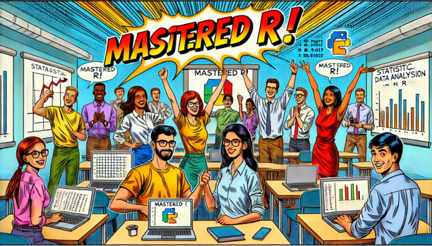
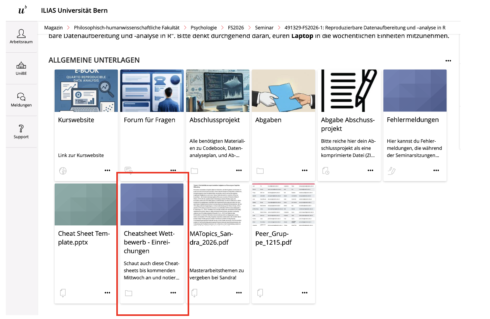
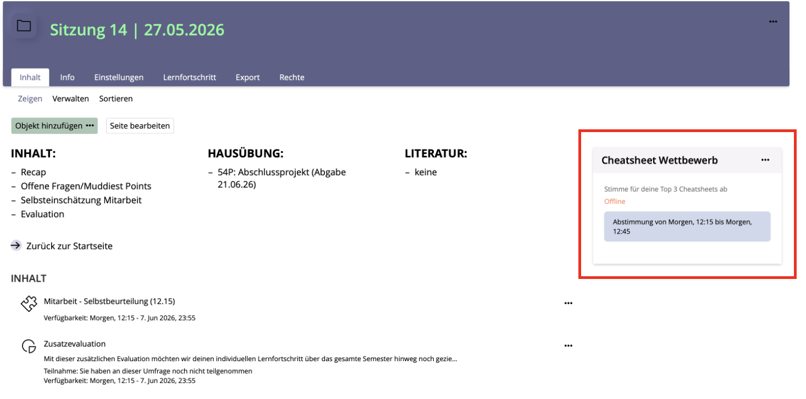
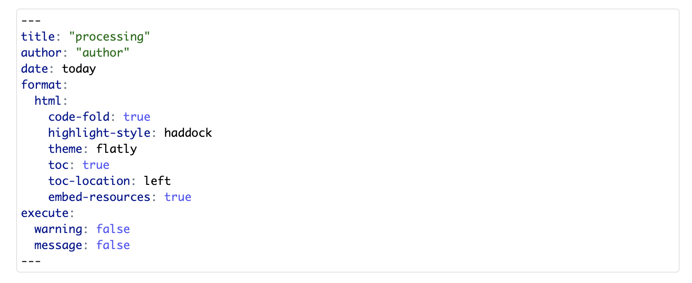
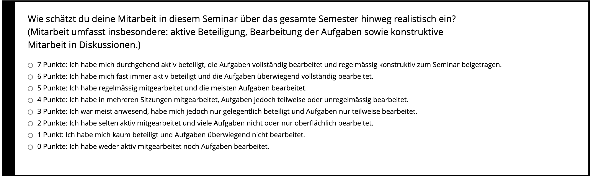
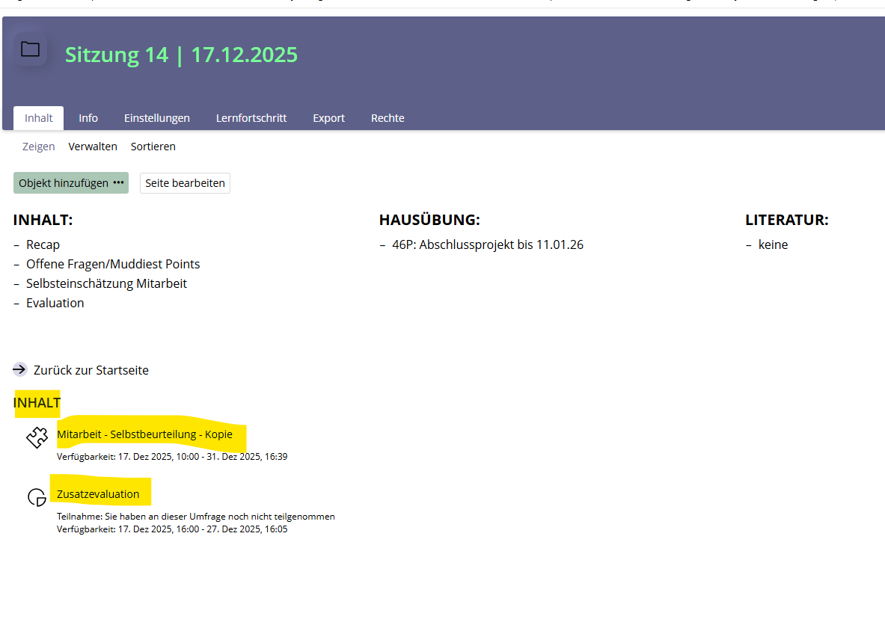
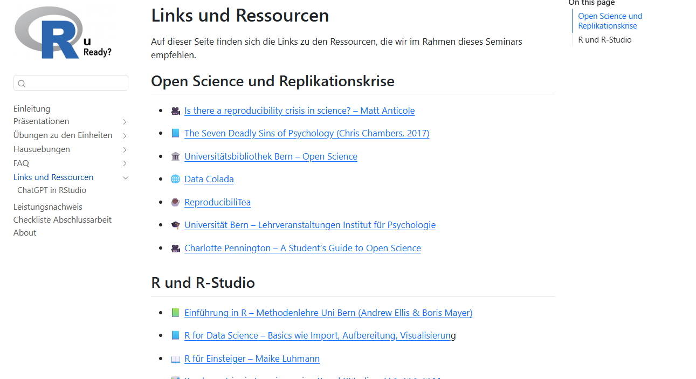
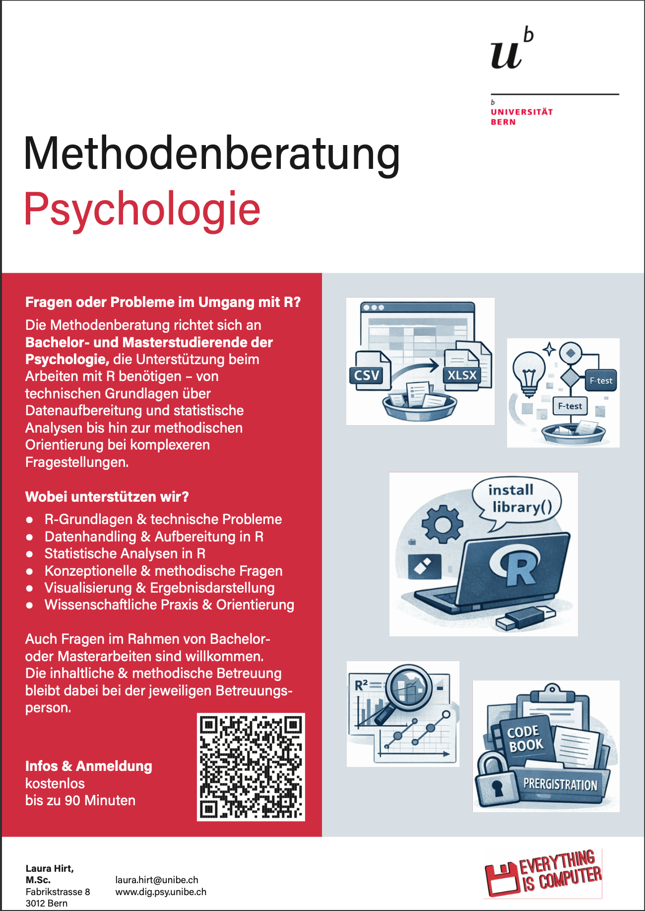

## R u Ready? Reproduzierbare Datenaufbereitung und -analyse mit R

FS 2026<br><br><br> **LV-Leitung**: PD Dr. Sandra Grinschgl / MSc. Laura Hirt<br> **Tutor**: BSc. Lars Schilling<br><br><br>**14. Einheit**, 27.05.2026

------------------------------------------------------------------------

## Heute:

::: {style="width:100%; height:80vh; background:#777; padding:20px; box-sizing:border-box; border-radius:10px; overflow:auto; "}
```{=html}
<embed
    src="../../PDFs/Syllabus.pdf#view=FitH&navpanes=0&toolbar=0"
    type="application/pdf"
    style="width:100%; height:220vh; border:0; display:block; background:white;"
  >
```
:::

------------------------------------------------------------------------

## Congrats!



------------------------------------------------------------------------

## Inhalte heute

<br>

1.  Offene Fragen zu HÜ3 / Hands-On 7

2.  Muddiest Points III

3.  Gruppe Laura: Wettbewerb Cheatsheet

4.  Abschlussarbeit: letzte Informationen & Repetition

    -   relative Pfade mit `here()`

    -   YAML-Header

    -   verlängerte Abgabefrist

    -   Feedback-Möglichkeiten zur Arbeit

5.  Recap: zentrale Take-Home Messages

6.  Evaluation & Abschluss

    -   Selbstevaluation der Mitarbeit

    -   Seminarevaluation

    -   Kurze Zusatzevaluation via Ilias

------------------------------------------------------------------------

## 1. Offene Fragen zu HÜ 3 / Hands-On 7?

{fig-align="center" width="411"}

------------------------------------------------------------------------

##  {data-background-iframe="../../PDFs/Muddiest_Points_III.pdf#view=FitH&navpanes=0&toolbar=0" data-background-interactive=""}

------------------------------------------------------------------------

## 3. Gruppe Laura: Wettbewerb Cheatsheet

<br>

**So stimmt ihr ab:**

::::: columns
::: {.column width="50%"}
{fig-align="center" width="100%"}
:::

::: {.column width="50%"}
{fig-align="center" width="100%"}
:::
:::::

<br>

::: center
# Die zwei Zusatzpunkte gehen an …
:::

------------------------------------------------------------------------

## **4. Abschlussarbeit**

#### Repetition: relative Pfade mit `here()`

<br>

Relative Pfade starten im Projektordner (dort, wo `ryouready.Rproj` liegt)

Es gibt zwei Varianten:

<br>

**Variante 1: relativer Pfad von Hand**

```{r, echo=TRUE, eval=FALSE}
dat_pct <- read.csv("data/raw/data_pct.csv")
```

<br>

**Logik:**

```         
Projektordner
└── data
    └── raw
        └── data_pct.csv
```

------------------------------------------------------------------------

## **4. Abschlussarbeit**

#### Repetition: relative Pfade mit `here()`

<br>

**Variante 2: relativer Pfad mit `here()`**

```{r, echo=TRUE, eval=FALSE}
dat_pct <- read.csv(
  here::here("data", "raw", "data_pct.csv")
)
```

<br>

**Logik:**

```         
here::here("data", "raw", "data_pct.csv")
```

baut automatisch den passenden Pfad aus den einzelnen Teilen:

```         
Projektordner/data/raw/data_pct.csv
```

------------------------------------------------------------------------

## **4. Abschlussarbeit**

#### Repetition: Anpassung des YAML-Headers

<br>

**4.5 Formelle Vorgaben:** Warn- und Fehlermeldungen werden nicht unterdrückt, sondern transparent dargestellt und interpretiert...

→ Der YAML-Header muss in beiden R Skripten (processing und analysis) angepasst werden!

<br>

{fig-align="center" width="411"}

::: notes
warning: true

message: true
:::

------------------------------------------------------------------------

## **4. Abschlussarbeit**

#### Verlängerung der Abgabefrist

<br>

Die Abgabefrist der Abschlussarbeit wurde um eine Woche verlängert.

→ Deadline ist neu der `21.06.2026, 23:55 Uhr`

------------------------------------------------------------------------

## **4. Abschlussarbeit**

#### Feedback-Möglichkeiten zur Arbeit

<br>

-   Wenn du individuelles Feedback zu deiner Abschlussarbeit möchtest

-   Infos zur genauen Zusammensetzung deiner Note

-   Oder anderen Seminar-bezogenen Dinge

👉 Selbstständig bei uns (laura.hirt\@unibe.ch / sandra.grinschgl\@unibe.ch) melden!

------------------------------------------------------------------------

## **5. Recap**

#### **Konzeptionelle Kompetenzen**

<br>

-   Replikationskrise und ihre Ursachen

-   Open-Science-Praktiken

-   Massnahmen zur Steigerung der Transparenz, z.B. durch **Datenanalysepläne** und **Codebooks**

-   Grundlagen des FAIR Forschungsdatenmanagement – PsychDS

------------------------------------------------------------------------

## **5. Recap**

#### **Praktische Kompetenzen**

<br>

-   RStudio und Pakete installieren, laden und nutzen

-   Anlegen von Projekten; Einführung in die RStudio- und Quarto-Benutzeroberfläche

-   Coding-Basics: z.B. Verktoren, Operatoren, Objekte, Working Directory

-   Stilregeln und systematische Fehlersuche (Error Detection) in R

-   Daten importieren und exportieren

-   Manipulation von Data Frames, Matrizen und Listen

-   Daten zwischen Wide- und Long-Format umwandeln

-   Verwendung des Pipe-Operators `%>%` oder `|>`

------------------------------------------------------------------------

## **5. Recap**

#### **Praktische Kompetenzen**

<br>

-   Umgang mit fehlenden Werten

-   Filtern, Manipulation und Gruppierung von Datensätzen (Data Wrangling)

-   Umkodieren von Variablen

-   Berechnen von deskriptiven Statistiken (z. B. Mittelwerte, Standardabweichungen, Schiefe, Kurtosis)

-   Überprüfung der Normalverteilung inkl. visueller Darstellung der Residuen

-   Berechnung von Skalenreliabilitäten

-   Datenvisualisierungen

-   Korrelationen und Regressionen

-   t-Tests und ANOVAs (inkl. Überprüfung der Voraussetzungen und Berechnung von Effektstärken)

------------------------------------------------------------------------

## **5. Recap**

#### **Was dieses Seminar nicht leisten konnte**

<br>

-   vollständige Wiederholung/Auffrischung der Statistik

-   „Kochbuch“ für jede mögliche Masterarbeit

-   vollständiges Cheatsheet mit „allen Funktionen“ in R

-   komplexe statistische Modelle, z.B. Strukturgleichungsmodelle oder Mehrebenenmodelle

    -   Siehe weiterführende Methodenseminare der Abteilungen Gesundheitspsychologie und Psychologie der Digitalisierung

------------------------------------------------------------------------

## **6. Recap: Evaluation & Abschluss**

#### **Selbstevaluation der Mitarbeit**

<br>

-   **14 Punkte insgesamt**

-   **7 Punkte dürft ihr euch selbst vergeben**

👉Umfrage auf ILIAS (Woche 14)!

{fig-align="center"}

------------------------------------------------------------------------

## **6. Recap: Evaluation & Abschluss**

#### **Seminarevaluation: Standardfragebogen der Uni**

<br>

**Bitte verwendet den Link, welcher zu eurer Gruppe gehört!**

------------------------------------------------------------------------

## Gruppe Laura 12:15

<https://scanserveruls.unibe.ch/evasys/public/online/index/index?online_php=&pswd=SMKNC&ONLINEID=157540934219219477945284313175345624895804>

{fig-align="center"}

------------------------------------------------------------------------

## Gruppe Sandra 16:15

<https://scanserveruls.unibe.ch/evasys/online.php?pswd=KE6VY> 

{fig-align="center"}

------------------------------------------------------------------------

## **6. Recap: Evaluation & Abschluss**

#### **Zusatzfragebogen**

<br>

**Auf ILIAS in Ordner EH14**

{fig-align="center"}

------------------------------------------------------------------------

## **Weiterführende Ressourcen**

<br>

{fig-align="center"}

------------------------------------------------------------------------

## Methodenberatung

<br>

<p align="center">



</p>

------------------------------------------------------------------------

## Schöne Sommerferien und alles Gute!

{fig-align="center"}

Bei Fragen: Forum nutzen!
