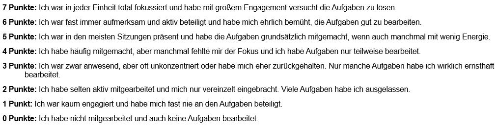
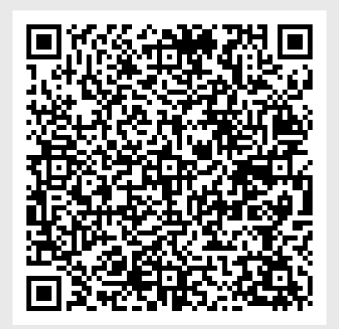
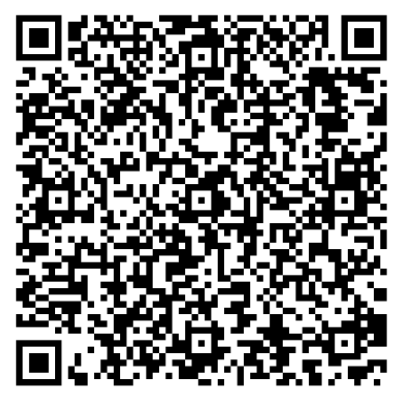
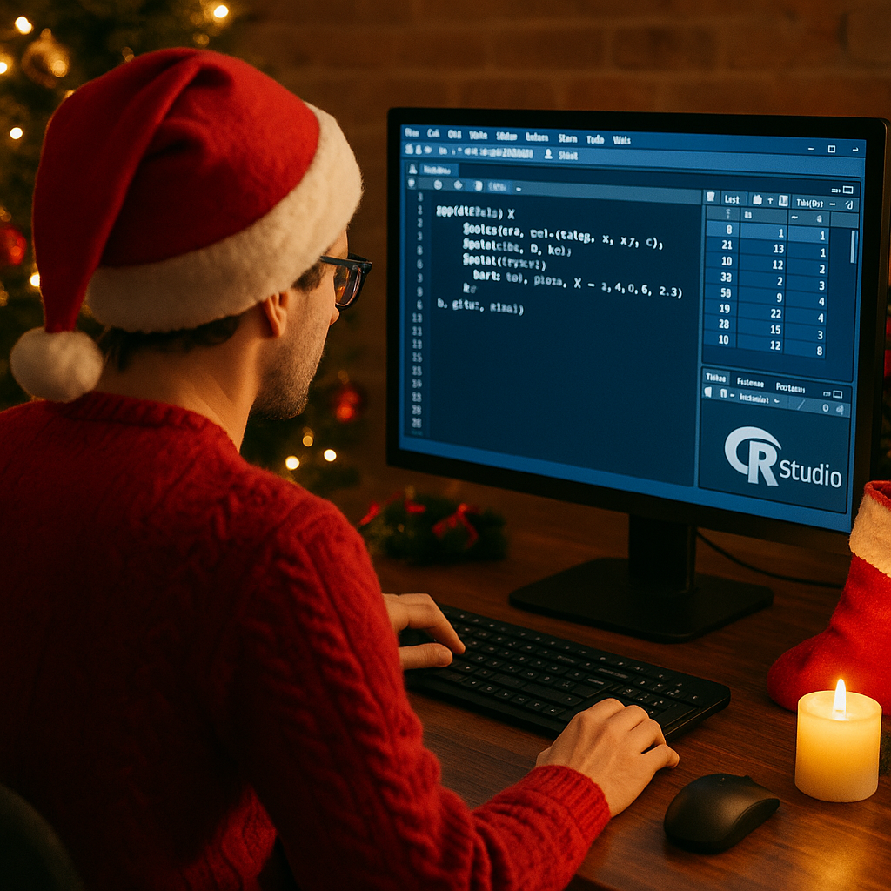

```{r, echo = FALSE, message=FALSE, warning=FALSE}


options(scipen = 999)
library(tidyverse)
library(palmerpenguins)
library(apaTables)
library(car)
library(afex)
library(emmeans)

library(effectsize)


penguins <- drop_na(palmerpenguins::penguins)


bfi_10_data <- read_delim("raw/bfi_10_data.csv", delim = ";", escape_double = FALSE, trim_ws = TRUE)

dat_full <- read_csv("raw/dat_full.csv")

dat_full_long <- dat_full |>
      pivot_longer(
        cols = c(pre1, pre4),
        names_to = "time_rating",
        values_to = "rating"
      )


dat_full$group_all <- as.factor(dat_full$group_all)

dat_full <- dat_full |>
  mutate(pre1 = pre1*10,
         pre2 = pre2*10,
         pre3 = pre3*10,
         pre4 = pre4*10)
```

## R u Ready? Reproduzierbare Datenaufbereitung und -analyse mit R

FS 2026<br><br><br> **LV-Leitung**: Dr. Sandra Grinschgl / MSc. Laura Hirt<br> **Tutor**: BSc. Lars Schilling<br><br><br>**14. Einheit**, 27.05.2026

------------------------------------------------------------------------

## Heute:

```{=html}
<embed 
  src="../../PDFs/Syllabus.pdf" 
  type="application/pdf"
  style="width:100%; height:90vh;"
>
```

------------------------------------------------------------------------

## Congrats


------------------------------------------------------------------------

## Fragen zu Hausübung 3 - Hands On 7?

------------------------------------------------------------------------

### Muddiest Points

-   Auf Website

**Werden nach Weihnachten ins FAQ integriert.**

------------------------------------------------------------------------

## **Recap**

**Konzeptionelle Kompetenzen**

-   Replikationskrise und ihre Ursachen

-   Open-Science-Praktiken

-   Möglichkeiten zur Steigerung der Transparenz, z. B. durch Datenanalysepläne und Codebooks

-   Grundlagen des FAIR Forschungsdatenmanagement – PsychDS

------------------------------------------------------------------------

## **Praktische Kompetenzen**

-   Installation von RStudio sowie Installation und Laden von Paketen

-   Anlegen von Projekten; Einführung in die RStudio- und Quarto-Benutzeroberfläche

-   Coding-Basics (z. B. Erstellen und Verändern von Vektoren, mathematische Operatoren, Arbeitsverzeichnis setzen)

-   Stilregeln und Fehlersuche (Error Detection) in R

-   Datenimport und -export

-   Manipulation von Data Frames, Matrizen und Listen

-   Umwandeln von Data Frames zwischen Wide- und Long-Format

-   Verwendung des Pipe-Operators `%>%` oder `|>`

------------------------------------------------------------------------

## **Praktische Kompetenzen**

-   Umgang mit fehlenden Werten

-   Filtern, Manipulieren und Gruppieren von Datensätzen (Data Wrangling)

-   Umkodieren von Variablen

-   Berechnen von deskriptiver Statistik (z. B. Mittelwerte, Standardabweichungen, Schiefe, Kurtosis)

-   Überprüfung der Normalverteilung inkl. visueller Darstellung der Residuen

-   Berechnung von Skalenreliabilitäten

-   Datenvisualisierungen

-   Korrelationen und Regressionen

-   t-Tests und ANOVAs (inkl. Überprüfung der Voraussetzungen und Berechnung von Effektstärken)

------------------------------------------------------------------------

## Was wir nicht gemacht haben:

-   Wiederholung/Auffrischung von Statistik

-   Ein „Kochbuch“ für die Masterarbeit ein Cheatsheet mit „allen Funktionen“ in R

-   komplexe statistische Analysen in R wie etwa Strukturgleichungsmodelle oder Multilevel Models

    -   Siehe weiterführende Methodenseminare der Abteilungen Gesundheitspsychologie und Psychologie der Digitalisierung

------------------------------------------------------------------------

## Errinnerung Leistungsbeurteilung

<iframe src="../../PDFs/LeistungsnachweisHS25.pdf" width="100%" height="600px">

</iframe>

------------------------------------------------------------------------

**Leistungsbeurteilung:**

**✅ Mitarbeit - 14 Punkte**

**✅ Regelmässige Hausübungen** **-** **40 Punkte**

**⬜ Abschlussprojekt - 46 Punkte**

------------------------------------------------------------------------

## **Mitarbeit**

-   **14 Punkte Insgesamt**

-   **7 Punkte dürft ihr euch selbst vergeben**

👉Umfrage auf ILIAS!

{fig-align="center"}

------------------------------------------------------------------------

## **Mitarbeit**

{fig-align="center"}

------------------------------------------------------------------------

## **Abschlussarbeit**

**Deadline 11.1.2026 - 23:55**

**Checkliste auf Website**

------------------------------------------------------------------------

## Feedback-Möglichkeit

-   Wenn du individuelles Feedback zu deiner Abschlussarbeit möchtest

-   Zur Zusammensetzung deiner Note

-   Zu anderen Seminar-bezogenen Dingen

👉 Selbstständig bei und (aaron.friedli\@unibe.ch / sandra.grinschgl\@unibe.ch) melden!

Aaron nur mehr bis Ende Januar erreichbar!

------------------------------------------------------------------------

## **Evaluation**

**Standardfragebogen der Uni**

------------------------------------------------------------------------

## 10:15

<https://scanserveruls.unibe.ch/evasys/public/online/index/index?online_php=&pswd=F7GK9&ONLINEID=65188644261466756196721217091602273395940>

{fig-align="center"}

------------------------------------------------------------------------

## 16:15

<https://scanserveruls.unibe.ch/evasys/public/online/index/index?online_php=&pswd=SFR8Z&ONLINEID=799329654453545430845235731708924671495875>

{fig-align="center"}

------------------------------------------------------------------------

## **Zusatzfragebogen**

**Auf ILIAS in Ordner EH 14**

{fig-align="center"}

------------------------------------------------------------------------

## **Weiterführende Ressourcen!**

{fig-align="center"}

------------------------------------------------------------------------

## Methodenberatung

**Ab Januar/Februrar von Laura Hirt**

<iframe src="../../PDFs/Flyer_Methodenberatung.pdf" width="100%" height="600px">

</iframe>

------------------------------------------------------------------------

## Schöne Ferien!

{fig-align="center"}
