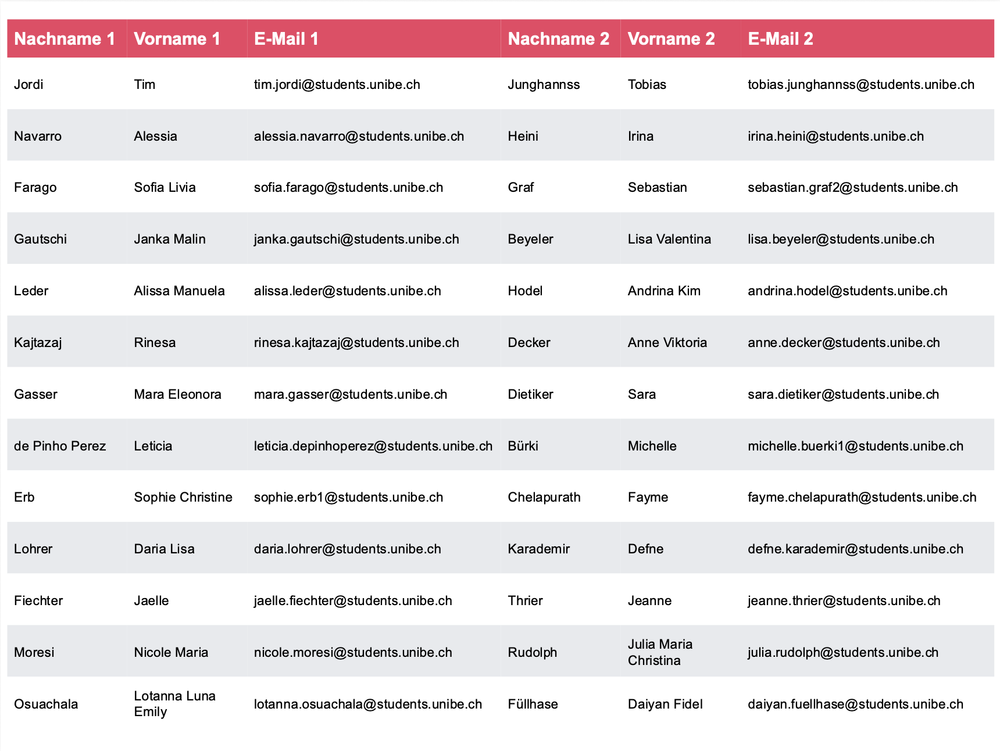
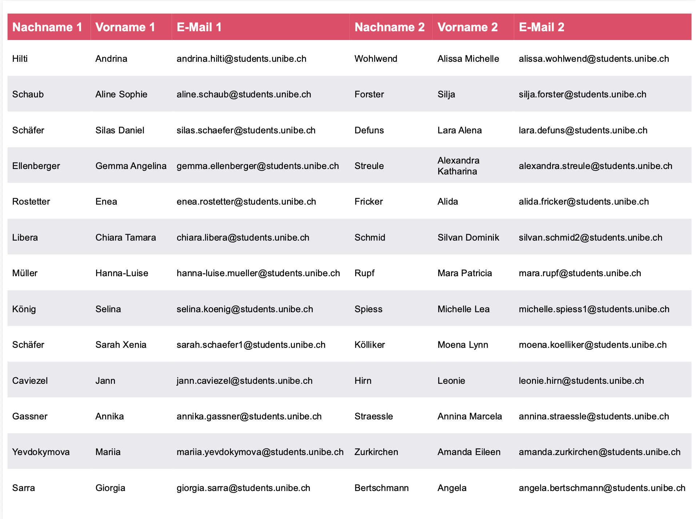
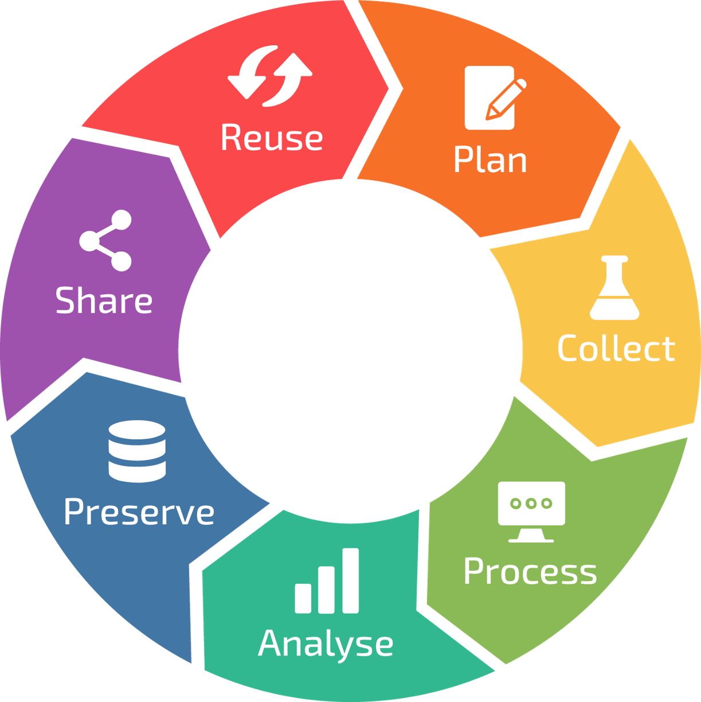
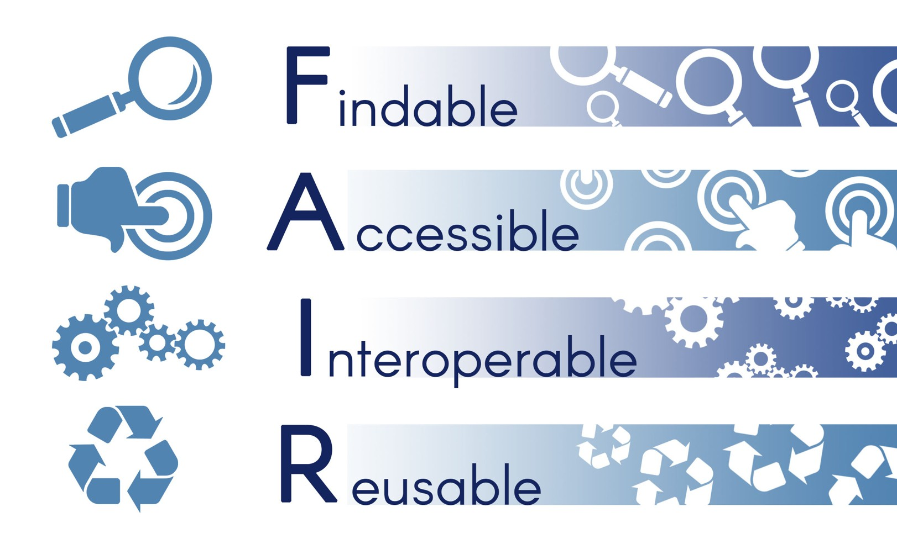
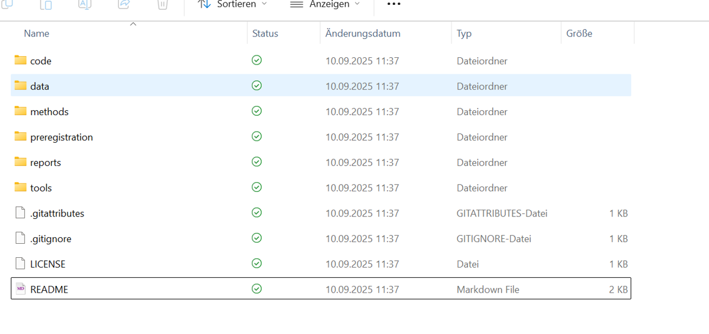
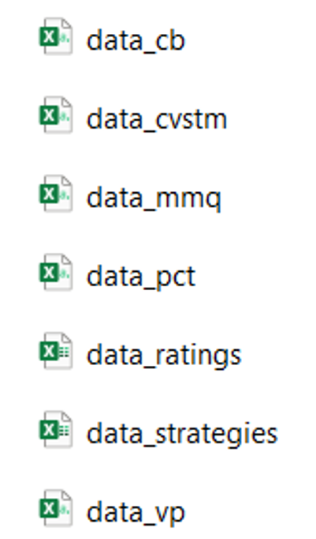

## R u Ready? Reproduzierbare Datenaufbereitung und -analyse mit R

FS 2026<br><br><br> **LV-Leitung**: Dr. Sandra Grinschgl / MSc. Laura Hirt<br> **Tutor**: BSc. Lars Schilling<br><br><br>**3. Einheit**, 04.03.2026

------------------------------------------------------------------------

## Fragen zum Datenanalyseplan:


::: notes
jetzt auch auf Homepage unter "Hausübungen" ergänzt
:::

------------------------------------------------------------------------

## Fragen zu den Hands On Übungen der ersten beiden Wochen?

-   Was hat euch Schwierigkeiten bereitet?

-   Welche Übungen sollen wir gemeinsam live durchgehen?

-   Gibt es noch Unklarheiten?

-   **Musterlösungen online für Block 1!**

    ::: notes
    zeigen:\
    R Oberfläche

    Erklärung zu Paketen\
    \
    Variable zuweisen mit \<- und nicht =\
    Vektoren mit c() für combine\
    3 Arten von Vektoren
    :::

------------------------------------------------------------------------

## Heute:

::: {style="width:100%; height:80vh; background:#777; padding:20px; box-sizing:border-box; border-radius:10px; overflow:auto; "}
```{=html}
<embed
    src="../../PDFs/Syllabus.pdf#view=FitH&navpanes=0&toolbar=0"
    type="application/pdf"
    style="width:100%; height:220vh; border:0; display:block; background:white;"
  >
```
:::

------------------------------------------------------------------------

## Peer-Pairings

**12.15 (Liste auch auf Ilias)**



::: notes
Liste zeigen, Namen aufrufen und zusammensetzen lassen - zumindest später bei Hands On wenn sie wollen
:::

------------------------------------------------------------------------

## Peer-Pairings

**16.15 (Liste auch auf Ilias)**



::: notes
Liste zeigen, Namen aufrufen und zusammensetzen lassen
:::

------------------------------------------------------------------------

## Forschungsdatenmanagement:

***Planung, Organisation, Speicherung, Dokumentation und Archivierung von Daten während des gesamten Forschungsprozesses***

::::: columns
::: {.column width="70%"}
### *Warum Datenmanagement?*:

-   Datenflut in der Forschung
-   Risiken ohne gutes Management (z.B. keine Möglichkeit zur Replikation & Reproduktion)

### Ziele von Datenmanagement:

-   Qualitätssicherung

-   Sicherheit/Datenschutz & Ethik

-   Reproduzierbarkeit

-   Nachhaltigkeit und Transparenz

    **-\> gute wissenschaftliche Praxis**
:::

::: {.column width="30%"}
[](Quellen:%20https://www.unilu.ch/forschung/open-science/forschungsdatenmanagement/)
:::
:::::

::: notes
Link zu letzter Einheit - Forschungsdatenmanagement gehört zu guter wissenschaftlicher Praxis
:::

------------------------------------------------------------------------

## Forschungsdatenmanagement (2)

:::::: columns
::: {.column width="70%"}
### **Standards & Vorgaben:**

-   FAIR Prinzipien

-   Data Management Plan (SNF)

-   Förderorganisationen & Journals

**Praktische Umsetzung:**

-   Ordnerstrukturen & Versionierung

-   Dokumentation (README, Codebooks)

-   Offene Dateiformate
:::

:::: {.column width="30%"}
{fig-alt="https://www.go-fair.org/fair-principles/" width="100%"}

::: notes
### **F – auffindbar** (aus Wikipedia: <https://de.wikipedia.org/wiki/FAIR-Prinzipien>)

\[[Bearbeiten](https://de.wikipedia.org/w/index.php?title=FAIR-Prinzipien&veaction=edit&section=2 "Abschnitt bearbeiten: F – auffindbar") \| [Quelltext bearbeiten](https://de.wikipedia.org/w/index.php?title=FAIR-Prinzipien&action=edit&section=2 "Quellcode des Abschnitts bearbeiten: F – auffindbar")\]

-   F1 (Meta-)Daten sind mit einem weltweit eindeutigen und dauerhaften [persistent identifier](https://de.wikipedia.org/wiki/Identifikator#Persistenz "Identifikator") versehen.

-   F2 (Meta-)Daten werden mit umfangreichen [Metadaten](https://de.wikipedia.org/wiki/Metadaten "Metadaten") beschrieben.

-   F3 (Meta-)Daten sind in einer durchsuchbaren Ressource registriert oder indiziert.

-   F4 (Meta-)Daten enthalten eine klare und eindeutige Identifizierung der Daten, die sie beschreiben.

### **A – zugänglich**

\[[Bearbeiten](https://de.wikipedia.org/w/index.php?title=FAIR-Prinzipien&veaction=edit&section=3 "Abschnitt bearbeiten: A – zugänglich") \| [Quelltext bearbeiten](https://de.wikipedia.org/w/index.php?title=FAIR-Prinzipien&action=edit&section=3 "Quellcode des Abschnitts bearbeiten: A – zugänglich")\]

-   A1 (Meta-)Daten können anhand ihrer Identifizierung über ein standardisiertes Kommunikationsprotokoll abgerufen werden.

    -   A1.1 das Protokoll ist offen, frei und universell implementierbar.

    -   A1.2 das Protokoll ermöglicht bei Bedarf ein Authentifizierungs- und Autorisierungsverfahren.

-   A2 – (Meta-)Daten sind zugänglich, auch wenn die Daten nicht mehr verfügbar sind.

### **I – interoperabel**

\[[Bearbeiten](https://de.wikipedia.org/w/index.php?title=FAIR-Prinzipien&veaction=edit&section=4 "Abschnitt bearbeiten: I – interoperabel") \| [Quelltext bearbeiten](https://de.wikipedia.org/w/index.php?title=FAIR-Prinzipien&action=edit&section=4 "Quellcode des Abschnitts bearbeiten: I – interoperabel")\]

-   I1 (Meta-)Daten verwenden eine formale, zugängliche, gemeinsame und weithin anwendbare Sprache zur Wissensdarstellung.

-   I2 (Meta-)Daten verwenden Vokabulare, die den FAIR-Grundsätzen entsprechen.

-   I3 (Meta-)Daten enthalten qualifizierte Verweise auf andere (Meta-)Daten.

### **R – wiederverwendbar**

\[[Bearbeiten](https://de.wikipedia.org/w/index.php?title=FAIR-Prinzipien&veaction=edit&section=5 "Abschnitt bearbeiten: R – wiederverwendbar") \| [Quelltext bearbeiten](https://de.wikipedia.org/w/index.php?title=FAIR-Prinzipien&action=edit&section=5 "Quellcode des Abschnitts bearbeiten: R – wiederverwendbar")\]

-   R1 (Meta-)Daten haben mehrere genaue und relevante Attribute.

    -   R1.1 (Meta-)Daten werden mit einer klaren und zugänglichen Datennutzungslizenz freigegeben.

    -   R1.2 (Meta-)Daten sind mit ihrer Herkunft verbunden.

    -   R1.3 (Meta-)Daten entsprechen den für den Bereich relevanten Gemeinschaftsstandards.
:::
::::
::::::

------------------------------------------------------------------------

## Ordnerstrukturen: Psych-DS

-   Standard für die Organisation von Daten, Skripten und weiteren Studiendokumenten

    

**Ein Standard von vielen Möglichen**

[Psych-DS](https://psychds-docs.readthedocs.io/en/latest/guides/1_getting_started/)

::: notes
Hier auch Ordner und Files, die wir für unsere Zwecke nicht verwenden werden. Z.B. Github Files, sind zwar gut für Version Control und ein wichtiges Tool, aber würde den Rahmen sprengen.
:::

------------------------------------------------------------------------

## Psych-DS für unsere Zwecke:

-   Leicht abgeändertes Format für unser Seminar

    -   Macht es leichter für uns, die Abgaben zu kontrollieren

-   Hilft euch, eine übersichtliche Ordnerstruktur zu behalten

    --\> Ordner "R_You_Ready"

------------------------------------------------------------------------

## Psych-DS: Wichtigste Grundsätze

-   Datensätze nur in "data".

    -   Die Rohdatenfiles werden nicht bearbeitet!

    -   Aufbereitete Datensätze -\> data/processed

-   Codebook in Ordner "data"

-   Datenanalyseplan in "preregistration"

-   Skripte in "code"

    -   Aufbereitungsschritte im Skript "processing"

    -   Analyse (mit den aufbereiteten Datensätzen) im Skript "analysis"

-   Keine Redundanzen!

    -   Keine redundanten Dateien

    -   Skripte: Keine redundanten Pakete (nur Pakete laden, die auch verwendet werden), Aufarbeitungsschritte & Analysen.

    ::: notes
    Bewertungsrelevant für die Abschlussarbeit
    :::

------------------------------------------------------------------------

## Psychdsish

-   **📦 Packages** welche helfen sollen, Psych-DS Struktur & Stylevorgaben leichter einzuhalten.

-   Für Masterarbeiten: [Psychdsish](https://github.com/ianhussey/psychdsish?tab=readme-ov-file)

    Funktionen wie: `create_project_skeleton()`, `check_unused_objects()`, `validator()`

-   **🥅 Ziel**: Einhaltung von Standards erleichtern

------------------------------------------------------------------------

## Wiederholung: Benennung von Variablen etc. in R

-   Namen können aus Buchstaben, Zahlen und Zeichen (\_ oder .) bestehen

-   Er muss mit Buchstaben begonnen werden und darf keine Leerzeichen beinhalten

-   Sonderzeichen und Grossbuchstaben sollten vermieden werden; keine Namen verwenden, die schon an Funktionen vergeben sind (z.B. `mean()`, `data()`)

-   Empfehlung für leserlichen Code: **snake_case**

-   Name soll Variable inhaltlich bestmöglich beschreiben

-   Reproduzierbarkeit: „clarity instead of brevity“

-   Benennung am besten in Englisch, um internationalen Standards zu folgen

-   Kommentierung von R-Code mit \#

    -   Text nach \# wird ignoriert (für 1 Zeile)

    -   Neue Zeilen müssen wieder mit \# beginnen

    -   Alternative: R Notebooks, Markdown oder Quarto –\> EH5

------------------------------------------------------------------------

## Weitere Style Konventionen:

-   Leerzeichen:

    -   Vor und nach mathematischen Operatoren: `2+2` vs `2 + 2`

    -   Vor und nach Zuweisungen: `x<-sum(1+2)` vs `x <- sum(1 + 2)`

    -   Aber nicht vor und nach sich öffnenden oder schliessenden Klammern oder Anführungszeichen

    -   Nach Kommas (aber nicht davor)

    -   Weitere Leerzeichen erlaubt, wenn die Leserlichkeit erhöht wird (z.B. bei Einrückungen)

-   Verwendung des Pipe Operators (`%>%` oder **`|>`** ) –\> Erklärung folgt in kommenden Wochen!

-   Zeilenumbrüche für langen Code verwenden

    ```{r eval=FALSE, echo=TRUE}


    this_is_a_very_long_function_name <- (something = "this", requires = "many", arguments = "long words and sentences") #–> bad

    this_is_a_very_long_function_name <- (something = "this", 
                                          requires = "many", 
                                          arguments = "long words and sentences") #–> good
    ```

-   **👗**`styler`: Funktion, die Code automatisch in dieses Format bringt. 👉 Hands On!

------------------------------------------------------------------------

## Weitere Style Konventionen:

📖 **Lesbarkeit für Menschen und Maschine**

🧑‍💻 **Für Menschen:** Verwende aussagekräftige Dateinamen, die klar beschreiben, was in der Datei enthalten ist.

💻 **Für Maschinen:** Vermeide Leerzeichen, Sonderzeichen und Symbole in Dateinamen – bleibe bei Buchstaben, Zahlen und Unterstrichen.

🔢 **Struktur:** Benenne Dateien so, dass sie auch mit der Standard-Sortierung von Ordnern sinnvoll angeordnet werden. Ein bewährter Ansatz ist, mit Zahlen zu beginnen, um eine logische Reihenfolge abzubilden.

z.B.

01_processing

02_descriptive_analyses

03_inferential_analyses

------------------------------------------------------------------------

## Codebook

-   Naive Personen sollen Datensatz nachvollziehen können (Reproduzierbarkeit!)

-   Beinhaltet eine Liste und Beschreibung aller Variablen, z.B.

    -   Wie wurde die Variable erhoben (z.B. aus welchem Fragebogen)?

    -   Wie wurde die Variable berechnet (z.B. Summenscore, Mittelwert)?

    -   Welche Werte kann die Variable annehmen (theoretisches Minimum und Maximum)?

------------------------------------------------------------------------

## Wichtige Grundsätze für das Codebook

-   Am besten für Rohdaten als auch weiter-verarbeitete Daten

<!-- -->

-   Variablennamen in Codebook sollen identisch zu Variablennamen in Datensatz sein

<!-- -->

-   Variable muss ausführlich genug beschrieben sein, sodass andere Personen sie nachvollziehen können

------------------------------------------------------------------------

## Codebook: Vorlage

-   Kann in verschiedenen Formaten erstellt werden (Word, Excel, etc.)

-   Excel-Vorlage für das Seminar (siehe ZIP-Datei Abschlussprojekt)

-   Beispiel: "Example_Codebook" - Ordner

-   Für weitere Anleitungen siehe "Guideline Codebook"

Siehe auch: Pennington (2023)

::: notes
Buch von Pennington kann man bei Bedarf in Bib oder bei Sandra ausborgen
:::

------------------------------------------------------------------------

## Rohdaten für Grinschgl et al. (2020)

-   Bereits vorhanden in euren Ordnern (r_you_ready)

-   Wir mergen diese heute oder in EH4 zu einem vollständigen Datensatz –\> **dat_full**

    {width="145"}

------------------------------------------------------------------------

## Codebook

-   Notwendig für „gemergten“ Datensatz „dat_full“

-   Vorlage ist auf Englisch, kann aber auch auf Deutsch ausgefüllt werden (selbes gilt für Datenanalyseplan)

-   Basierend auf Horstmann et al. (2020)

-   Abgabe bis EH6 (25.03.) über ILIAS und via Email an Peer-Partner:in

-   Danach Peer Feedback

    ::: notes
    Idealerweise Codebook auch für Rohdaten, aber für das Seminar nur für dat_full
    :::

------------------------------------------------------------------------

## Reproduzierbare Auswertung (R-Skripte): Grundsätze

-   Digitale Rohdaten

-   Skripte (processing & analyses) sollen den gesamten Weg von den Rohdaten bis hin zu den Ergebnissen dokumentieren

-   Wenn man euren Code auf den Rohdaten laufen lässt, sollte man (fehlerfrei) zu den Ergebnissen kommen

-   Skripte sind kommentiert und sinnvoll gegliedert

------------------------------------------------------------------------

## Hands on!

-   Projekte

-   Daten einlesen

-   Daten speichern

-   Fortsetzung Coding Basics

------------------------------------------------------------------------

## Heute haben wir...

... Uns mit den Grundlagen von Forschungsdatenmanagement beschäftigt

... Psych-DS als einen Standard kennengelernt

... Style-Empfehlungen für R Code besprochen

... die Gründe für und den Aufbau von einem Codebook besprochen

... Datensätze in R importiert

... diese gemerged und exportiert (Fortsetzung in EH 4)

------------------------------------------------------------------------

## Hausübungen

-   Datenanalyseplan bis **Mi, 11.03.2026**

-   Codebook erstellen bis **Mi, 25.03.2026**

------------------------------------------------------------------------

## Literatur:

Horstmann, K. T., Arslan, R. C., & Greiff, S. (2020). Generating Codebooks to Ensure the Independent Use of Research Data: Some Guidelines. *European Journal of Psychological Assessment*, *36*(5), 721–729. https://doi.org/10.1027/1015-5759/a000620

Pennington, C. R. (2023). *A student’s guide to open science: Using the replication crisis to reform psychology*. McGraw Hill.
