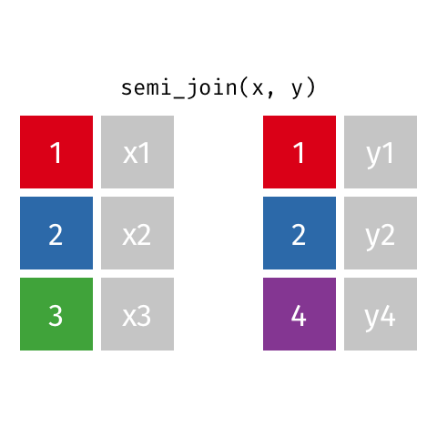
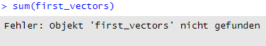
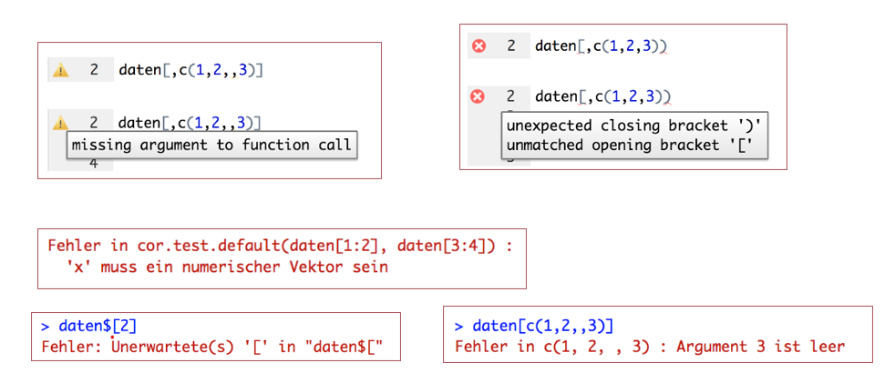
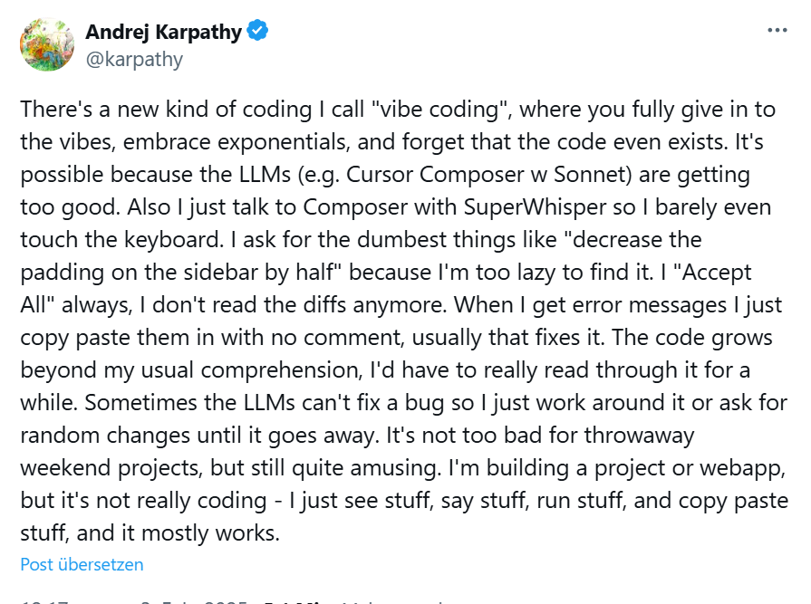
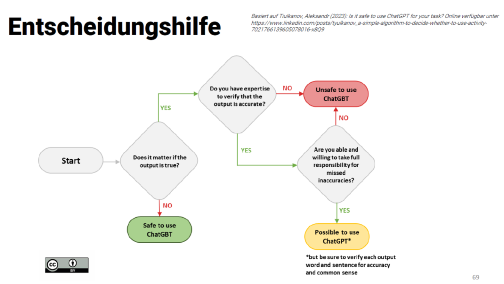

## R u Ready? Reproduzierbare Datenaufbereitung und -analyse mit R

FS 2026<br><br><br> **LV-Leitung**: Dr. Sandra Grinschgl / MSc. Laura Hirt<br> **Tutor**: BSc. Lars Schilling<br><br><br>**4. Einheit**, 11.03.2026

------------------------------------------------------------------------

## Fragen zum Datenanalyseplan & Codebook:

{fig-align="center"}

::: notes
Abgaben Datenanalysesplan heute via Ilias und per Email an Peer Feedback Partner:in
:::

------------------------------------------------------------------------

## Heute:

::: {style="width:100%; height:80vh; background:#777; padding:20px; box-sizing:border-box; border-radius:10px; overflow:auto; "}
```{=html}
<embed
    src="../../PDFs/Syllabus.pdf#view=FitH&navpanes=0&toolbar=0"
    type="application/pdf"
    style="width:100%; height:220vh; border:0; display:block; background:white;"
  >
```
:::

------------------------------------------------------------------------

## Hands On!

🎯 **Ziel:** Heute mindestens bis zum Daten-Mergen und Speichern kommen!

🏃 **Für alle, die schneller fertig sind:** Coding Basics, Funktionen und Styler

✈️ **Für besonders Schnelle:** Weiterarbeiten am Codebook / Peer-Feedback

------------------------------------------------------------------------

## Daten einlesen

**Code immer im Skript speichern**

-   Alle Schritte beim Einlesen von Daten gehören ins R-Skript

-   Nur so ist der Analyseprozess nachvollziehbar und reproduzierbar

**Das heisst: Code nicht nur in der Konsole ausführen**

-   Code in der Konsole wird nicht gespeichert
-   Analysen lassen sich später nicht mehr reproduzieren

**Beim Einlesen über das Environment**

-   Der generierte Code muss ins Skript kopiert werden. Sonst ist der Import nicht dokumentiert.

------------------------------------------------------------------------

## **Wie funktionieren Joins?**

::: notes
Fragen, wie weit man letzte Einheit gekommen ist, ggf. zuerst weiter arbeiten lassen
:::

-   `cbind()` vs. `full_join()`

-   `cbind()` verbindet Datensätze spaltenweise – warum ist das suboptimal?

-   `full_join()` nimmt alle Variablen aus beiden Datensätzen. Die Verbindung erfolgt über eine oder mehrere **gemeinsame Schlüsselvariable(n) (z.B. ID)**, die in beiden Datensätzen vorhanden ist/sind.

{fig-align="center" width="238"}

------------------------------------------------------------------------

## full_join()

**Was ist der Schlüssel?**

Eine gemeinsame Variable (z.B. **CODE**), die in beiden Datensätzen vorkommt und über die die Datensätze miteinander verbunden werden.

```{r, echo = FALSE}

library(tidyverse)
```

```{r echo=TRUE}

data_cb <- read_delim("data/raw/data_cb.csv", delim = ";")
data_vp <- read_delim("data/raw/data_vp.csv", delim = ";")

dat_full_1 <- full_join(data_cb, data_vp, by = "code")
head(dat_full_1)
```

::: notes
Iterativer Prozess: immer für 2 Datensätze bis man dat_full mit allen 7 Datensätzen hat –\> dafür wird dann Codebook geschrieben
:::

------------------------------------------------------------------------

## Beispiel

`full_join()` kombiniert beide Datensätze über die Variable `id` und behält **alle IDs aus beiden Tabellen**. Fehlt zu einer ID eine Information, wird der entsprechende Wert mit `NA` ergänzt.

```{r echo=TRUE}
df1 <- data.frame(id = c(1, 2, 3),
                  name = c("Anna", "Ben", "Chris"))

df2 <- data.frame(id = c(2, 3, 4),
                  score = c(80, 90, 70))

full_join(df1, df2, by = "id")

```

::: notes
ID 1 kommt nur in df1 vor → score aus Datensatz 2 = NA ID 4 kommt nur in df2 vor → name aus Datensatz 1 = NA

Es werden aus beiden Datensätzen alle Variablen genommen. Die Schlüsselvariable ist in diesem Beispiel die Variable id. Da nicht in beiden Datensätzen alle id's vorkommen (in df1 kommen nur 1,2 und 3 vor; in df2 2, 3 und 4), fehlen für diese jeweils die Angaben der anderen Variable. Diese fehlenden Werte werden bei einem full_join() automatisch mit NAs ergänzt.
:::

------------------------------------------------------------------------

## Unterschiede zwischen den diversen Joins:

::: notes
inner_join() behält im Gegensatz zu full_join() nur solche Beobachtungen, die in beiden Datensätzen vorkommen. Beobachtung 3 und 4 werden also ausgeschlossen. So werden nur Beobachtungen oder VPN beibehalten, welche in jedem Datensatz enthalten sind.
:::

{fig-align="center"}

------------------------------------------------------------------------

## Unterschiede zwischen den diversen Joins:

::: notes
left_join() verbindet zwei Datensätze über eine Schlüsselvariable (z. B. id) und behält alle Beobachtungen aus dem linken Datensatz. Fehlende Werte aus dem rechten Datensatz werden mit NA ergänzt.
:::

{fig-align="center"}

------------------------------------------------------------------------

## Unterschiede zwischen den diversen Joins:

::: notes
right_join() verbindet zwei Datensätze über eine Schlüsselvariable (z. B. id) und behält alle Beobachtungen aus dem rechten Datensatz. Fehlende Werte aus dem linken Datensatz werden mit NA ergänzt.
:::

{fig-align="center"}

------------------------------------------------------------------------

## Unterschiede zwischen den diversen Joins:

::: notes
semi_join() filtert den linken Datensatz anhand einer Schlüsselvariable und behält nur Beobachtungen, für die es eine passende Beobachtung im rechten Datensatz gibt. Es werden keine neuen Variablen hinzugefügt.
:::

{fig-align="center"}

------------------------------------------------------------------------

## Check-in:

-   Nun sollte jede/r einen Datensatz *dat_full* haben, der alle 7 Einzeldatensätze beinhaltet mit:

    -   **159** **Versuchspersonen (= Zeilen)**

    -   **und 36 Variablen (= Spalten).**

-   Checkt mit euren Peer-Partner:innen/Sitznachbar:innen!

-   Mit diesem Datensatz werden wir die Analysen von Grinschgl et al. (2020) durchführen.

-   Zu diesem Datensatz sollt ihr bis zum **25.03.** den ersten Entwurf für das Codebook schreiben!

------------------------------------------------------------------------

## Fehlererkennung in R (1)

*Der Code läuft nicht! Wie könnt ihr vorgehen, um den Fehler zu identifizieren und beheben?*

1️⃣ **Fehlermeldung lesen**

{width="477"}

2️⃣ **Typische Ursachen prüfen:**

✅ Tippfehler

✅ Syntaxfehler, z.B. fehlende Klammern

✅ Falsche Datentypen, prüfen mit `class()`

✅ Fehlende Pakete

✅ Verschachtelten Code schrittweise ausführen, z.B. `round(mean(vector1))`

------------------------------------------------------------------------

## Fehlererkennung in R (2)

### Wenn ihr nicht weiterkommt

🔎 Fehlermeldung googeln

Fehlermeldungen lassen sich besser googeln, wenn R auf Englisch eingestellt ist:

-   👉`Sys.setenv(LANGUAGE = "en")`
-   oft ist es auch hilfreich, das Betriebssystem anzugeben: `sessionInfo()`

------------------------------------------------------------------------

## Code Diagnostik:

{fig-align="center"}

::: notes
RStudio kann viele Fehler automatisch erkennen und anzeigen:

-   zeigt mögliche Fehler direkt im Skript an

-   warnt bei undefinierten Variablen oder falschen Argumenten

-   hilft, Probleme früh zu entdecken
:::

------------------------------------------------------------------------

## R-Studio gibt Hinweise!

{fig-align="center"}

::: notes
Fehlermeldungen: Die Information vor dem Doppelpunkt gibt uns an, in welcher Funktion der Fehler steckt; die Information nach dem Doppelpunkt gibt Aufschluss über die Art des Fehlers. Zweiteres ist für die Fehlersuche (zumeist) von großer Bedeutung.

Wenn ein oder mehrere Zeichen überflüssig sind bzw. fehlen, dann bekommt man Unerwartete(s) '...' in "..." ausgegeben. Hierbei teilt uns die Meldung mit, wo der Fehler liegt: In den Anführungszeichen "..." wird nur ein Teil des Codes ausgegeben und der Fehler ist zumeist das zuletzt ausgegebene Zeichen (oder es liegt unmittelbar davor).  z.B. daten\[2\]
:::

------------------------------------------------------------------------

## R-Ressourcen

-\> siehe [Website](https://r-you-ready.github.io/Webseite_FS26_Seminar/scripts/04_misc/links_und_ressourcen.html)

------------------------------------------------------------------------

## Wettbewerb: Erstelle dein eigenes R-Cheatsheet (1)

🎯 **Ziel**

Erstelle auf Basis der Vorlage (ILIAS) ein eigenes R-Cheatsheet mit wichtigen Befehlen, Beispielen und kurzen Erklärugen.

💡 **Idee**

Ein persönliches Nachschlagewerk für R-Workflows, Funktionen und Analysen; auch nützlich für spätere Projekte und/oder die Masterarbeit.

⭐ **Extrapunkte**

-   2 Punkte für Teilnahme (bei erfüllten Mindestkriterien)

-   +2 Punkte für das beste Cheatsheet (Abstimmung im Seminar)

-\> maximal 4 Extrapunkte!

------------------------------------------------------------------------

## Wettbewerb: Erstelle dein eigenes R-Cheatsheet (2)

📋 **Mindestkriterien**

-   klare Struktur (z.B. Datenimport, Visualisierung, Modelle...)

-   R-Code mit kurzen Erklärungen

-   praktisch nutzbar für andere

-   visuell ansprechend

📅 **Abgabe**

EH13 (20.05.)

🗳 **Abstimmung**

EH14 (27.05.)

⚠️ **Teilnahme freiwillig!**

------------------------------------------------------------------------

## Github CoPilot in R

::: {.absolute top="50%" left="33%" style="font-size: 3em;"}
**LIVE DEMO**
:::

------------------------------------------------------------------------

## LLM-Interface in R

::: {.absolute top="50%" left="33%" style="font-size: 3em;"}
**LIVE DEMO**
:::

------------------------------------------------------------------------

## Large Language Models & Datenanalyse

-   Modelle wie **ChatGPT**

-   Berechnen **Wortwahrscheinlichkeiten** und erzeugen daraus Text

-   **ABER:**

    -   Verstehen **keine Bedeutung**

    -   Können **nicht beurteilen, was inhaltlich korrekt ist**

{fig-align="center" width="300"}

::: notes
Für welche Aufgaben nutzt du LLMs im Analyseprozess?
:::

------------------------------------------------------------------------

## Vibe coding

{fig-align="center"}

👉KI in natürlicher Sprache prompten, ohne den generierten Code zu prüfen oder zu verstehen.

::: notes
Vibe Coding bedeutet, dass Nutzer\*innen mit KI-Codegeneratoren (z. B. ChatGPT, GitHub Copilot) Programme schreiben, indem sie nur Zielbeschreibungen in natürlicher Sprache eingeben, ohne den generierten Code wirklich zu verstehen oder gründlich zu überprüfen.\

Es ist also intuitives, versuchsorientiertes „Codieren nach Gefühl“, bei dem Schnelligkeit vor Verständnis steht.
:::

------------------------------------------------------------------------

## KI - LLMs (ChatGPT, Copilot, Rtutor)

✔️ **Vorteile**

-   Generieren schnell viel Code

-   Code häufig syntaktisch korrekt

-   On-Demand-Assistenz für Fragen aller Art

-   Reduziert Einstiegshürden

-   Unterstützung bei Debugging und Error Handling

-   **Tutoring-Funktion** –\> siehe [Prompts](https://learnius.com/llms/5+Prompting/Examples/AI+tutor+by+Ethan+Mollick+with+Claude+2)

------------------------------------------------------------------------

❌ **Risiken/Nachteile**

-   Unreflektiert Code übernehmen → Lerneffekt sinkt

-   Keine Garantie für Korrektheit → Code kann plausibel wirken, aber methodisch unangemessen sein

-   Overreliance / Cognitive Offloading → Reduziertes Verständnis dessen, was man tut

-   Nicht immer Best-Practice-Beispiele → Verletzung wissenschaftlicher Standards

-   "Fast but Flawed"

-   ⚠️Datenschutz: Niemals sensible Daten in LLMs hochladen ⚠️

::: notes
-   Beispiel: unreflektiert ChatGPT fragen, ob ich eine Mediationsanalyse machen kann → Code übernehmen, Output interpretieren lassen, Diskussion schreiben lassen → Rezept für ein Desaster.

-   Datenanalyse darf keine Blackbox sein → Die Schritte der Analyse müssen mindestens für die Person, die sie durchführt, nachvollziehbar sein.

<!-- -->

-   Datenschutz: unklar, wo Daten gespeichert werden; Risiko von Training Leakage und rechtlichen Verstössen!
:::

------------------------------------------------------------------------

## Sinnvolle Nutzung von KI im Datenanalyseprozess:

✔️ **Sinnvoll: Unterstützend – nicht ersetzend**

-   Kontrolle einfacher Fehler (Klammern, Typos)
-   Erklärung von Code und Syntax
-   Hilfe bei Fehlersuche (Debugging)
-   Kommentierung und Dokumentation

❌ **Nicht sinnvoll: Ersatz statt Unterstützung**

-   Generierung ganzer Analyse-Skripte

-   Automatische Auswahl von Methoden oder Tests

-   Interpretation statistischer Ergebnisse durch KI

-   Erstellung kompletter Berichte oder Diskussionen

-   Hochladen sensibler Daten

-   Unkritisches Übernehmen von Output

    **-\> Statt Vibe-Coding zur Methodenberatung!**

------------------------------------------------------------------------

## Verwendung von LLMs



------------------------------------------------------------------------

## Heute haben wir:

-   Datensätze gemerged und diverse `joins` kennengelernt

-   Tools für die Fehlerdiagnostik in R kennengelernt

-   Uns mit Ressourcen und dem Umgang mit LLMs befasst

------------------------------------------------------------------------

## Peer-Feedback zum Datenanalyseplan

📋 To Do's:

-   Musterlösung anschauen! (siehe Ordner Abschlussprojekt auf Ilias)

-   Datenanalyseplan des Partners/der Partnerin bis am **18.03.** durchschauen und kommentieren (am besten mit Word oder PDF Kommentaren)

-   Upload auf Ilias mit Kommentaren + Weitergabe an Partner:in per Email

-   Auch persönliches Feedback erwünscht 👉 selbstorganisiert

    *Selbständigkeit:* Bei Fragen auf uns zukommen (Forum, Sprechstunde etc. nutzen)

{fig-align="center" width="177"}

------------------------------------------------------------------------

## Peer Feedback zum Datenanalyseplan

-   **Klarheit und Verständlichkeit** (z.B. sind alle Begriffe und Konzepte ausreichend erklärt? Gibt es verwirrende oder unklare Formulierungen?)

-   **Vollständigkeit** (z.B. wurden alle notwendigen Fragen ausreichend beantwortet? Fehlen Informationen?)

-   **Reproduzierbarkeit** (Ist der Plan so formuliert, dass er von einer anderen Person nachvollzogen und reproduziert werden kann?)

------------------------------------------------------------------------

## Peer Feedback Regeln

-   Gib fundiertes, konstruktives und gut strukturiertes Feedback!

-   Fokus sollte auf inhaltlicher Qualität und Übereinstimmung mit den Anforderungen liegen, nicht auf persönlichen Präferenzen.

-   Verbesserungsvorschläge sind gewünscht, kein „Schön reden“ notwendig –\> wir wollen dazu lernen!

-   Verbesserungsvorschläge sollten möglichst konkret sein.

-   Bleibt aber natürlich sachlich und verwendet eine respektvolle Sprache!

-   Auch Lob für besonders gute Abschnitte darf nicht fehlen. Feedback ist ein Lernprozess, auch für den Gebenden. Seit bereit, euer Feedback anzupassen, wenn die andere Person es anders versteht oder weitere Informationen liefert.

-   Peer Feedback sollte nicht nur auf die aktuelle Aufgabe abzielen, sondern auch helfen, den Lernprozess der beteiligten Personen langfristig zu verbessern

------------------------------------------------------------------------

## Abfrage Muddiest Points I

-   Denke an die bisher besprochenen Inhalte zurück – was ist dir unklar geblieben? Was sollten wir noch einmal besprechen?

-   Denke sowohl an die R Hands On Sessions als auch die theoretischen Inhalte (z.B. Open Science, Datenanalyseplan, Codebook).

-   Notiere bitte max. drei konkrete Punkte. Falls du Vorschläge/Ideen zur Aufarbeitung dieser Punkte hast, gib diese auch gerne an.

-   Umfrage auf ILIAS (siehe EH 4) bis **Sonntag 15.03. 23:55**

------------------------------------------------------------------------

## Zusammenfassung der To Do's

-   Muddiest Points Umfrage bis Sonntag, 15.03. (23:55)

-   Peer-Feedback Datenanalyseplan bis Mittwoch, 18.03.

-   Selbstständiges Durcharbeiten des Hands On Block 2 bis Mittwoch, 18.03.

-   Freiwillig: Cheatsheet Wettbewerbung, Einreichung bis 20.05

------------------------------------------------------------------------
