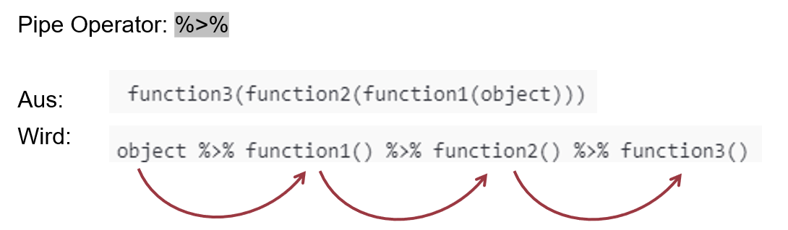
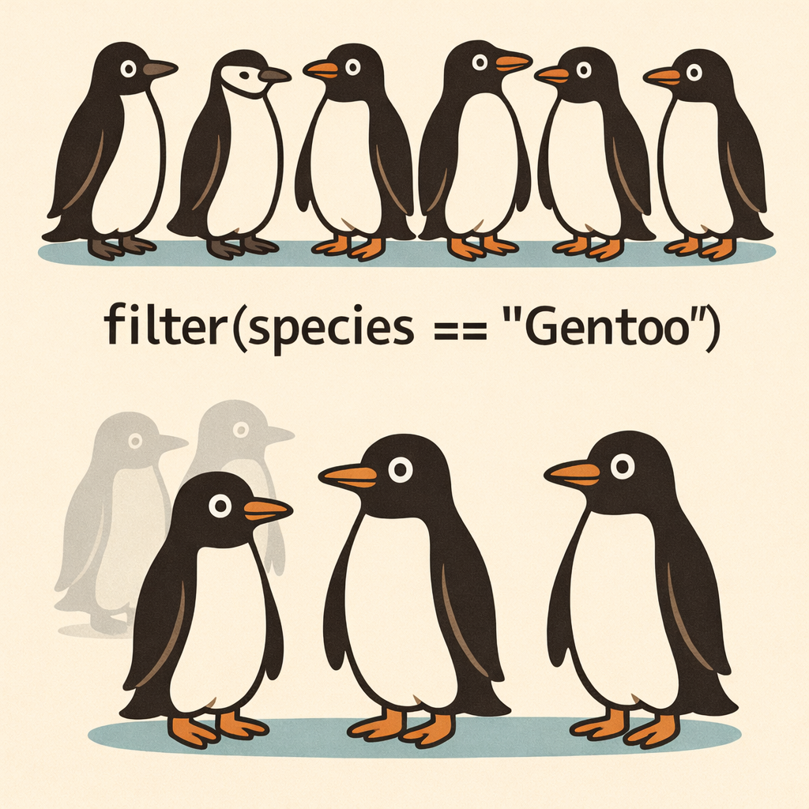
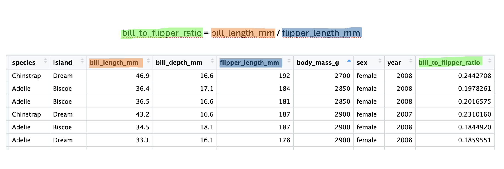
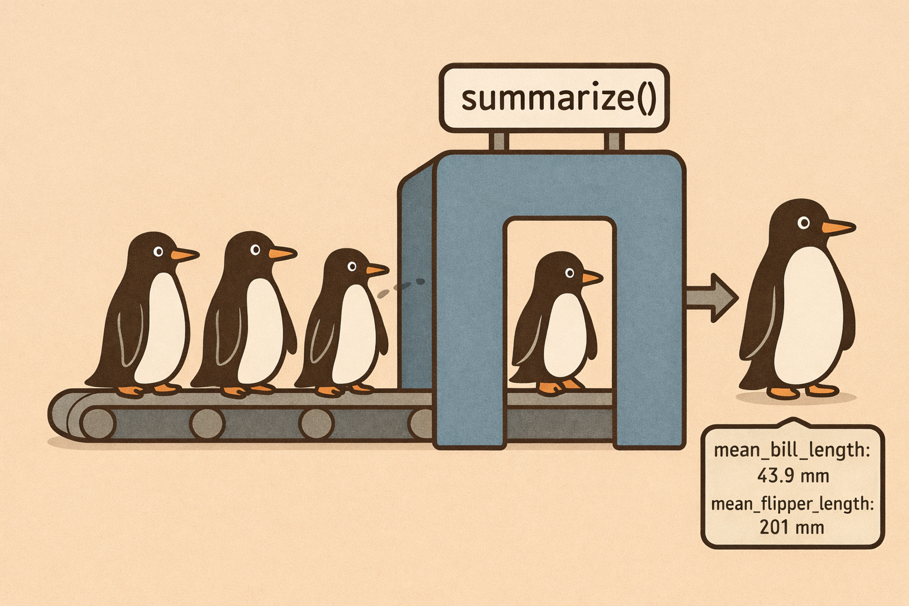
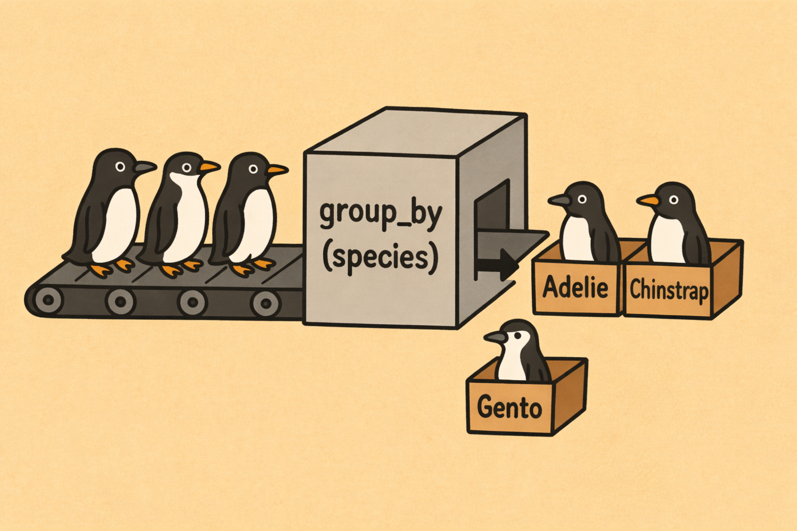

## R u Ready? Reproduzierbare Datenaufbereitung und -analyse mit R

FS 2026<br><br><br> **LV-Leitung**: Dr. Sandra Grinschgl / MSc. Laura Hirt<br> **Tutor**: BSc. Lars Schilling<br><br><br>**7. Einheit**, 01.04.2026

------------------------------------------------------------------------

## Heute:

::: {style="width:100%; height:80vh; background:#777; padding:20px; box-sizing:border-box; border-radius:10px; overflow:auto; "}
```{=html}
<embed
    src="../../PDFs/Syllabus.pdf#view=FitH&navpanes=0&toolbar=0"
    type="application/pdf"
    style="width:100%; height:220vh; border:0; display:block; background:white;"
  >
```
:::

------------------------------------------------------------------------

## Fragen zu Hands On Block 3?

{fig-align="center" width="411"}

------------------------------------------------------------------------

## Wiederholung: Datentypen

::: {style="font-size: 0.75em;"}
| Struktur | Eigenschaften | Beispiel-Inhalt |
|------------------------|------------------------|------------------------|
| **Vektor** | \- Enthält Elemente **eines** Datentyps - Grundbaustein in R | `c(1, 2, 3)` oder `c("Anna", "Ben")` |
| **Liste** | \- Kann verschiedene Datentypen enthalten - Elemente können unterschiedlich lang sein | Zahlenvektor, Textvektor, logischer Vektor in einer Liste |
| **Matrix** | \- Enthält nur **einen** Datentyp - Hat feste Dimensionen (Zeilen, Spalten) | 3x3-Matrix mit Zahlen 1–9 |
| **Data Frame** | \- Tabellarisch aufgebaut - Spalten können unterschiedliche Datentypen enthalten<br>- Jede Spalte gleich lang | Tabelle mit Name (Character), Alter (Numeric), Studiert (Logical) |
:::

------------------------------------------------------------------------

## Wiederholung

-   Faktoren definieren, z.B. `dat_full$group <- factor(dat_full$group, levels = c("above", "below", "control")` oder `dat_full$group <- as.factor(dat_full$group`

    --\> müssen wir bei jedem Öffnen von R/beim Einlesen von Datensätzen wieder machen

-   Matritzen erstellen mit `matrix()`

-   Listen erstellen mit `list()`

-   Data Frame ersellen mit `data.frame()`

    -   Zugriff auf Spalten mit `$` –\> heute besprechen wir Alternativen dazu

::: notes
bei factor() kann die Reihenfolge der levels festgelegt werden (aber geht auch automatisch), bei as.factor immer automatisch
:::

------------------------------------------------------------------------

## Inhalte heute

-   Schrittweise Transformation von Daten

-   Pipe-Operator verstehen und anwenden

-   Zentrale Funktionen aus `dplyr`:

    -   `filter()` → Daten auswählen

    -   `select()` → Variablen auswählen

    -   `mutate()` → neue Variablen erstellen

    -   `summarize()` → Daten zusammenfassen

    -   `group_by()` → nach Gruppen auswerten

**Praxis:**

-   💻 Anwendung der Funktionen in Übungen

------------------------------------------------------------------------

## Pipe-Operator - Code lesbarer gestalten

❌ **Verschachtelter Code (schwer lesbar)**

```{r, echo= TRUE , results = 'hide'}
library(tidyverse)
library(palmerpenguins)
head(select(filter(penguins, species == "Adelie"), species, bill_length_mm))
```

<br>

✅ **Mit Pipe: Schritt für Schritt lesbar (`|>` oder `%>%`)**

```{r, echo= TRUE , results = 'hide'}
penguins |>  
  filter(species == "Adelie") |>  
  select(species, bill_length_mm) |>  
  head()
```

💡 Der Code wird von oben nach unten lesbar

------------------------------------------------------------------------

## Pipe-Operator

### Wie funktioniert die Pipe?



👉 Das Ergebnis wird jeweils an die nächste Funktion weitergegeben

siehe auch [Kapitel 4.2](https://methodenlehre.github.io/einfuehrung-in-R/chapters/04-tidyverse.html)

------------------------------------------------------------------------

## Pipe-Operator

### Was macht die Pipe genau?

👉 Die Pipe (`|>` oder `%>%`) bedeutet:

-   Nimm das Ergebnis links

-   Setze es als erstes Argument in die nächste Funktion ein

💡 Die Pipe ersetzt das erste Argument der nächsten Funktion

<br>

👉 **Beispiel**

<br>

```{r, echo= TRUE , results = 'hide'}
penguins |> filter(species == "Adelie")
```

=

```{r, echo= TRUE , results = 'hide'}
filter(penguins, species == "Adelie")
```

------------------------------------------------------------------------

## Daten transformieren mit `dplyr`

👉 `dplyr` bietet zentrale Funktionen für die Datenverarbeitung

👉 Teil des `tidyverse`

👉 Diese Funktionen lassen sich ideal mit der Pipe kombinieren

::: {style="display: flex; justify-content: center; gap: 50px;"}
 
:::

siehe auch [Kapitel 4.4](https://methodenlehre.github.io/einfuehrung-in-R/chapters/04-tidyverse.html#data-wrangling-dplyr)

------------------------------------------------------------------------

## dplyr: filter()

{fig-align="center"}

------------------------------------------------------------------------

## dplyr: filter()

-   `filter()` wählt **Zeilen/Beobachtungen (rows)** basierend auf Bedingungen

```{r, echo = TRUE}

penguins |>
  filter(species == "Gentoo") |>
  head(n = 4)
```

👉 Ergebnis: Nur Gentoo-Pinguine bleiben übrig

<br>

```{r, echo = TRUE}

penguins |>
  filter(species != "Gentoo") |>
  head(n = 4)
```

👉 Ergebnis: Alle Pinguine ausser Gentoo bleiben übrig

------------------------------------------------------------------------

## dplyr: filter()

Alternative (ggf. Update von `dplyr` notwendig):

```{r, echo = TRUE}

penguins |>
  filter_out(species == "Gentoo") |>
  head()
```

------------------------------------------------------------------------

## dplyr: select()

-   `select()` wählt **Spalten (Variablen)** aus einem Datensatz aus
-   Die Zeilen bleiben unverändert

<br>

💡 **Merke:**

-   `filter()` → wählt Zeilen (Beobachtungen)

-   `select()` → wählt Spalten (Variablen)

------------------------------------------------------------------------

## dplyr: select ()

### Bestimmte Spalten direkt auswählen

```{r, echo = TRUE}
penguins |> 
  select(species, island, bill_length_mm) |>
  head(n = 3)
```

-   `species`, `island` und `bill_length_mm` bleiben erhalten

-   alle anderen Spalten werden entfernt, die Zeilen bleiben gleich

<br>

👉 **Ergebnis:**

-   Der Datensatz enthält nur noch diese drei Spalten

------------------------------------------------------------------------

## dplyr: select()

### Spalten mit Hilfsfunktionen auswählen, z.B.

```{r, echo = TRUE}
penguins |> 
  select(starts_with("bill")) |>
  head(n = 3)
```

Wählt alle Spalten, deren Name mit `"bill"` beginnt

<br>

👉 **Ergebnis:**

-   `bill_length_mm`

-   `bill_depth_mm`

------------------------------------------------------------------------

## dplyr: select()

### Spalten mit Hilfsfunktionen auswählen, z.B.

**Weitere Möglichkeiten**, z.B.: `ends_with()`, `contains()`, `where(is.numeric)`

Wenn man das Gegenteil erzielen will:

```{r, echo = TRUE}

penguins |> 
  select(!starts_with("bill")) |>
  head(n = 3)
```

👉 **Ergebnis:** alle Spalten, die nicht mit "bill" starten

------------------------------------------------------------------------

## dplyr: select()

### Spalten ausschliessen mit `-`

```{r, echo = TRUE}
penguins |> 
  select(-species, -island) |>
  head(n = 3)
```

-   `-` bedeutet: diese Spalten **entfernen**

-   alle anderen Spalten bleiben erhalten

<br>

👉 **Ergebnis:**

-   Datensatz enthält alle Spalten **ausser** `species` und `island`

------------------------------------------------------------------------

## dplyr: mutate()

-   `mutate()` erstellt neue Variablen (Spalten),

-   oder verändert bestehende Variablen

<br>

👉 Alle Zeilen des ursprünglichen Datensatzes werden behalten

👉 Neue Spalten werden aus bestehenden Variablen berechnet

------------------------------------------------------------------------

## dplyr: mutate()

-   Wird oft genutzt, um **berechnete Spalten** hinzuzufügen (z.B. `bill_to_flipper_ratio`)

-   Die Berechnung erfolgt zeilenweise (jede Zeile bekommt ihren eigenen Wert)

<br>

```{r, echo = TRUE}
penguins_upgraded <- penguins |>    
  mutate(bill_to_flipper_ratio = bill_length_mm / flipper_length_mm, 
         body_mass_kg = body_mass_g / 1000) 

head(penguins_upgraded, n = 3)
```

------------------------------------------------------------------------

## dplyr: mutate()



👉 Zeilenweise Berechnung, ohne dabei die Originalvariablen zu verändern

------------------------------------------------------------------------

## dplyr: summarize()

-   `summarize()` fasst Daten zu **Kennwerten** zusammen

-   Aus vielen Beobachtungen wird eine **kompakte Zusammenfassung**

<br>

💡 **Typische Kennwerte:**

-   Mittelwert (`mean()`)

-   Median (`median()`)

-   Standardabweichung (`sd()`)

<br>

👉 `summarize()` reduziert viele Zeilen zu einer oder wenigen zusammengefassten Zeilen

------------------------------------------------------------------------

## dplyr: summarize()

{fig-align="center"}

👉 Einzelne Beobachtungen verschwinden, übrig bleibt die zusammengefasste Information

------------------------------------------------------------------------

## dplyr: summarize()

### Kennwerte berechnen mit `summarize()`

```{r, echo=TRUE}
penguins |> 
  summarize(
    mean_bill_length = mean(bill_length_mm, na.rm = TRUE),
    mean_flipper_length = mean(flipper_length_mm, na.rm = TRUE)
  )
```

<br>

👉 **Ergebnis:** Eine Tabelle mit einer Zeile und den beiden berechneten Kennwerten

------------------------------------------------------------------------

## dplyr: group_by()

{fig-align="center"}

------------------------------------------------------------------------

## dplyr: group_by()

`group_by()` und `summarize()`

```{r, echo=TRUE}
grouped_summary <- penguins |> 
  group_by(species) |> 
  summarize(
    mean_bill_length = mean(bill_length_mm, na.rm = TRUE),
    mean_flipper_length = mean(flipper_length_mm, na.rm = TRUE)
  )

grouped_summary
```

------------------------------------------------------------------------

## dplyr: group_by()

### Ohne vs. mit `group_by()`

**Ohne `group_by()`:**

```{r, echo= TRUE}
penguins |>
  summarize(mean_body_mass = mean(body_mass_g, na.rm = TRUE))
```

➡️ Ergebnis: 1 Wert

<br>

**Mit `group_by()`:**

```{r, echo= TRUE}
penguins |>
  group_by(species) |>
  summarize(mean_body_mass = mean(body_mass_g, na.rm = TRUE))
```

➡️ Ergebnis: ein Wert pro Art

------------------------------------------------------------------------

## Heute haben wir gelernt:

🧩 **Daten Schritt für Schritt verarbeiten**

-   Pipe (`|>` oder `%>%`) verbindet mehrere Schritte

🔍 **Daten auswählen**

-   `filter()` → Zeilen (Beobachtungen)

-   `select()` → Spalten (Variablen)

🧮 **Daten verändern**

-   `mutate()` → neue Variablen erstellen

📊 **Daten zusammenfassen**

-   `summarize()` → Kennwerte

-   `group_by()` → Funktionen pro Gruppe anwenden

------------------------------------------------------------------------

## R-Hausübung

-   Bis am 22.04.2026 (EH 9)

-   Alle Instruktionen auf der Website

-   Danach Feedback von uns

-   16:15 Gruppe: am 15.04 kommt Laura statt Sandra!

    ***Schöne Osterfeiertage!***
