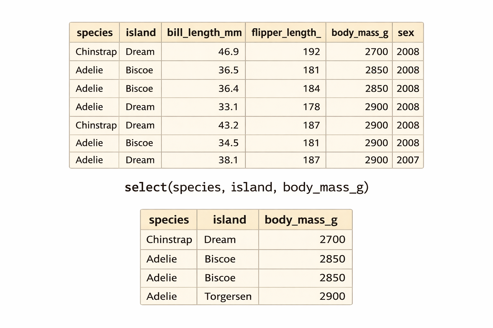

## R u Ready? Reproduzierbare Datenaufbereitung und -analyse mit R

FS 2026<br><br><br> **LV-Leitung**: Dr. Sandra Grinschgl / MSc. Laura Hirt<br> **Tutor**: BSc. Lars Schilling<br><br><br>**7. Einheit**, 01.04.2026

------------------------------------------------------------------------

## Heute:

::: {style="width:100%; height:80vh; background:#777; padding:20px; box-sizing:border-box; border-radius:10px; overflow:auto; "}
```{=html}
<embed
    src="../../PDFs/Syllabus.pdf#view=FitH&navpanes=0&toolbar=0"
    type="application/pdf"
    style="width:100%; height:220vh; border:0; display:block; background:white;"
  >
```
:::

------------------------------------------------------------------------

## Fragen zu Hands On Block 3?

{fig-align="center"}

------------------------------------------------------------------------

## Inhalte heute

-   Schrittweise Transformation von Daten

-   Pipe-Operator verstehen und anwenden

-   Zentrale Funktionen aus `dplyr`:

    -   `filter()` → Daten auswählen

    -   `select()` → Variablen auswählen

    -   `mutate()` → neue Variablen erstellen

    -   `summarize()` → Daten zusammenfassen

    -   `group_by()` → nach Gruppen auswerten

**Praxis:**

-   💻 Anwendung der Funktionen in Übungen

------------------------------------------------------------------------

## Pipe-Operator

### Warum wird Code schnell unübersichtlich?

❌ **Verschachtelter Code:**

```{r, echo= TRUE , results = 'hide'}
library(palmerpenguins)
library(tidyverse)

head(select(filter(penguins, species == "Adelie"), species, bill_length_mm))
```

👉 Wo beginnt die Ausführung dieses Codes?

------------------------------------------------------------------------

## Pipe-Operator (2)

### Von verschachtelt zu lesbar

❌ **Verschachtelter Code (schwer lesbar)**

```{r, echo= TRUE , results = 'hide'}
head(select(filter(penguins, species == "Adelie"), species, bill_length_mm))
```

✅ **Mit Pipe: Schritt für Schritt lesbar (`|>` oder `%>%`)**

```{r, echo= TRUE , results = 'hide'}
penguins |>  
  filter(species == "Adelie") |>  
  select(species, bill_length_mm) |>  
  head()
```

💡 Der Code wird von oben nach unten lesbar

------------------------------------------------------------------------

## Pipe-Operator (3)

### Wie funktioniert die Pipe?


👉 Das Ergebnis wird jeweils an die nächste Funktion weitergegeben

------------------------------------------------------------------------

## Pipe-Operator (4)

### Was macht die Pipe genau?

👉 Die Pipe (`|>` oder `%>%`) bedeutet:

-   Nimm das Ergebnis links

-   Setze es als erstes Argument in die nächste Funktion ein

💡 Die Pipe ersetzt das erste Argument der nächsten Funktion

<br>

👉 **Beispiel**

```{r, echo= TRUE , results = 'hide'}
penguins |> filter(species == "Adelie")
```

=

```{r, echo= TRUE , results = 'hide'}
filter(penguins, species == "Adelie")
```

------------------------------------------------------------------------

## Pipe-Operator (5)

-   `%>%` aus magrittr (tidyverse)

-   `|>` in Base R

👉 **Zweck:**

-   Macht Code lesbarer und verständlicher

-   Erlaubt Schritt-für-Schritt Verarbeitung

::: notes
Unterschiede zwischen den beiden Pipes: Unterschiedliche Platzhalter, native pipe etwas schneller. Für uns spielt der Unterschied keine Rolle.
:::

------------------------------------------------------------------------

## Daten transformieren mit dplyr

👉 dplyr bietet zentrale Funktionen für die Datenverarbeitung

👉 Diese Funktionen lassen sich ideal mit der Pipe kombinieren

::: {style="display: flex; justify-content: center; gap: 50px;"}
 
:::

------------------------------------------------------------------------

## dplyr: filter()

{fig-align="center"}

------------------------------------------------------------------------

## dplyr: filter()

-   filter() wählt **Zeilen/Beobachtungen (rows)** basierend auf Bedingungen

-   Nur Zeilen mit TRUE bleiben erhalten

```{r, eval= FALSE}
species == "Gentoo"
```

👉 ergibt für jede Zeile:

{fig-align="center"}

👉 filter() behält nur TRUE-Zeilen

------------------------------------------------------------------------

## dplyr: filter()

```{r, echo= TRUE}

penguins |>
  filter(species == "Gentoo") |>
  head()
```

👉 Ergebnis: Nur Gentoo-Pinguine bleiben übrig

------------------------------------------------------------------------

## dplyr: select()

-   select() wählt **Spalten (Variablen)** aus einem Datensatz aus
-   Die Zeilen bleiben unverändert

💡 **Merke:**

-   `filter()` → wählt Zeilen (Beobachtungen)

-   `select()` → wählt Spalten (Variablen)

------------------------------------------------------------------------

## dplyr: select()

{fig-align="center"}

👉 Nur die ausgewählten Spalten bleiben erhalten; die Beobachtungen bleiben gleich

------------------------------------------------------------------------

## dplyer: select ()

### Bestimmte Spalten direkt auswählen

```{r, echo = TRUE}
penguins |> 
  select(species, island, bill_length_mm) |>
  head(n = 3)
```

-   `species`, `island` und `bill_length_mm` bleiben erhalten

-   alle anderen Spalten werden entfernt

👉 **Ergebnis:**

-   Der Datensatz enthält nur noch diese drei Spalten

------------------------------------------------------------------------

## dplyr: select()

### Spalten mit Hilfsfunktionen auswählen

```{r, echo= TRUE}
penguins |> 
  select(starts_with("bill")) |>
  head(n = 3)
```

Wählt alle Spalten, deren Name mit `"bill"` beginnt

👉 **Ergebnis:**

-   `bill_length_mm`

-   `bill_depth_mm`

------------------------------------------------------------------------

## dplyr: select()

### Spalten ausschliessen mit `-`

```{r, echo = TRUE}
penguins |> 
  select(-species, -island) |>
  head(n = 3)
```

-   `-` bedeutet: diese Spalten **entfernen**

-   alle anderen Spalten bleiben erhalten

👉 **Ergebnis:**

-   Datensatz enthält alle Spalten **ausser** `species` und `island`

------------------------------------------------------------------------

## dplyr: summarize()

-   `summarize()` fasst Daten zu **Kennwerten** zusammen

-   Aus vielen Beobachtungen wird eine **kompakte Zusammenfassung**

<br>

💡 **Typische Kennwerte:**

-   Mittelwert (`mean()`)

-   Median (`median()`)

-   Minimum/Maximum (`min()`, `max()`)

<br>

👉 `summarize()` reduziert viele Zeilen zu einer oder wenigen zusammengefassten Zeilen

------------------------------------------------------------------------

## dplyr: summarize()

{fig-align="center"}

👉 Einzelne Beobachtungen verschwinden, übrig bleibt die zusammengefasste Information

------------------------------------------------------------------------

## dplyr: summarize()

### Kennwerte berechnen mit `summarize()`

```{r, echo=TRUE}
penguins |> 
  summarie(
    mean_bill_length = mean(bill_length_mm, na.rm = TRUE),
    mean_flipper_length = mean(flipper_length_mm, na.rm = TRUE)
```

👉 **Ergebnis:** Eine Tabelle mit einer Zeile und den beiden berechneten Kennwerten

------------------------------------------------------------------------

## dplyr: summarize()

### `summarize()` mit und ohne Gruppierung

👉 Ohne `group_by()`

-   Kennwerte für den gesamten Datensatz

<br>

👉 Mit `group_by()`

-   Kennwerte pro Gruppe

```{r, echo=TRUE}
penguins |>
  group_by(species) |>
  summarize(mean_body_mass = mean(body_mass_g, na.rm = TRUE))
```

------------------------------------------------------------------------

## dplyr: mutate()

-   `mutate()` erstellt neue Variablen (Spalten),

-   oder verändert bestehende Variablen

<br>

👉 Alle Zeilen des ursprünglichen Datensatzes werden behalten

👉 Neue Spalten werden aus bestehenden Variablen berechnet

------------------------------------------------------------------------

## dplyr: mutate()

-   Wird oft genutzt, um **berechnete Spalten** hinzuzufügen (z.B. `bill_to_flipper_ratio`)

-   Die Berechnung erfolgt zeilenweise (jede Zeile bekommt ihren eigenen Wert)

```{r, echo=TRUE}
penguins_upgraded <- penguins |> 
  mutate(
    bill_to_flipper_ratio = bill_length_mm / flipper_length_mm,
    body_mass_kg = body_mass_g / 1000
  )

head(penguins_upgraded, n = 3)
```

------------------------------------------------------------------------

## dplyr: mutate()


👉 Zeilenweise Berechnung, ohne dabei die Originalvariablen zu verändern

------------------------------------------------------------------------

## dplyr: group_by()

-   `group_by()` teilt die Daten in **Gruppen** auf (z.B. nach `species`)

-   Die Daten selbst werden nicht verändert, sondern intern als gruppiert markiert

<br>

👉 Es verändert nur, wie nachfolgende Funktionen arbeiten

------------------------------------------------------------------------

## dplyr: group_by()

### Was macht `group_by()` wirklich?

-   `group_by()` alleine verändert das Ergebnis nicht sichtbar

-   Jedoch werden nachfolgende Funktionen pro Gruppe ausgeführt

<br>

💡 **Beispiel:**

-   ohne `group_by()` → ein Mittelwert über alle Daten

-   mit `group_by()` → ein Mittelwert pro Gruppe

------------------------------------------------------------------------

## dplyr: group_by()

{fig-align="center"}

------------------------------------------------------------------------

## dplyr: group_by()

### `group_by()` und `summarize()`

```{r, echo=TRUE}
grouped_summary <- penguins |> 
  group_by(species) |> 
  summarize(
    mean_bill_length = mean(bill_length_mm, na.rm = TRUE),
    mean_flipper_length = mean(flipper_length_mm, na.rm = TRUE)
  )

grouped_summary
```

------------------------------------------------------------------------

## dplyr: group_by()

### Ohne vs. mit `group_by()`

**Ohne `group_by()`:**

```{r, echo= TRUE}
penguins |>
  summarize(mean_body_mass = mean(body_mass_g, na.rm = TRUE))
```

➡️ Ergebnis: 1 Wert

<br>

**Mit `group_by()`:**

```{r, echo= TRUE}
penguins |>
  group_by(species) |>
  summarize(mean_body_mass = mean(body_mass_g, na.rm = TRUE))
```

➡️ Ergebnis: ein Wert pro Art

------------------------------------------------------------------------

## Heute haben wir gelernt:

🧩 **Daten Schritt für Schritt verarbeiten**

-   Pipe (`|>` oder `%>%`) verbindet mehrere Schritte

<br>

🔍 **Daten auswählen**

-   `filter()` → Zeilen (Beobachtungen)

-   `select()` → Spalten (Variablen)

<br>

🧮 **Daten verändern**

-   `mutate()` → neue Variablen erstellen

<br>

📊 **Daten zusammenfassen**

-   `summarize()` → Kennwerte

-   `group_by()` → pro Gruppe

------------------------------------------------------------------------

## R-Hausübung

-   Bis am 22.04.2026 (EH 9)

-   Alle Instruktionen auf der Website

-   Danach Feedback von uns

------------------------------------------------------------------------
