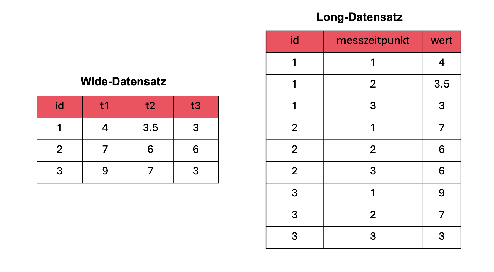
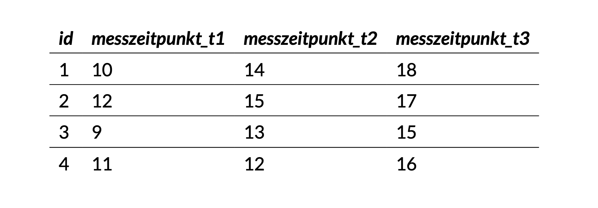
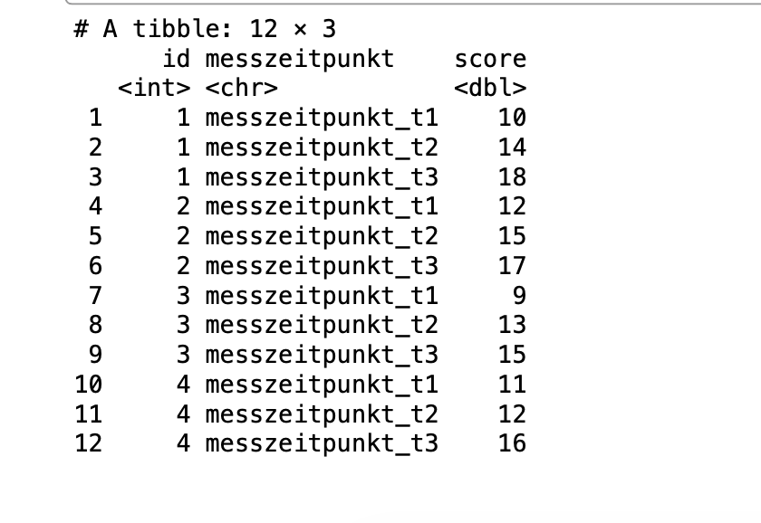
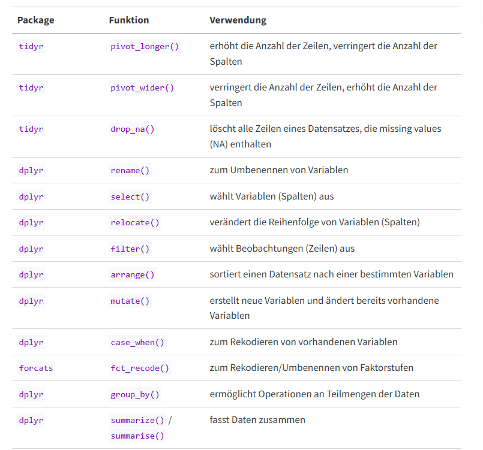
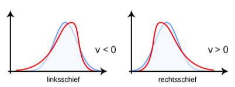
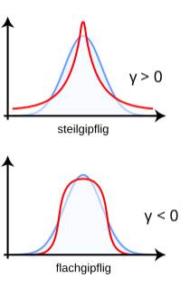

```{r, echo = FALSE, message=FALSE}

library(tidyverse)
library(palmerpenguins)


bfi_10_data <- read_delim("raw/bfi_10_data.csv", delim = ";", escape_double = FALSE, trim_ws = TRUE)

bfi_10 <- drop_na(bfi_10_data)


penguins <- penguins
```

## R u Ready? Reproduzierbare Datenaufbereitung und -analyse mit R

FS 2026<br><br><br> **LV-Leitung**: Dr. Sandra Grinschgl / MSc. Laura Hirt<br> **Tutor**: BSc. Lars Schilling<br><br><br>**9. Einheit**, 22.04.2026

------------------------------------------------------------------------

## Heute:

::: {style="width:100%; height:80vh; background:#777; padding:20px; box-sizing:border-box; border-radius:10px; overflow:auto; "}
```{=html}
<embed
    src="../../PDFs/Syllabus.pdf#view=FitH&navpanes=0&toolbar=0"
    type="application/pdf"
    style="width:100%; height:220vh; border:0; display:block; background:white;"
  >
```
:::

------------------------------------------------------------------------

## Fragen zu Hands On Block 4?

Neue Variablen im Codebook ergänzen bzw. anpassen

{fig-align="center" width="411"}

::: notes
mmq_mean & Pre Ratings
:::

------------------------------------------------------------------------

## Genzplyr 💅

Falls euch die `dplyr()` Funktionen zu Öde sind 😄[genzplyr](https://hadley.github.io/genzplyr/) - Hadley Wickham

{fig-align="center"}

------------------------------------------------------------------------

## Info: Masterarbeiten zu vergeben!

:::::: columns
::: {.column width="33%"}

:::

::: {.column width="33%"}

:::

::: {.column width="33%"}

:::
::::::

------------------------------------------------------------------------

## Inhalte heute

<br>

**1. Daten strukturieren**

-   Wide- vs. Long-Format verstehen

-   Daten gezielt transformieren

**2. Datenqualität prüfen**

-   Verteilungen beurteilen (Schiefe, Kurtosis)

-   Ausreisser erkennen

-   Skalenreliabilität einschätzen

------------------------------------------------------------------------

## Wie können Daten organisiert sein?

**Zwei typische Formate:**

-   Wide Format

-   Long Format

👉 *Beide enthalten die gleichen Informationen – **aber unterschiedlich strukturiert.***

------------------------------------------------------------------------

## Wide vs. Long

{fig-align="center" width="411"}

**Wide:** eine Zeile = eine Person

**Long:** eine Zeile = eine Messung

------------------------------------------------------------------------

## Warum ist das Datenformat entscheidend?

<br>

**Viele statistische Analysen erwarten Long Format**

-   Jede Zeile = eine Beobachtung

-   notwendig bei mehreren Messzeitpunkten pro Person

**Beispiel: Veränderung über die Zeit**

-   Person 1: T1 → T2 → T3

-   Person 2: T1 → T2 → T3

→ Jede Messung muss **eine eigene Zeile** sein

------------------------------------------------------------------------

## Wide to Long Tranformation:

-   Messzeitpunkte werden untereinander statt nebeneinander angeordnet

-   Die ID wird für jede Messung wiederholt

-   **Ergebnis:** eine Zeile = eine Messung

{fig-align="center" width="1200"}

------------------------------------------------------------------------

## **Transformation: Wide** → **Long**

<br>

**Wie müssen wir den folgenden Datensatz transformieren, um ihn ins Long Format zu bekommen?**

<br>

| *id* | *messzeitpunkt_t1* | *messzeitpunkt_t2* | *messzeitpunkt_t3* |
|------|--------------------|--------------------|--------------------|
| 1    | 10                 | 14                 | 18                 |
| 2    | 12                 | 15                 | 17                 |
| 3    | 9                  | 13                 | 15                 |
| 4    | 11                 | 12                 | 16                 |

------------------------------------------------------------------------

## **Wide** → **Long mit `pivot_longer()`**

**Zentrale Argumente:**

-   **`cols`**: Welche Spalten werden gestapelt?

-   **`names_to`**: Name der neuen Variable (z.B. Messzeitpunkt)

-   **`values_to`**: Neue Variable für die Werte

```{r}
df_wide <- data.frame(
  id = 1:4,
  messzeitpunkt_t1 = c(10, 12, 9, 11),
  messzeitpunkt_t2 = c(14, 15, 13, 12),
  messzeitpunkt_t3 = c(18, 17, 15, 16)
)
```

```{r, echo = TRUE, eval = TRUE}
df_long <- df_wide |>
  pivot_longer(
    cols = starts_with("messzeitpunkt_t"),
    names_to = "messzeitpunkt",
    values_to = "score"
  )

df_long
```

::: notes
notwendig für dat_full um 2x3 ANOVA zu berechnen
:::

------------------------------------------------------------------------

## **Wide** → **Long mit `pivot_longer()`**

<br>

::::: columns
::: {.column width="50%"}

:::

::: {.column width="50%"}

:::
:::::

------------------------------------------------------------------------

## Umgekehrter Fall: Long → Wide mit **`pivot_wider()`**

👉 Daten wieder in eine **übersichtlichere Tabellenform** bringen

<br>

**Zentrale Argumente:**

-   **`names_from`**: Werte aus dieser Spalte (`messzeitpunkt`) werden wieder zu Spaltennamen

-   **`values_from`**: Werte aus dieser Spalte (`score`) füllen die neu entstandenen Spalten

```{r echo = TRUE}
df_wide_again <- df_long |> 
  pivot_wider(
    names_from = messzeitpunkt,
    values_from = score
  )

df_wide_again
```

------------------------------------------------------------------------

## Paket tidyr

{fig-align="center" width="148"}

`pivot_longer()` und `pivot_wider()` stammen aus dem Paket tidyr → Teil des tidyverse

[Cheatsheet tidyr](https://rstudio.github.io/cheatsheets/tidyr.pdf)

Umgang mit fehlenden Werten: `drop_na()`, `replace_na()` stammen auch aus tidyr

------------------------------------------------------------------------

## Wichtige Funktionen für die Datenaufbereitung:

aus [Einführung in R, Kapitel 4.1](https://methodenlehre.github.io/einfuehrung-in-R/chapters/04-tidyverse.html)

{fig-align="center"}

------------------------------------------------------------------------

## Hands On!

-   Code korrigieren / verbessern

-   Long Transformationen

------------------------------------------------------------------------

## Datenqualität:

1.  Schiefe /Skewness
2.  Kurtosis / Kurtosis
3.  Normalverteilung der Residuen
4.  Ausreisseranalyse
5.  Skalenreliabilität

👉 **Datenqualität bestimmt die Qualität der Ergebnisse**

Paket: `psych`

::: notes
psych sollte aus Diagnostik bekannt sein. Beinhaltet zb. Funktionen zu Schiefe, Kurtosis, Reliabilität
:::

------------------------------------------------------------------------

## 1. Schiefe (Skewness)

**Funktion `skew()`**

-   beschreibt die Asymmetrie der Verteilung

👉 **rechtsschief (linkssteil):** Die meisten Werte liegen links (klein), einige wenige hohe Werte ziehen die Verteilung nach rechts

👉 **linksschief (rechtssteil):** Die meisten Werte liegen rechts (hoch), einige wenige niedrige Werte ziehen die Verteilung nach links

<br>

[{fig-align="center"}](https://de.wikipedia.org/wiki/Schiefe_(Statistik)#/media/Datei:Rechtsschief.svg)

------------------------------------------------------------------------

## 2. Wölbung (Kurtosis)

**Funktion `kurtosi()`**

-   beschreibt die Form der Verteilung

👉 **steilgipflig:** viele Werte nahe am Mittelwert

👉 **flachgipflig:** breitere Verteilung

<br>

{fig-align="center"}

::: notes
Kurtosis: Je kleiner der Wert, desto flacher ist die Kurve, je höher, desto steiler. Negative Werte sind dabei nicht möglich. Eine Normalverteilung hat eine Kurtosis von 3.
:::

:::: notes
::: notes
Eine Schiefe nahe 0 und eine Kurtosis von etwa 3 sprechen für eine Normalverteilung. Statt der Kurtosis wird oft der Exzess betrachtet. Dabei wird von der Kurtosis der Wert 3 abgezogen, sodass eine Normalverteilung den Wert 0 hat. Werte \< 0 sprechen für einen im Vergleich zur Normalverteilung flacheren, Werte \> 0 für einen steileren Verlauf
:::
::::

------------------------------------------------------------------------

## 3. Normalverteilung der Residuen

-   Voraussetzung für viele statistische Tests

<br>

#### Formen der Überprüfung:

-   **Visuelle Verfahren**: z.B. QQ-Plot

-   **Formale Tests**: z.B. Shapiro-Wilk –\> "veraltete" Methode, zu konservativ bei grossen Stichproben

------------------------------------------------------------------------

## 3. Normalverteilung der Residuen

👉 Ein Residuum ist die Differenz zwischen beobachtetem und vorhergesagtem Wert (Vorhersageabweichung)

```{r}
model_1 <- lm(body_mass_g ~ bill_length_mm + sex, data = penguins)

residuals <- rstandard((model_1))
hist(residuals)
```

::: notes
Ein Residuum beschreibt, wie stark sich ein tatsächlicher Wert von dem Wert unterscheidet, den unser mathematisches Modell vorhersagt.

Wenn wir zum Beispiel einen Wert vorhersagen und die Beobachtung ist etwas höher oder tiefer, dann ist genau diese Differenz das Residuum.

Gute Modelle haben tendenziell kleine Residuen – das heisst, ihre Vorhersagen liegen nahe an den tatsächlichen Werten.

Für viele statistische Verfahren ist es wichtig, dass diese Residuen zufällig verteilt sind und ungefähr einer Normalverteilung folgen. 
:::

------------------------------------------------------------------------

## 3. Visuelle Form der Überprüfung: QQ-Plot

**Zweck:** QQ-Plots prüfen, ob die Daten einer theoretischen Verteilung (z. B. Normalverteilung) folgen.

-   **X-Achse:** **Theoretische Quantile**

-   **Y-Achse:** **Beobachtete (empirische) Datenquantile**

```{r}
qqnorm(residuals)
qqline(residuals)
```

::: notes
Der QQ-Plot und das Histogramm zeigen, dass die Residuen insgesamt nahe an einer Normalverteilung liegen, jedoch im linken Extrembereich **etwas mehr Werte** (heavy tail) und im rechten Extrembereich **etwas weniger Werte** (light tail) aufweisen. Diese Abweichungen sind gering, sodass parametrische Analysen weiterhin angemessen sind.
:::

------------------------------------------------------------------------

## 4. Ausreisser

👉 Ausreisser sollten vor der Analyse klar definiert werden (z.B. Präregistrierung / Datenanalyseplan)

<br>

#### Mögliche Kriterien:

-   Werte ausserhalb von ± SD vom Mittelwert

-   Visuelle Ausreisser in Boxplots und/oder Scatterplots

<br>

#### Wichtig:

👉 Extreme Werte nicht unüberlegt entfernen!

Die Entscheidung hängt von Kontext und Fragestellung ab

**Mehr dazu in @leys2019**

------------------------------------------------------------------------

## 4. Ausreisser

```{r, echo=FALSE}

new_penguin <- tibble(
  species = "Adelie",
  island = "XX",
  bill_length_mm = 1,
  bill_depth_mm = 1,
  flipper_length_mm = 170,
  body_mass_g = 7200,
  sex = "male",
  year = 1990
)

penguins <- bind_rows(penguins, new_penguin)

penguins_dropped <- drop_na(penguins)

```

#### **Streudiagramme/Scatterplots**

```{r echo = TRUE}

ggplot(data = penguins_dropped, aes( x = flipper_length_mm, y = body_mass_g))+
  geom_point()
```

------------------------------------------------------------------------

## 4. Ausreisser

#### **boxplot**

```{r}
ggplot(penguins_dropped, aes(x = "", y = body_mass_g)) +
  geom_boxplot()

```

::: notes
„Ein Ausreißer ist ein Wert, der stark von den übrigen Daten abweicht.\
Wichtig ist: Ein solcher Wert kann verschiedene Ursachen haben.

Manchmal handelt es sich um Fehler – zum Beispiel falsche Eingaben oder Messprobleme. In solchen Fällen kann es sinnvoll sein, den Wert zu entfernen.

In anderen Fällen ist der Wert jedoch real und gehört zur Population – er ist einfach selten oder extrem. Dann sollte er **nicht einfach gelöscht werden**, da er wichtige Informationen enthalten kann.

Deshalb gilt:\
👉 Man muss immer prüfen, *warum* ein Wert auffällig ist – und nicht nur, *dass* er auffällig ist.“

Beispiel:

Ein Pinguin, der von Menschen gefüttert wurde und deshalb ungewöhnlich schwer ist, könnte tatsächlich nicht mehr gut zur Zielpopulation passen.

ABER: Ein besonders großer oder schwerer Pinguin innerhalb der natürlichen Variation wäre hingegen **kein Fehler**, sondern ein echter Extremwert.
:::

------------------------------------------------------------------------

## 4. Interpretation von Ausreissern

#### **Ausreisser können unterschiedliche Ursachen haben:**

-   Messfehler oder falsche Daten → prüfen und ggf. entfernen

-   Seltene, aber reale Beobachtungen → behalten

👉 **Nicht jeder extreme Wert ist ein Ausreisser!**

------------------------------------------------------------------------

## 5. Skalenreliabilität

#### **Was bedeutet Skalenreliabilität?**

Mehrere Items einer Skala sollen dasselbe Konstrukt messen

-   Beispiel: Skala zur *Extraversion*\
    → „Ich bin gesellig“\
    → „Ich gehe gerne auf andere zu“\
    → „Ich fühle mich in Gruppen wohl“

**Zentrale Frage:**

👉 Messen diese Items wirklich das Gleiche?

**Idee:**

-   Wenn Items gut zusammenpassen → hohe Reliabilität

-   Wenn Items unterschiedlich sind → niedrige Reliabilität

------------------------------------------------------------------------

## 5. Skalenreliabilität: Cronbach's Alpha

→ Wichtiger Wert: **raw_alpha** (hier: 0.76)

```{r echo=TRUE}
bfi_10_extra <- bfi_10_data |>
  select(bfi_extra_1_r, bfi_extra_2)

psych::alpha(bfi_10_extra, check.keys = TRUE)
```

------------------------------------------------------------------------

## 5. Skalenreliabilität: Weitere Formen der Reliabilität

<br>

**Alternatives Mass der internen Konsistenz**

-   [McDonalds Omega](McDonald's%20Omega%20(ω)%20https://dorsch.hogrefe.com/stichwort/mcdonalds-omega-o) (Alternative zu Cronbach's Alpha)

<br>

**Weitere Reliabilitätsarten:**

-   **Test-Retest Reliabilität:** → Stabilität über die Zeit
-   **Split-half Reliabilität:** → Konsistenz zwischen Itemhälften

<br>

Mehr Infos dazu: [Psychometrics in R](https://bookdown.org/annabrown/psychometricsR/exercise5.html) & [Björn Walther](https://bjoernwalther.com/cronbachs-alpha-in-r-berechnen/)

::: notes
In diesem Beispiel werden nur zwei Items verwendet - wir gehen davon aus dass bfi_extra_1_r schon rekodiert wurde. Anonsten könnte man das auch im alpha befehl weiter spezifizieren.
:::

------------------------------------------------------------------------

## Heute haben wir:

-   Wide to long Transformationen gemacht - **You mastered the tidyr!**

    {width="156"}

-   Datenqualitätsindikatoren kennengelernt

------------------------------------------------------------------------

## Bis nächste Woche

-   Muddiest Points Umfrage bis Sonntag 23:55
-   Bei weiteren Fragen zu den bisherigen Inhalten: Forum nutzen & Lars kontaktieren

**Optional / Empfehlung**

-   Keine HÜ → Nutzt die Zeit, um Inhalte zu vertiefen oder nachzuholen

------------------------------------------------------------------------
