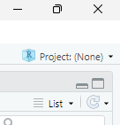
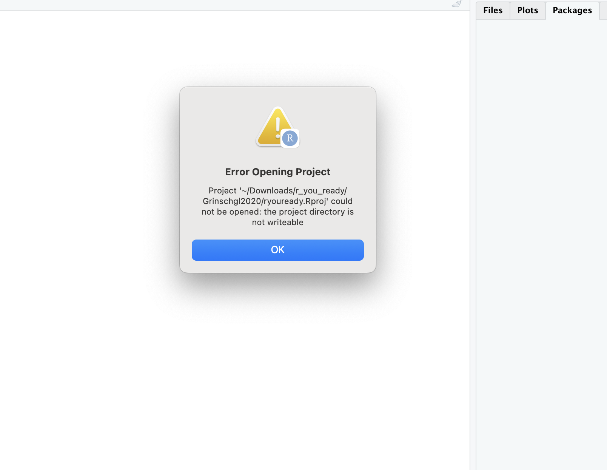
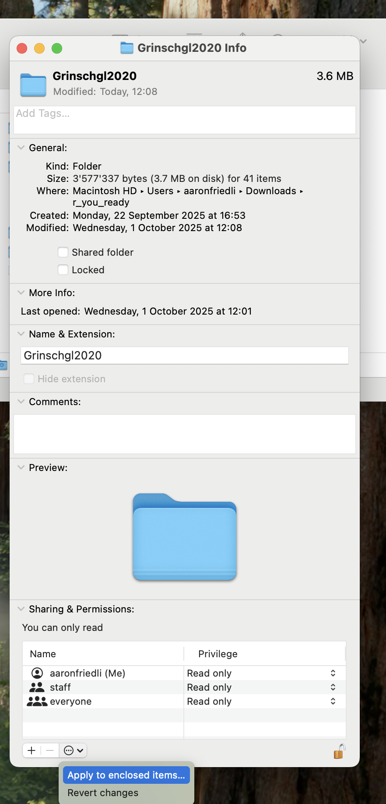
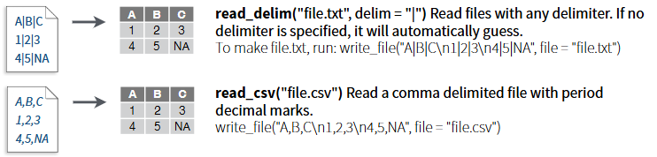
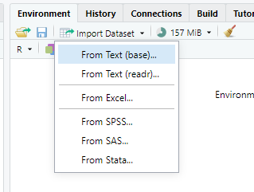
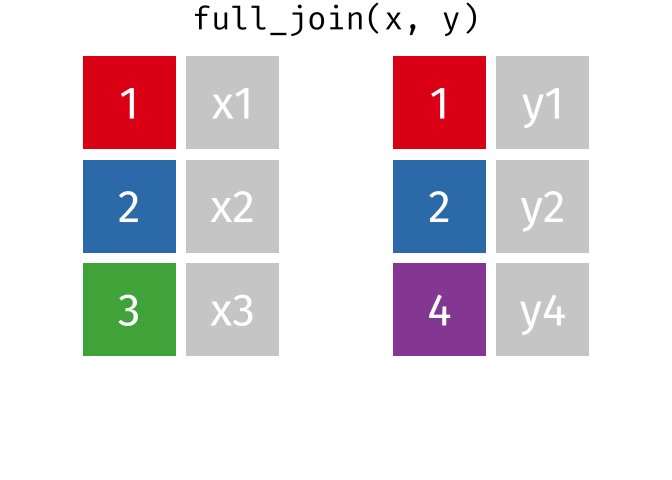
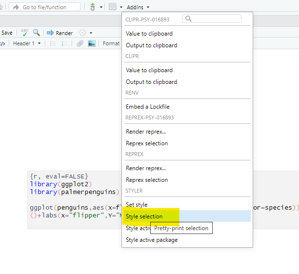

Bei Bedarf finden sich hier nochmal die Slides zu Einheit 3:

::: {=html}
<iframe src="../01_slides/EH_3.html" width="100%" height="500" style="border:0; display:block; margin: 0 0 2rem 0;">

</iframe>
:::

Und hier die Slides zu Einheit 4:

Die Folien zu EH4 werden kurz vor dem Termin hochgeladen.

<!--
::: {=html}
<iframe src="../01_slides/EH_4.html" width="100%" height="500" style="border:0; display:block; margin: 0 0 2rem 0;">

</iframe>
:::
-->

# Lernziele dieses Hands-On-Blocks

✅Projekte

✅Unterschied zwischen relativen und absoluten Pfaden verstehen

✅Datensätze in R importieren, inspizieren und speichern

✅Datensätze mit `cbind()` und `full_join()` mergen und Vor- und Nachteile reflektieren

✅Funktionen und ihre Argumente (inkl. Defaults) nutzen

✅Style Conventions

# Projekte und Pfade

### Was sind R-Projekte?

👉 [Kapitel 6.2 in R for Data Science](https://r4ds.hadley.nz/workflow-scripts.html#projects)

Ein **R-Projekt** ist eine Projektdatei mit der Endung (`.Rproj`), die du in RStudio anlegst oder öffnest.\

Wenn du ein Projekt öffnest, passiert Folgendes automatisch:

-   RStudio setzt das **Working Directory (Arbeitsverzeichnis)** auf den Ordner, in dem die `.Rproj`-Datei liegt.\
-   Alle Dateien, Skripte, Daten und Ergebnisse, die du in diesem Ordner ablegst, gehören logisch zu diesem Projekt.\
-   Du arbeitest in einer klar definierten, geschlossenen Umgebung.\
-   Du kannst entweder ein neues Projekt erstellen oder ein bestehendes Projekt öffnen.\

Du kannst dir ein Projekt wie einen **Container** für ein Forschungsprojekt vorstellen. Alles, was zu einer Analyse gehört, liegt gebündelt an einem Ort.

Das ist besonders wichtig für:

    - Seminararbeiten
    - Reanalysen
    - Masterarbeiten
    - Kollaborative Projekte
    
#### Warum sollte man immer mit Projekten arbeiten?

Viele typische Probleme in R entstehen dadurch, dass kein Projekt verwendet wird:

-   Das Working Directory ist falsch gesetzt.
-   Skripte funktionieren nur auf dem eigenen Laptop.
-   Dateien werden an unterschiedlichen Orten gespeichert.
-   Analysen sind schwer reproduzierbar.

R-Projekte verhindern genau diese Probleme.

👉 In der wissenschaftlichen Praxis ist das Arbeiten mit Projekten Standard, weil es die **Reproduzierbarkeit und Struktur** von Analysen deutlich verbessert.

#### Woran erkennst du, ob ein Projekt geöffnet ist?

Oben rechts in RStudio siehst du den Namen des aktuellen Projekts.

In diesem Screenshot ist noch kein Projekt geöffnet (Project: (None)). Wenn ein Projekt aktiv ist, wird dort der entsprechende Projektname angezeigt.



**Übung:**\

Im ZIP-Ordner zum Abschlussprojekt, den wir letzte Woche gemeinsam von Ilias heruntergeladen haben (inklusive Datenanalyseplan und Codebook), haben wir für euch bereits eine `.Rproj`-Datei angelegt.
Diese befindet sich im Ordner *Grinschgl2020*.

1. Öffne diese Datei.
2. Überprüfe oben rechts in RStudio, ob das richtige Projekt aktiv ist.
3. Schliesse RStudio und öffne es erneut über die `.Rproj`-Datei.

👉 Gewöhne dir an, Analysen immer über die Projektdatei zu starten.


::: {.callout-note collapse="true" title="Bei Fehlermeldungen:"}
„Achtung! Bei Mac-Usern kann es teilweise zu Problemen mit den Berechtigungen kommen. Falls dir beim Öffnen diese Fehlermeldung angezeigt wird:“



Die Lösung besteht darin, die Berechtigungen für den Ordner anzupassen. Dafür gehst du auf den ‚r_you_ready‘-Ordner und öffnest das Menü mit ‚Get Info‘.



Die Berechtigungen passt du an, indem du auf das Schloss unten rechts klickst, dein Passwort eingibst und bei deinem Account ‚Read & Write‘ auswählst. Anschliessend klickst du auf die drei Punkte im Kreis und führst ‚Apply to enclosed items…‘ aus. Danach solltest du die vollen Berechtigungen haben.
:::

**Eigenes Projekt erstellen**

Wenn du zukünftig ein eigenes Projekt anlegen möchtest (z.B. für deine Masterarbeit): 👉[Kapitel 6.2 in R for Data Science](https://r4ds.hadley.nz/workflow-scripts.html#projects)

------------------------------------------------------------------------

### Absolute vs. relative Pfade

Wenn du in R eine Datei einliest, musst du angeben, **wo** diese Datei liegt.

Diesen "Weg" zur Datei nennt man einen **Pfad**.

Dabei unterscheidet man zwei Arten von Pfaden:

#### Absolute Pfade

-   Ein **absoluter Pfad** beschreibt den vollständigen Weg zu einer Datei, ausgehend vom Wurzelverzeichnis *deines* Computers.

    🔴 Nachteil: Sie sind oft sehr lang und funktionieren nur auf deinem Rechner.\

    -   Beispiel (Windows):\
        `C:\Users\maxmustermann\Dokumente\r_you_ready\Grinschgl2020\data\raw\Beispieldatei.csv`
        
Wenn jemand anderes dieses Skript ausführt, wird dieser Pfad nicht existieren.

#### Relative Pfade

-   Ein **relativer Pfad** beschreiben den Weg zu einer Datei ausgehend vom *aktuellen Arbeitsverzeichnis*.

-   Wenn du mit einem R-Projekt arbeitest, ist das Working Directory automatisch der Projektordner.

    🟢 Vorteil: Sie sind kürzer, übersichtlicher und funktionieren auf jedem Rechner, solange die Projektstruktur gleich bleibt.\

    -   Beispiel:

        -   Projektordner = *Grinschgl2020*
        -   Datei liegt in *data/raw/Beispieldatei.csv*
        -   relativer Pfad:

        ```         
        data/raw/Beispieldatei.csv              # relativer Pfad
      
        read_csv("data/raw/Beispieldatei.csv")  # Einlesen der Datei in R
        ```

Solange die Projektstruktur gleich bleibt, funktioniert dieser Code auf jedem Computer.

#### Warum ist das wichtig?

In der wissenschaftlichen Praxis sollen Analysen:

    - nachvollziehbar
    - überprüfbar
    - reproduzierbar

sein.

Absolute Pfade verhindern dies; relative Pfade ermöglichen es.

**❓Reflexionsfrage:*

Um ein Skript reproduzierbar zu gestalten – was eignet sich besser: relative Pfade oder absolute Pfade? Aus welchen Gründen?

# Daten importieren und exportieren

## Import

👉 [Kapitel 3.2](https://methodenlehre.github.io/einfuehrung-in-R/chapters/03-data_frames.html#daten-importieren)

[Cheatsheat Datenimport](https://rstudio.github.io/cheatsheets/html/data-import.html) mit `readr`

### Einlesen via Oberfläche

-   Stelle sicher, dass du das Metapaket **tidyverse** geladen hast (`library(tidyverse)`) (siehe Hands-On 1).\
    Wir verwenden Funktionen aus den Packages **readr** und **readxl**, die Teil des Tidyverse sind.

In diesem Seminar arbeiten wir mit csv und xslx Dateien. Wie werden uns mehere Arten und Weisen anschauen wie man diese einlesen kann.

Beim Einlesen von Daten ist ein wichtiger Faktor, mich welchem Trennzeichen (Delimiter) die Werte von einander getrennt werden.

Auszug aus [Cheatsheet](https://rstudio.github.io/cheatsheets/html/data-import.html): Die Funktionen read_delim und read_csv:



`read_csv()` ist eine Spezialisierung von `read_delim()`, die automatisch Komma als Trennzeichen verwendet, während man bei `read_delim()` das gewünschte Trennzeichen selbst angeben muss.

-   Importiere die Datei `"data_mmq.csv"` über die Point & Klick-Oberfläche von RStudio. Verwende dafür "From Text (readr)"



```         
-   Tipp: Klicke auf **Environment** → **Import Dataset** → wähle die `"readr"`-Funktion.
-   Schaue dir den Datensatz an: Mit welchem Trennzeichen sind die Daten getrennt?
-   
    -   Stelle in der Oberfläche `"Delimiter"` auf das passende Trennzeichen. Was verändert sich?
-   Betrachte den Code, den die Oberfläche generiert. Versuche den Pfad im Kontext von Projekten zu verstehen.
    -   Wenn du im Projekt gearbeitet hast, sollte bei dir der Code etwa so aussehen: `data_mmq <- read_delim("data/raw/data_mmq.csv", delim = ";", escape_double = FALSE, trim_ws = TRUE)`
    -   Wenn du nicht im Projekt gearbeite hättest, wie würde dann der Dateipfad aussehen?
-   Wenn du den Code via Klick-Oberfläche eingelesen hast, wirst du den ausgeführten Code in der Konsole sehen. Kopiere diesen in dein Skript, so dass du ihn in Zukunft wiederverwenden und anpassen kannst.
-   Schaue dir die eingelesenen Daten mit `View(data_mmq)` an. Wenn du alles richtig gemacht hast, ist in jeder Zelle nur ein Wert.
```

### Einlesen via Code

#### .CSV Dateien

-   Versuche, weitere CSV-Datensätze einzulesen: `data_cb`, `data_cvstm`, `data_pct`, `data_vp`.\
    Suche dafür eine geeignete Funktion zum Einlesen von `.csv`.

    -   Verwende den von R-Studio generierten Code, und passe ihn an um einen weiteren Datensatz einzulesen (z.B. indem du den Filenamen veränderst).

-   Korrigiere diesen Code und lies damit die Datei `data_vp` ein (überprüfe den Pfad und den Delimiter)

```{r, eval=FALSE, echo=TRUE}
data_vp <- read_delim("/raw/data_vp.csv", 
    delim = ",")
```

#### .XSLX Dateien

-   Einige Dateien liegen im `.xlsx`-Format.

    -   Verwende dafür das Paket **readxl** und die Funktion `read_excel()`. Tipp: Installiere und lade das Paket zunächst.
    -   Nutze die Hilfefunktion (`?read_excel`) für Infos zur Funktion oder schaue dir das [Cheatsheet](https://rstudio.github.io/cheatsheets/html/data-import.html) an
    -   Versuche, die Datensätze `data_ratings` und `data_strategies` einzulesen.

-   Am Ende solltest du die **7 verschiedene Datensätze** in deinem Environment sehen.

::: {.callout-note collapse="true" title="Vertiefung"}
👉Für das Einlesen anderer Arten von Datensätzen (z.B. SPSS Dateien), siehe [Kapitel 3.2](https://methodenlehre.github.io/einfuehrung-in-R/chapters/03-data_frames.html#daten-importieren)
:::

# Daten mergen

***Wird in EH4 noch genauer erklärt - aber probiere auch gerne schon vorab!***

Nun haben wir 7 verschiedene Datensätze in unserem Enviornment. Da wir jedoch mit dem kompletten Datensatz arbeiten wollen, ist es sinnvoll diese Datensätze zu einem zu verbinden. Jedoch müssen dafür mehrere Dinge beachtet werden: Sind die Daten in der gleichen Reihenfolge (z.B. geordnet nach Identifier (z.B. `code` in `data_mmq`).

**Mögliche Funktionen:** z. B. `cbind()` aus Base R oder `full_join()` aus dem Tidyverse.

## Aufgaben

### Füge alle 7 Datensätze mit `cbind()` zusammen und schaue dir das Ergebnis an.

-   Was fällt dir auf?\
-   Hinweis: Die Datensätze werden einfach nebeneinander „geklebt“, ohne inhaltlich abgeglichen zu werden.\
-   Reflektiere: Macht das Sinn? Was sind die Gefahren, Daten auf diese Art zu mergen?

------------------------------------------------------------------------

### Versuche es nun mit `full_join()`.

Full_join verbindet zwei Datensätze anhand einer Schlüsselvariable, so dass alle Zeilen aus beiden Datensätzen erhalten bleiben. Die Schlüsselvariable ist essentiell dafür dass die Datensätze richtig verbunden werden (Anordnung der Variablen), und grenzt sich dadurch von Funktionen wie `cbind()` ab.

{width="307"}

-   Lege eine gemeinsame Variable als Schlüssel fest, hier: `by = "code"`.

-   Füge nun alle 7 Datensätze zu einem zusammen, nenne diesen `dat_full`

    -   **Achtung:** `full_join()` funktioniert immer nur mit 2 Datensätzen gleichzeitig 👉 du musst es also mehrfach anwenden, um alle 7 Datensätze zusammenzuführen.

    -   Hinweis: Im Datensatz `data_pct` heißt die Code-Variable leicht anders. Verwende deshalb `by = c("code_all" = "code")`.

------------------------------------------------------------------------

### Inspiziere deinen zusammengefügten Datensatz "dat_full"

-   🔍Überprüfe: Wie viele Zeilen und Spalten hat dein Datensatz? Verwende: `ncol()` , `nrow()`, `dim()`
    -   Stimmt die Anzahl der Zeilen mit der Anzahl der Versuchspersonen aus dem Paper überein?
-   👀Verschaffe dir eine Überblick über deinen Datensatz mit den Funktionen, die wir schon im letzten Hands On getestet haben:
    -   Lasse dir die Variablenamen ausgeben mit `names()`
    -   `head()`
    -   `glimpse()`
    -   `str()`
    -   `dat_full`
    -   `summary()`
-   Gibt es redundante oder doppelte Variablen?

**Auf einzelne Werte zugreiffen:**

-   Greife auf den **ersten Wert der ersten Spalte** zu: Verwende eckige Klammern. Der erste Wert in der Klammer steht für die Zeile, der zweite für die Spalte.

-   Greife auf die Werte der **Spalten 1–15 in der ersten Zeile** zu. Verwende wieder eckige Klammern und den Bereichsoperator `1:15`.

-   Lasse dir alle Werte der Variable `"mean_rl_all"` ausgeben. Auf Variablen greifst du mit `$` zu.

-   Greife auf die **ersten 10 Werte der Variable `"question1"`** zu. Verwende dazu den `$`-Operator in Kombination mit dem Bereichsoperator `1:10`.

------------------------------------------------------------------------

# Daten speichern

### Speichere `dat_full` in deinem Ordner `"data"` als CSV-Datei ab

Verwende dafür die Funktion `write.csv()`. Du musst zwei Argumente angeben: Welcher Datensatz aus deinem Environment gespeichert werden soll und unter welchem Pfad (inklusive Dateiname) er abgelegt wird. Bei Unklarheiten schaue dir das [Cheatsheet](https://rstudio.github.io/cheatsheets/html/data-import.html) oder die Hilfefunktion an. Überprüfe nach dem speichern, ob dein Datensatz im richtigen Ordner zu finden ist.

👉 Für diesen Datensatz sollt ihr anschließend das **Codebook** erstellen.

------------------------------------------------------------------------

# Coding Basics: Funktionen

👉[Kapitel 2.4: Calling Functions](https://r4ds.hadley.nz/workflow-basics.html)

👉[Kapitel 2.3: Funktionen aufrufen](https://methodenlehre.github.io/einfuehrung-in-R/chapters/02-R-language.html#funktionen-aufrufen)

Wir haben in diesen Übungen bereits einige Funktionen verwendet (z. B. `sum()` oder `sort()`). Funktionen bestehen aus einem Namen und Argumenten. In diesem Beispiel wird die Funktion `sort()` aufgerufen. Die Argumente, die dafür benötigt werden, sind `first_vector` und `decreasing = TRUE`. Die meisten Funktionen haben *Defaults*, also Argumente mit einer Voreinstellung. Wenn man diese nicht verändern möchte, müssen sie nicht explizit angegeben werden. `sort()` hat als Default `decreasing = FALSE`. Deswegen müssen wir, um die höchsten Werte des Vektors zu bestimmen, diesen Default umstellen. Argumente ohne Defaults müssen zwingend angegben werden).

Die Defaults von Funktionen lassen sich über die Hilfefunktion nachschauen. Diese kann entweder im Tab *Help* geöffnet werden oder direkt über die Konsole mit `?Funktionsname`.

```{r}
first_vector <- c(22342, 4, 5, 6, 7, 23234, 342, 342)
highest_values_1 <- sort(first_vector)[1:2]
highest_values <- sort(first_vector, decreasing = TRUE)[1:2]
```

Bei vielen Funktionen werden die **Namen der Argumente** weggelassen.

Welche Argumente werden hier übergeben? Schreibe die Funktion mit den vollständigen Argumentnamen aus:

```{r}
 seq(-4, 11, 3)
```

Wenn die Argumente nicht explizit benannt werden, ist die Reihenfolge entscheidend. Wenn du die Argumente explizit angibst, kannst du die Reihenfolge frei wählen.

-   Korrigiere diesen Code: Ergänze die Argumentnamen, sodass eine Sequenz von 3 bis 12 in 2er-Schritten erstellt wird. Belasse dabei die Reihenfolge der Zahlen.

```{r, eval=FALSE, echo=TRUE}
seq(2, 12, 3)
```

ℹ️Manche Funktionen sind in mehreren Paketen beinhaltet, sowie wie z.B. die Funktion `filter()`. Um die Funktion definitiv aus einem bestimmten Paket zu verwenden, muss man das Paket dazu schreiben: `dyplr::filter()`

## Tab Completion:

Eine nützliche Funktion von RStudio ist die **Tab Completion**. Wenn du eine Funktion aufrufst und die Tabulator-Taste drückst, erscheint ein Menü mit den möglichen Argumenten, die du angeben kannst. Probiere es mit der Funktion `mean()`. Das funktioniert auch für Funktionen aus Paketen, wenn du diese mit `::` auswählst, zum Beispiel: `readr::`.

## Weitere Tasten und Tastenkürzel:

👉[Kapitel 1.4.6](https://methodenlehre.github.io/einfuehrung-in-R/chapters/01-workflow.html#tasten)

In RStudio benötigen wir häufig Zeichen, die wir im Alltag kaum verwenden. Da wir nicht alle mit dem gleichen Betriebssystem (Mac/Windows) und auch nicht mit identischen Tastaturen arbeiten, können wir keine einheitlichen Angaben machen, wo sich diese Zeichen genau befinden. Versuche daher, die folgenden Zeichen auf deiner eigenen Tastatur zu finden:

-   `[ ]` Square brackets (eckige Klammern)

-   `{ }` Curly brackets (geschweifte Klammern)

-   `$` Dollar sign (Dollarzeichen – wird für das Auswählen von Variablen benötigt)

-   `#` Hash (Rautezeichen – für Kommentare in R-Skripten)

-   `~` Tilde (für Modellnotationen in R; brauchen wir v.a. am Ende des Semesters bei den Analysen)

-   `|` Vertical bar (senkrechter Strich – als logischer Operator)

-   `` ` `` Backtick (Gravis – vor allem für Code Chunks, selten manuell einzugeben)

## Verschachtelte Funktionen:

ℹ️Es ist zwar möglich, mehrere Funktionen ineinander zu verschachteln. Dies kann jedoch schnell zu Verwirrung führen und den Code unnötig unübersichtlich machen. Verschachtelte Funktionen werden von innen nach aussen ausgeführt.

❓Stelle dir hier die Frage: Was wird genau gerundet? Die einzelnen Elemente des Vektors oder der errechnet Durchschnitt?

```{r}
print(mean(round(first_vector)))
```

❗Aufgabe: Zerlege die Verschatelte Funktion in ihre Teilschritte.

# Style Conventions

Korrigiere diesen Code so dass er

-   Fehlerfrei läuft

-   Leserlicher ist: Beachte dafür

    -   Naming Conventions

    -   Weitere Style Vorgaben (z.B. Leerzeichen)

```{r, eval=FALSE, echo=TRUE}

Französischschul_NotenSemesester -<(4,5, 6,5,4,  3)
mean <-mean(Französichschul_NotenSemsester
print  ( mittelwert)

```

-   Installiere das Package `styler` mit `install.packages()` und lade es. `styler` hat eine sogenannte "Wrapper-Funktion", die du unter "Addins" aufrufen kannst (evtl. musst du R vor dem Laden neu starten). Verwende den Default-Style (tidyverse).



-   Versuche mit der `Styler` -Funktion diesen Code zu leserlicher zu machen (markiere den Code und wähle *Style selection*). (Du musst diesen ggplot Code nicht verstehen - wir kommen dazu in einer späteren Einheit noch.)

```{r, eval=FALSE}
library(ggplot2)
library(palmerpenguins)

ggplot(penguins,aes(x=flipper_length_mm,y=body_mass_g,color=species))+geom_point()+labs(x="flipper",Y="MASS")+theme_minimal()

```

# Am Ende deiner Übungen - vergiss nicht dein Skript abzuspeichern! :-)
