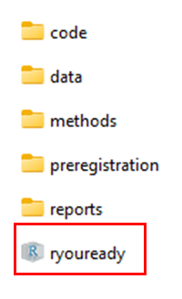
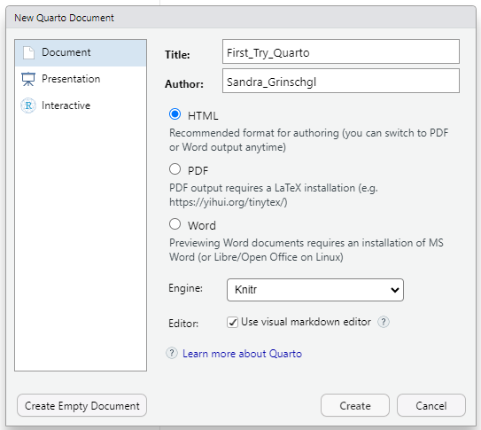
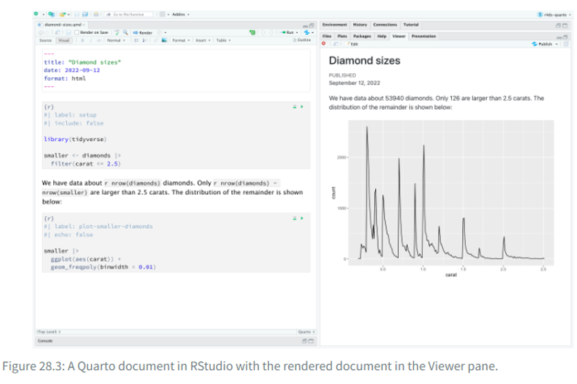

Bei Bedarf findest du hier nochmals die Slides zu Einheit 5:

::: {=html}
<iframe src="../01_slides/EH_5.html" width="100%" height="500" style="border:0; display:block; margin: 0 0 2rem 0;">

</iframe>
:::

Und hier die Slides zu Einheit 6 (werden kurz vor EH 6 ergänzt):

```{=html}
<!--
::: {=html}
<iframe src="../01_slides/EH_6.html" width="100%" height="500" style="border:0; display:block; margin: 0 0 2rem 0;">

</iframe>
:::
-->
```

# Wiederholung Hands On Block 2:

-   Projekt und relativer Pfad: Arbeitet immer mit eurem R Projekt. Klickt auf dieses, um R zu öffnen.

{width="105"}

-   Ausgehend vom Arbeitsverzeichnis des Projektes, kannst du Dateien mit einem relativen Pfad in den jeweiligen Unterordnern abspeichern. z.B.: `write.csv(dat_full, "data/processed/dat_full.csv")`

-   Ebenso kannst du ausgehend vom Arbeitsverzeichnis des Projektes auch Dateien einlesen, z.B.: `dat_pct <- read.delim("data/raw/data_pct.csv", delim = ";")`

-   **Ergänzung**: Um sicherzustellen die Dateien ausgehend vom Arbeitsverzeichnis des Projektes zu lesen kannst du die Funktion `here` aus dem gleichnamigen Package `here::` verwenden, z.B. `dat_pct <- read.csv(here::here("data", "raw", "dat.full.csv"))`. Die Funktion geht immer vom Ordner der Projektdatei aus und baut dann anhand der beliebig vielen angegebenen Argumente selbstständig den passenden Pfad zum Einlesen einer Datei. Wir empfehlen dir für dein Abschlussprojekt mit `here()` zu arbeiten.

-   Mehrere Datensätze könnten mit `full_join()` "gemerged" werden

-   Datensätze können mit z.B. `head()` und `summary()` inspiziert werden

Wir haben nun schon mit einigen Funktionen gearbeitet, wie etwa `full_join()`. Falls du die Übungen der letzten Wochen noch nicht abgeschlossen hast, versuche diese nun nachzuholen. Schaue dir

-   Funktionen

-   Tab Completion

-   und Style Conventions an.

[Hier kommt hier zurück zu den Inhalten Hands-On-Blocks 2.](https://r-you-ready.github.io/Webseite_FS26_Seminar/scripts/02_excercises/loesung_2.html)

# Lernziele des Hands-On-Blocks 3

✅Basics Reproduziebarer Code

✅Quarto

✅Faktoren

✅Datentypen: Vektoren, Listen, Matrizen, Dataframes

# Reproduzierbarer Code: Quarto

👉[R for Datascience, Kapitel 28](https://r4ds.hadley.nz/quarto.html)

Bisher haben wir hauptsächlich in klassischen R-Skripten gearbeitet. RStudio bietet jedoch auch die Möglichkeit, in einem Dateiformat zu arbeiten, dass Textelemente und Code kombiniert 👉 **Quarto**.

Quarto verbindet normalen Text und Code in einem dynamischen Dokument. Auch diese Website wurde mit Quarto erstellt. Dadurch lässt sich die Kommentierung von Code besser integrieren, was die Arbeit insgesamt reproduzierbarer macht. Mit Quarto können zudem ganze Dokumente erstellt werden, beispielsweise eine Masterarbeit.

Der Vorteil von Quarto ist, dass Code ausführlich kommentiert werden kann und Skripte mit Überschriften, Inhaltsverzeichnis etc. erstellt werden können. Das macht R-Coder übersichtlicher und verständlicher und somit auch reproduzierbarer.

## Übungen:

-   Erstelle ein neues Quarto-Skript:



-   Versuche dich zu orientieren: Wie wechselst du zwischen dem **Visual** und **Source Editor**?

-   **Erstelle eine Überschrift:**

    -   Suche zuerst nach der entsprechenden Option im **Visual Editor**.

    -   Schau dir anschließend die Überschrift im **Source Editor** an. Wie unterscheiden sich Überschriften von normalem Text?

    -   Schreibe einige Dinge in *kursiv*, **fett**, [unterstrichen]{.underline}, Schaue dir diese im Source Editor an.

    -   Rendere deine Datei indem du den Button "Render" verwendest. Schaue dir das Resultat an.

        Eine gerenderete Datei ist eine PDF, HTML oder Word Datei, die man dann auch mit anderen Programmen als R öffnen kann. So könnte man z.B. aus einem Quarto Dokument den Ergebnisteils für eine Masterarbeit erstellen und diesen als Word Datei speichern.

## Code Chunks

📖 [R4DS Kapitel 28.5.1](https://r4ds.hadley.nz/quarto.html#code-chunks)

Für weitere Informationen, konsultiere das [Quarto Cheatsheat](https://rstudio.github.io/cheatsheets/quarto.pdf) und die [Quarto Website](https://quarto.org/).

-   **Erstelle einen neuen Code-Chunk:**

    -   Versuche es im **Visual Editor**, indem du ein „/“ eingibst und im Drop-down-Menü **„R-Code Chunk“** auswählst

-   Gib deinem Code-Chunk ein "Label". Verwende dafür "#\|" in deinem Chunk um lokale Einstellungen zu setzen. (📖 [R4DS Kapitel 28.5.1](https://r4ds.hadley.nz/quarto.html#code-chunks)).

-   Manchmal will man nicht alle Teile des Skripts in das gerenderte Dokument übernehmen. Erstelle einen neuen Code-Chunk und stelle `eval` und `include` auf TRUE

-   **Kreiere eine neue Variable `datum`** mit dem heutigen Datum. Nutze dafür `Sys.Date()`.

## Inline Code

-   **Füge folgenden dynamischen Satz in dein Dokument ein:** „*Dieses Dokument wurde zum letzten Mal am `datum` bearbeitet.*“

-   Benutze dafür die Variable `datum` die du bereits kreiert hast. Diese kannst du hinzufügen indem du "/" benutzt und "Inline R Code" suchst. Inline Code lässt sich auch mit diesem Sonderzeichen \` kreieren wenn du danach ein "r" eingibst.

-   **Rendere das Dokument:** Stelle ganz oben in deinem Dokument dafür das Format auf docx um. Wenn du das Dokument als PDF rendern willst benötigst du TinyTeX. Das kannst du mit dem Befehl `install.packages("tinytex")` installieren.

-   Nutze dafür den **Render-Button** und schau dir das gerenderte Ergebnis an. Was ist mit deinem dynamischen Satz passiert?

*Das Resultat sollte so aussehen (mit dem aktuellen Datum):*

```{r, echo=FALSE}
datum <- Sys.Date()
```

Dieses Dokument wurde zum letzten Mal am `r datum` bearbeitet.

::: callout-important
Quarto-Dokumente lassen sich nur rendern, wenn das gesamte Skript fehlerfrei durchläuft. Tritt beim Rendern ein Fehler auf, ist es sinnvoll, das gesamte Skript auszuführen und auf Fehlermeldungen zu achten. Auf diese Weise wird die **Reproduzierbarkeit** sichergestellt.

Möchte man das Skript trotz eines Fehlers rendern, kann man an den entsprechenden Code-Chunk `#| eval: false` schreiben - dies verhindert, dass der Code für die gerenderte Datei ausgeführt wird
:::

## Quarto Header

In den Code Chunks hast du bereits einige Einstellungen kennengelernt. In den **Quarto-Headern** lassen sich verschiedene Einstellungen vornehmen.\
Beispielsweise kann man den **Output des Dokuments** anpassen (z. B. `format: html` `format: docx` `format: pdf`).

Manchmal möchte man auch **globale Einstellungen** vornehmen, die für das gesamte Dokument gelten.\
Zum Beispiel kann es sinnvoll sein, **Warnmeldungen von R** im gerenderten Dokument auszublenden, um die Übersicht zu behalten.\
Dies lässt sich mit der Option `warning: false` einstellen.

-   Versuche den Quarto Header so zu verändern das du ein Word oder PDF renderst.

Viele weitere Einstellungsmöglichkeiten findest du unter folgendem [Link](https://quarto.org/docs/reference/formats/html.html).



### Übungen Quarto Header

Stelle in deinem Quarto Header die folgenden Einstellungen ein, indem du die Elemente des YAML-Headers überarbeitest. Diesen findest du ganz oben in deinem Dokument. Dafür kannst du den Code-Block unten kopieren und für deinen Header anpassen.

-   Titel

-   Autor:in

-   Inhaltsverzeichnis (toc) = TRUE

-   Position des Inhaltsverzeichnisses = left

-   Warning = FALSE

-   Message = FALSE

-   <div>

    ```{r, eval=FALSE, echo=TRUE}
    title: 'Gib hier den Namen deines Dokuments ein'
    author: 'Dein Name'
    date: today
    format:
      html:
        theme: flatly
        toc:   # Inhaltsverzeichnis?
        toc-location:  # Links oder Rechts?
    execute:
      warning:  # TRUE or FALSE
      message: # TRUE or FALSE

    ```

    </div>

**Aufgabe:** Rendere das Dokument erneut und überprüfe das gerenderte Ergebnis im Vorschaufenster oder im Ausgabeordner.

Arbeite von nun an immer in einem Quarto Skript. Für das Abschlussprojekt findest du im Ordner "code" schon zwei vorgegebene Quarto Skripte.

# Faktoren (Spezialtyp eines Vektors):

👉[Einführung in R, Kapitel 2.4.4](https://methodenlehre.github.io/einfuehrung-in-R/chapters/02-R-language.html#factors)

***Aufgabe: Arbeiten mit kategorialen Variablen (Faktoren)***

Kategoriale bzw. nominale Variablen werden in R als **Faktoren** gespeichert (`factor`-Datentyp).

-   **Erstelle** einen Character-Vektor mit mindestens fünf Einträgen, die verschiedene Geschlechtskategorien enthalten (z. B. *"male"*, *"female"*, *"nonbinary"*).

-   **Definiere** nun einen Faktor mit der Funktion `factor()` für diesen Vektor.

-   **Untersuche** die Eigenschaften deines Faktors mit den Funktionen `class()`, `attributes()` und `table()`.

**Beachte:** Die erste Stufe des Faktors ist die sogenannte **Referenzkategorie** – sie ist für manche Analysen relevant. Mit `relevel()` kannst du die Referenzkategorie ändern.

# Datenstrukturen: Vektoren, Listen, Matrizen und Data Frames

👉[Einführung in R, Kapitel 2.4](https://methodenlehre.github.io/einfuehrung-in-R/chapters/02-R-language.html#datentypen)

Bevor wir mit den Übungen starten, ein Überblick über die Unterschiede:

| Struktur | Eigenschaften | Beispiel-Inhalt |
|------------------------|------------------------|------------------------|
| **Vektor** | \- Enthält Elemente **eines** Datentyps<br>- Grundbaustein in R | `c(1, 2, 3)` oder `c("Anna", "Ben")` |
| **Liste** | \- Kann verschiedene Datentypen enthalten<br>- Elemente können unterschiedlich lang sein | Zahlenvektor, Textvektor, logischer Vektor in einer Liste |
| **Matrix** | \- Enthält nur **einen** Datentyp<br>- Hat feste Dimensionen (Zeilen, Spalten) | 3x3-Matrix mit Zahlen 1–9 |
| **Data Frame** | \- Tabellarisch aufgebaut<br>- Spalten können unterschiedliche Datentypen enthalten<br>- Jede Spalte gleich lang | Tabelle mit Name (Character), Alter (Numeric), Studiert (Logical) |

***👉*** **Merksatz:**

\
**Vektor** = einfachste Struktur, ein Datentyp\
**Liste** = flexibel, verschiedene Datentypen\
**Matrix** = „Zahlenrechteck“, ein Datentyp\
**Data Frame** = Tabelle, Spalten können unterschiedliche Datentypen haben

## Vektoren:

Wir haben in den Hands-On-Übungen Block 1 und 2 bereits einige einfache Vektoren erstellt und damit operiert.

## Matrizen

Eine **Matrix** besteht nur aus einem Datentyp (z.B. nur Zahlen).

-   Erstelle eine 3x3-Matrix `matrix()` mit den Zahlen 1 bis 9.

-   Wandle einen Vektor 1:12 in eine 3x4-Matrix um. Teste den Unterschied zwischen `byrow = TRUE` und `byrow = FALSE` innerhalb von matrix().

-   Greife auf das Element in der 2. Zeile, 3. Spalte zu.

-   Berechne die Spaltensummen und Zeilensummen.

-   Schaue dir an, was passiert wenn du `t()` auf deine Matrix anwendest.

::: callout-note
## Freiwillig für Fortgeschrittene:

-   Generiere aus den Variablen ID, Initialen und Alter eine Matrize, die so aussieht: "1-RS-44" "2-MM-78" "3-PD-22" "4-PG-34" "5-DK-67" "1-RS-59«

-   Erstelle einen Vektor mit den Namen mehrerer berühmter Wissenschaftler:innen. Kombiniere die Namen mit paste() und einem zusätzlichen Suffix, z. B. „, PhD“. Prüfe mit grepl(), ob einer der Namen ein bestimmtes Muster enthält (z. B. „stein“).
:::

## Listen

Eine **Liste** kann verschiedene Datentypen enthalten (z. B. Zahlen, Zeichenketten, logische Werte).

👉 [Einführung in R, Kapitel 2.4.5](https://methodenlehre.github.io/einfuehrung-in-R/chapters/02-R-language.html#lists)

-   **Erstelle eine Liste mit drei Elementen und der Funktion** `list()`**:**

    -   einem Vektor mit den Zahlen 1 bis 5

    -   einem Character-Vektor mit den Namen deiner Kommiliton:innen

    -   einem logischen Vektor (TRUE, FALSE)

-   Greife auf das zweite Element der Liste zu.

-   Greife auf den dritten Wert des ersten Elements der Liste zu.

-   Füge der Liste ein weiteres Element hinzu (z. B. den Mittelwert der Zahlen).

## Data Frames

👉[Einführung in R, Kapitel 2.4.6](https://methodenlehre.github.io/einfuehrung-in-R/chapters/02-R-language.html#data-frames)

Ein **Data Frame** ist eine tabellarische Struktur mit Spalten, die verschiedene Datentypen enthalten können.

-   Erstelle einen Data Frame `data.frame()` oder `tibble()` mit drei Spalten:

    -   name (Character)

    -   alter (Numeric)

    -   studiert (Logical: TRUE/FALSE)

-   Greife mit `datensatz$alter` auf die Spalte "alter" zu.

-   Filtere alle Zeilen, in denen studiert `== TRUE`.

-   Füge eine neue Spalte hinzu, die "alter" + 10 berechnet.

-   Benenne die Spalten in deinem Data Frame mit `colnames()` oder `rename()`um, sodass sie internationalen Standards folgen.

-   Berechne den Mittelwert und die Standardabweichung der Variable „age".

-   Sortiere den Data Frame basierend auf "age" absteigend mit `arrange()`.

Weitere Informationen zum Erstellen von Data Frames findest du hier: [Einführung in R, Kapitel 3.1](https://methodenlehre.github.io/einfuehrung-in-R/chapters/03-data_frames.html#datens%C3%A4tze-selber-erstellen)

## Übungen mit dat_full

Nun, da wir einige Operationen mit Data Frames kennengelernt haben, wenden wir diese auf unseren Datensatz dat_full an.

-   Lies **dat_full** ein. Diesen Datensatz solltest du als .csv-Datei abgespeichert haben.

-   Sieh dir den Datensatz genau an. Die Variable `csvtm_sum` scheint einen Tippfehler zu enthalten. Korrigiere diesen zu `cvstm_sum` mit einer der oben vorgestellten Funktionen.

-   Überlege dir: Welche Variable sollte in einen Faktor umgewandelt werden?

-   Definiere diese Variable(n) als Faktor, z. B. mit `as.factor()` oder `factor().`

-   **Zum Schluss speichere den bereinigten Datensatz erneut mit `write.csv` ab.**

::: callout-note
**Hinweis:** R speichert nicht automatisch, dass eine Variable als Faktor definiert wurde. Dieser Code muss daher bei jedem Neustart erneut ausgeführt werden, wenn du wieder mit denselben Faktoren arbeiten möchtest.
:::

# Am Ende deiner Übungen - vergiss nicht dein Skript abzuspeichern! :-)
