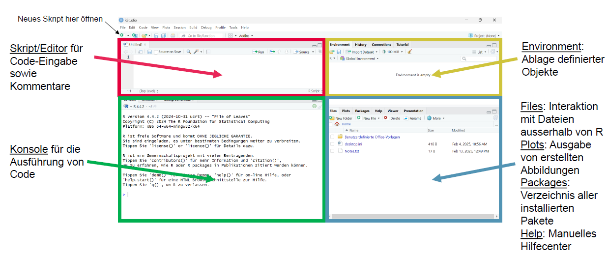

# Lösung - Codings Basics (Einheiten 1 und 2)

Bei Bedarf finden sich hier nochmal die Slides zur EH1:

::: {=html}
<iframe src="../01_slides/EH_1.html" width="100%" height="500" style="border:0; display:block; margin: 0 0 1.5rem 0;">

</iframe>
:::

Und hier nochmal die Slides zur EH2:

::: {=html}
<iframe src="../01_slides/EH_2.html" width="100%" height="500" style="border:0; display:block; margin: 0 0 1.5rem 0;">

</iframe>
:::

## Installation R und R-Studio

Installiere R und RStudio:

1.  Installation von R – neueste Version 4.5.2: <https://stat.ethz.ch/CRAN/>

2.  Installation von Rstudio (Version 2026.01.06): <https://posit.co/download/rstudio-desktop/>

Du weisst nicht, was es mit R auf sich hat? Hier ist eine Kurzerklärung: <https://methodenlehre.github.io/einfuehrung-in-R/>

## Einstellungen

1.  RStudio öffnen & Einstellungen vornehmen: Unter «tools» –«global options» die **unter 1.1.** beschriebenen Einstellungen vornehmen: [https://methodenlehre.github.io/einfuehrung-in-R/chapters/01-workflow.html](#0){.uri}

<!-- -->

2.  Neues Skript öffnen & orientieren:

## Hands on: Coding Basics

Im folgenden machen wir uns vertraut mit der Oberfläche von R-Studio:

{fig-align="center"}

<!-- -->

a)  Skript für Code-Eingabe sowie Kommentare
b)  Konsole für die Ausführung von Code -\> Teste einfache mathematische Operation in dieser; reproduziere diese mittels Skript
c)  Rechts oben: Environment & History
d)  Rechts unten: Files, Plots, Packages und Help Viewer

## Pakete installieren und laden

Tidyverse ist ein Meta-Paket, das mehrere Pakete umfasst[{width="472"}](https://www.tidyverse.org/)

1.  Pakete installieren (nur 1x notwendig) -\> führe diesen Code in der Konsole aus

    ```{r}
    #| eval: false
    #| echo: TRUE

    install.packages("tidyverse")
    ```

2.  Paket laden (innerhalb des Skriptes, bei jedem Neustart von R notwendig)

    ```{r}
    #| echo: TRUE

    library(tidyverse)
    ```

Tipp: Pakete regelmässig updaten mit z.B. update.packages()

### Operatoren kennenlernen

1.  a\. Nutze R als Taschenrechner

    1.  `123+456`

::: {.callout-note collapse="true" title="Lösung"}
```{r, include = TRUE, eval = TRUE}
123 + 456
```
:::

```         
2.  `144*112`
```

::: {.callout-note collapse="true" title="Lösung"}
```{r, include = TRUE, eval = TRUE}
144*112
```
:::

```         
3.  `10/3`
```

::: {.callout-note collapse="true" title="Lösung"}
```{r, include = TRUE, eval = TRUE}
10/3
```
:::

```         
4.  Quadriere 420
```

::: {.callout-note collapse="true" title="Lösung"}
```{r, include = TRUE, eval = TRUE}
420^2
```
:::

```         
5.  Ziehe die Quadratwurzel aus 146 mit der Funktion `sqrt()`
```

::: {.callout-note collapse="true" title="Lösung"}
```{r, include = TRUE, eval = TRUE}
sqrt(146)
```
:::

```         
6.  Berechne den Rest der Division 10/3 mit dem Modulo Operator: `%%`
```

::: {.callout-note collapse="true" title="Lösung"}
```{r, include = TRUE, eval = TRUE}
10 %% 3
```
:::

#### Arithmetische Operatoren und Funktionen in R, z.B.

| Zeichen | Bedeutung                   |
|---------|-----------------------------|
| \+      | Addition                    |
| \-      | Substraktion                |
| \*      | Multiplikation              |
| /       | Division                    |
| sqrt(x) | Quadratwurzel               |
| abs(x)  | Betrag (absoluter Wert)     |
| x %% y  | Modulo (x mod y) 5 %% 2 = 1 |
| \^      | Potenz                      |

### Erste Zuweisungen/Variablen definieren

1.  Erstelle eine Variable `x` und weise ihr mit dem Zuweisungsoperator `<-` den Wert 5 zu.

::: {.callout-note collapse="true" title="Lösung"}
```{r, include = TRUE, eval = TRUE}
x <- 5
```
:::

2.  Weise der Variable `y` eine beliebige Zahl zu. Teile anschliessend `x` (aus Aufgabe 1) durch `y` und speichere das Ergebnis in der Variable `z`.

::: {.callout-note collapse="true" title="Lösung"}
```{r, include = TRUE, eval = TRUE}
y <- 10 # hier könntet ihr auch jede andere Ziffer wählen

z <- x / y
```
:::

3.  Schaue dir das Ergebnis in deinem Environment an. Lass dir das Ergebnis auch in der Konsole ausgeben. Das Environment findest du oben rechts, die Konsole ist unter deinem Skript.

::: {.callout-note collapse="true" title="Lösung"}
```{r, include = TRUE, eval = TRUE}
# z (hier über das # auskommentiert, da der Befehl nicht im Skript, sondern unten in der Konsole ausgeführt werden soll)
```
:::

4.  Erstelle zwei Variablen: eine mit deinem Vornamen und eine mit deinem Nachnamen. Zeichenketten (character-Variablen) müssen in R in Anführungszeichen (`""`) gesetzt werden.

::: {.callout-note collapse="true" title="Lösung"}
```{r, include = TRUE, eval = TRUE}
vorname <- "Lars"
nachname <- "Schilling"
```
:::

5.  Kombiniere deinen Vor- und Nachnamen mithilfe der Funktion `paste` zu deinem vollen Namen. Speichere das Ergebnis in der Variable `voller_name`.

::: {.callout-note collapse="true" title="Lösung"}
```{r, include = TRUE, eval = TRUE}
voller_name <- paste(vorname, nachname)
```
:::

### Vektoren definieren

1.  Definiere einen Vektor `first_vector` mit den Zahlen 100, 80, 54 und 73. Verwende dazu die folgende Syntax: `first_vector <- c(...)`.

::: {.callout-note collapse="true" title="Lösung"}
```{r, include = TRUE, eval = TRUE}
first_vector <- c(100, 80, 54, 73)
```
:::

2.  Wende den Befehl `boxplot()` auf deinen Vektor an

::: {.callout-note collapse="true" title="Lösung"}
```{r, include = TRUE, eval = TRUE}
boxplot(first_vector)
```
:::

3.  Berechne die Summe `sum()`und den Mittelwert `mean()` von deinem Vektor

::: {.callout-note collapse="true" title="Lösung"}
```{r, include = TRUE, eval = TRUE}
sum(first_vector)

mean(first_vector)
```
:::

4.  Multipliziere deinen Vektor mit `*2`

::: {.callout-note collapse="true" title="Lösung"}
```{r, include = TRUE, eval = TRUE}
first_vector * 2
```
:::

Die wichtigsten Operatoren und Funktionen in R: <https://methodenlehre.github.io/einfuehrung-in-R/chapters/02-R-language.html>

#### Statistische Funktionen, die man auf Vektoren anwenden kann, z.B.

| Funktion              | Bedeutung                 |
|-----------------------|---------------------------|
| mean(x, na.rm =FALSE) | Mittelwert                |
| sd(x)                 | Standardabweichung        |
| var(x)                | Varianz                   |
| median(x)             | Median                    |
| sum(x)                | Summe                     |
| min(x)                | Minimalwert               |
| max(x)                | Maximalwert               |
| range(x)              | Minimal - und Maximalwert |

### Logische Operatoren

1.  Teste, ob die Zahl 5 größer als 2 ist –\> TRUE or FALSE?

::: {.callout-note collapse="true" title="Lösung"}
```{r, include = TRUE, eval = TRUE}
5 > 2
```

TRUE, 5 ist grösser als 2.
:::

2.  Teste, ob 6 ungleich 8 ist –\> TRUE or FALSE?

::: {.callout-note collapse="true" title="Lösung"}
```{r, include = TRUE, eval = TRUE}
6 != 8
```

TRUE, 6 und 8 sind ungleich.
:::

3.  Subtrahiere 80 von 50 und speichere das Ergebnis in einer Variable namens `diff_score`.

::: {.callout-note collapse="true" title="Lösung"}
```{r, include = TRUE, eval = TRUE}
diff_score <- 50 - 80
```
:::

4.  Berechne mit `abs()` den absoluten Wert von `diff_score`. Lasse dir diesen mit `print(diff_score)` in der Konsole ausgeben.

::: {.callout-note collapse="true" title="Lösung"}
```{r, include = TRUE, eval = TRUE}
diff_score_abs <- abs(diff_score)

# print(diff_score_abs) (hier erneut mit # auskommentiert, da der Befehl nicht im Skript, sondern in der Console ausgeführt werden soll)
```
:::

#### Logische Operatoren, z.B.

| Zeichen | Bedeutung      |
|---------|----------------|
| ==      | gleich         |
| !=      | ungleich       |
| \>      | grösser        |
| \>=     | grösser gleich |
| \<      | kleiner        |
| \<=     | kleiner gleich |
| \|      | Logisches Oder |
| &       | Logisches Und  |

## Nachvollziehbarkeit von Code

### Kommentare

Informative Kommentare im Code sind elementar für die Nachvollziehbarkeit.

1.  Schreibe einen Kommentar, indem du ein `#` verwendest.

::: {.callout-note collapse="true" title="Lösung"}
```{r, include = TRUE, eval = TRUE}
# Hier ein Beispiel für einen Kommentar. Wie auch schon weiter oben mehrmals verwendet, hindert dieser die Lösungen daran, ausgeführt zu werden.
```
:::

2.  Code, der nach einem `#` steht, wird nicht ausgeführt. Setze ein `#` vor eine Codezeile, führe sie aus und beobachte, was passiert.

::: {.callout-note collapse="true" title="Lösung"}
```{r, include = TRUE, eval = TRUE}
# 1 + 2
```
:::

### Benennung von Variablen

Es gibt verschiedene Konventionen wie man Variablen bennen kann:

<https://methodenlehre.github.io/einfuehrung-in-R/chapters/02-R-language.html#variablennamen>

1.  Definiere eine neue Variable nach snake_case

::: {.callout-note collapse="true" title="Lösung"}
```{r, include = TRUE, eval = TRUE}
neue_variable <- "snake_case"
```
:::

2.  Definiere eine zweite Variable nach CamelCase

::: {.callout-note collapse="true" title="Lösung"}
```{r, include = TRUE, eval = TRUE}
neueVariable <- "CamelCase"
```
:::

## Für fortgeschrittene R-Nutzer:innen

1.  Speichere die beiden höchsten Werte aus «first_vector» in einer neuen Variable ab.

::: {.callout-note collapse="true" title="Lösung"}
```{r, include = TRUE, eval = TRUE}
# Lösung mit Indexierung
top_two <- sort(first_vector, decreasing = TRUE)[1:2]

# Option mit head()
top_two <- first_vector %>%
  sort(decreasing = TRUE) %>%
  head(2)
```
:::

2.  Erstelle einen Vektor mit Werten von 0-1000 in 10er Schritten.

::: {.callout-note collapse="true" title="Lösung"}
```{r, include = TRUE, eval = TRUE}
vec_seq <- seq(from = 1, to = 1000, by = 10)
```
:::

3.  Ziehe zufällig eine Zahl aus diesem Vektor

::: {.callout-note collapse="true" title="Lösung"}
```{r, include = TRUE, eval = TRUE}
sample(vec_seq, 1)
```
:::

4.  Generiere einen Vektor, der aus 50 Wiederholungen der Zahl 3 besteht.

::: {.callout-note collapse="true" title="Lösung"}
```{r, include = TRUE, eval = TRUE}
my_vector <- rep(3, times = 50)
```
:::

Tipps zu diesen Aufgaben findest du bei Bedarf hier: <https://methodenlehre.github.io/einfuehrung-in-R/chapters/02-R-language.html> (Kapitel 2.1)

## Datentypen

1.  **numeric vectors:** werden in integer (ganze Zahlen) und double (reelle Zahlen) unterteilt, z.B.

    `numerical_vector <- c(1, 2.5, 4)`

2.  **character vectors:** bestehen aus Zeichen, welche von Anführungszeichen umgeben werden, z.B.

    `text_vector <- c("Hello", "World")`

3.  **logical vectors:** Elemente dieses Typs können nur 3 Werte annehmen: TRUE, FALSE oder NA

    `log_vector <- c(TRUE, FALSE, TRUE)`

Vektoren müssen aus denselbsten Elementen bestehen, d.h. z.B. numeric und character können nicht gemischt werden. Vektoren werden meist mit `c()` erstellt.

# Zusätzliche Übungen (falls Zeit):

ℹ️ **Hinweis:** Hilfestellungen zu den Übungen findest du [hier](https://methodenlehre.github.io/einfuehrung-in-R/chapters/02-R-language.html#datentypen).

Nicht alle benötigten Funktionen sind explizit erwähnt. Nutze bei Bedarf eine Suchmaschine, um passende Befehle zu finden.

**Überprüfen von Datentypen – palmerpenguins**

Lade den öffentlich in R verfügbaren Datensatz *palmerpenguins* mit den folgenden Befehlen:

``` r
install.packages("palmerpenguins")   # nur einmal nötig 
```

::: {.callout-note collapse="true" title="Lösung"}
```{r, include = TRUE, eval = TRUE}
# install.packages("palmerpenguins")   # nur einmal nötig # führe diesen Code in der Console aus
```
:::

``` r
library(palmerpenguins) 
my_penguins <- penguins 
```

::: {.callout-note collapse="true" title="Lösung"}
```{r, include = TRUE, eval = TRUE}
library(palmerpenguins) 
my_penguins <- penguins
```
:::

### Datensatz inspizieren

-   Wie viele Variablen (Spalten) sind enthalten?

::: {.callout-note collapse="true" title="Lösung"}
```{r, include = TRUE, eval = TRUE}
ncol(my_penguins)
```
:::

-   Wie viele Beobachtungen (Zeilen)?

::: {.callout-note collapse="true" title="Lösung"}
```{r, include = TRUE, eval = TRUE}
nrow(my_penguins)
```
:::

### Überblick über den Datensatz

Nutze verschiedene Befehle und vergleiche die Ergebnisse:

Verwende die Hilfefunktion `?funktionsname` um dir zeigen zu lassen, welche Argumente die Funktionen benötigen.

-   `head()`

::: {.callout-note collapse="true" title="Lösung"}
```{r, include = TRUE, eval = TRUE}
?head() # um die Hilfeseite zu öffnen
head(my_penguins)
```
:::

-   `glimpse()`

::: {.callout-note collapse="true" title="Lösung"}
```{r, include = TRUE, eval = TRUE}
?glimpse() # um die Hilfeseite zu öffnen
glimpse(my_penguins)
```
:::

-   `str()`

::: {.callout-note collapse="true" title="Lösung"}
```{r, include = TRUE, eval = TRUE}
?str() # um die Hilfeseite zu öffnen
str(my_penguins)
```
:::

-   `penguins`

::: {.callout-note collapse="true" title="Lösung"}
```{r, include = TRUE, eval = TRUE}
# ist keine Funktion sondern ein Datensatz und daher gibt es hierfür auch keine Hilfeseite
penguins
```
:::

-   `summary()`

::: {.callout-note collapse="true" title="Lösung"}
```{r, include = TRUE, eval = TRUE}
?summary() # um die Hilfeseite zu öffnen
summary(my_penguins)
```
:::

👉 Was sind die Unterschiede zwischen den Befehlen?

Alle der Befehle sind dafür geeignet, einen ersten schnellen Überblick über den Datensatz zu erhalten. `head()` gibt die ersten paar (Standardmässig 6) Zeilen des Datensatzes aus. `glimpse()` gibt für jede Spalte den Namen, Typ und ihren ersten Wert aus. `str()` gibt einen Überblick über die Dimensionen des Datensatzes, wie Anzahl an Spalten, Anzahl an Zeilen und über die Datentypen. `summary()` gibt eine statistische Zusammenfassung des Datensatzes, wie beispielsweise bei numerischen Variablen den minimalen Wert, maximalen Wert, Median und Mean oder bei faktoriellen Variablen die Anzahl an Faktorstufen und ihrer entsprechenden Häufigkeit. Mit `penguins` allein wird einfach das entsprechende Objekt aufgerufen (hier handelt es sich nicht um eine Funktion).

### Datentypen überprüfen

-   Welchen Datentyp haben diese Variablen?

    -   `island`

::: {.callout-note collapse="true" title="Lösung"}
```{r, include = TRUE, eval = TRUE}
class(my_penguins$island)
```
:::

`island` hat den Datentyp *factor*.

```         
-   `body_mass_g`
```

::: {.callout-note collapse="true" title="Lösung"}
```{r, include = TRUE, eval = TRUE}
class(my_penguins$body_mass_g)
```
:::

`body_mass_g`hat den Datentyp *integer*.

```         
-   `species`
```

::: {.callout-note collapse="true" title="Lösung"}
```{r, include = TRUE, eval = TRUE}
class(my_penguins$species)
```
:::

`species` hat den Datentyp *factor*.

```         
Tipp: Googeln
```

::: {.callout-note collapse="true" title="Vertiefung"}
Ihr hättet die Datentypen aus den vorherigen Aufgaben auch mit folgendem Code lösen können:

```{r, include = TRUE, eval = TRUE}
typeof(my_penguins$island)
typeof(my_penguins$body_mass_g)
typeof(my_penguins$species)
```

Wie die Funktion `class()` lässt sich auch mit der Funktion `typeof()` der Datentyp einer Spalte abfragen. Allerdings unterscheiden sich die beiden Funktionen darin, **welche Information sie liefern**, und dementsprechend auch in ihren Ausgaben.

Die Funktion `class()` gibt an, **welcher Klasse ein Objekt in R zugeordnet ist** – also, wie es sich in Funktionen und Methoden verhalten soll. Beispiele für Klassen sind `numeric`, `character`, `factor` oder `data.frame`.

Die Funktion `typeof()` hingegen zeigt an, **welcher grundlegende Datentyp intern im Speicher verwendet wird**, um das Objekt zu repräsentieren. Für Objekte vom Typ `numeric` oder `character` liefern `class()` und `typeof()` in der Regel identische Ergebnisse. Bei einem `factor`-Objekt unterscheiden sich die Ausgaben jedoch: `class()` gibt `"factor"` zurück, während `typeof()` `"integer"` liefert, da Faktoren intern als Ganzzahlen mit zugehörigen Levels gespeichert werden. Wir empfehlen dir daher die Funktion `class` zu verwenden, da wir uns im Rahmen des Seminars dafür interessieren welcher Klasse ein Objekt in R zugeordnet ist. [Hier](https://mgimond.github.io/ES218/data_objects.html#:~:text=An%20R%20object's%20data%20type,not%20distinguish%20integers%20from%20doubles.) kannst du noch eine genauere Erklärung dazu finden welche grundlegende Datentypen im internen Speicher verwendet werden und wo der Unterschied herkommt.
:::

### Logisches Abfragen

-   Überprüfe, ob `bill_depth_mm` ein numerischer Vektor ist.

::: {.callout-note collapse="true" title="Lösung"}
```{r, include = TRUE, eval = TRUE}
is.numeric(my_penguins$bill_depth_mm)
```
:::

-   Gib die Antwort als logischen Wert aus (`TRUE` oder `FALSE`) und speichere sie in einer neuen Variable.

::: {.callout-note collapse="true" title="Lösung"}
```{r, include = TRUE, eval = TRUE}
species_numeric <- is.numeric(my_penguins$bill_depth_mm) # der genaue Name der Variable sollte im snake_case geschrieben sein und über den Inhalt informieren. Ansonsten ist er arbiträr
```
:::

-   Prüfe anschliessend, ob diese neue Variable selbst ein logischer Vektor ist.

::: {.callout-note collapse="true" title="Lösung"}
```{r, include = TRUE, eval = TRUE}
is.logical(species_numeric) # hier müsst ihr als Argument natürlich den von euch eben vergebenen Variablennamen auswählen
```
:::

### 2) Simulation eines Münzwurf-Experiments

-   In dieser Aufgabe simulieren wir ein einfaches Zufallsexperiment: den Wurf einer fairen Münze.

-   Wir definieren:

    -   0 = Kopf
    -   1 = Zahl
    -   Bei einer fairen Münze ist die Wahrscheinlichkeit für Kopf und Zahl jeweils 50%.

**1. Erstelle drei Vektoren:**

-   Simuliere mit Hilfe der Funtion `sample()` drei unterschiedliche Experimente:

    a)  50 zufällige Münzwürfe

::: {.callout-note collapse="true" title="Lösung"}
```{r, include = TRUE, eval = TRUE}
set.seed(42) # Hiermit stellt ihr sicher, dass eure Ziehungen deterministisch randomisiert sind. Das heisst, die Ziehung selbst ist zwar zufällig. Der Mechanismus hinter dieser zufälligen Ziehung wird hiermit aber standardisiert. Hierdurch ist sichergestellt, dass meine und eure Ziehungen dieselben Werte erhalten.

coin_50 <- sample(c(0, 1), size = 50, replace = TRUE) # replace = TRUE sorgt dafür, dass die Ziehungen unabhängig voneinander sind, d.h. dass die gezogene Zahl wieder zurückgelegt wird und somit bei der nächsten Ziehung erneut gezogen werden könnte. Bei replace = FALSE würde die gezogene Zahl nicht zurückgelegt werden, was zu einer Abhängigkeit zwischen den Ziehungen führen würde.
```
:::

```         
b)  100 zufällige Münzwürfe
```

::: {.callout-note collapse="true" title="Lösung"}
```{r, include = TRUE, eval = TRUE}
set.seed(42)

coin_100 <- sample(c(0, 1), size = 100, replace = TRUE)
```
:::

```         
c)  1000 zufällige Münzwürfe
```

::: {.callout-note collapse="true" title="Lösung"}
```{r, include = TRUE, eval = TRUE}
set.seed(42)

coin_1000 <- sample(c(0, 1), size = 1000, replace = TRUE)
```
:::

-   Speichere die Ergebnisse jeweils in drei getrennten Variablen (z.B. coin_50, coin_100, coin_1000).

👉 Tipp: Du möchtest zufällig aus den Werten 0 und 1 ziehen. Achte darauf, dass jede Ziehung unabhängig ist.

**2. Inspiziere deine Vektoren:**

-   Untersuche jeden der drei Vektoren:

    -   Berechne den Mittelwert mit `mean()`

::: {.callout-note collapse="true" title="Lösung"}
```{r, include = TRUE, eval = TRUE}
mean(coin_50)
mean(coin_100)
mean(coin_1000)
```
:::

```         
-   Berechne die Summe mit `sum()`
```

::: {.callout-note collapse="true" title="Lösung"}
```{r, include = TRUE, eval = TRUE}
sum(coin_50)
sum(coin_100)
sum(coin_1000)
```
:::

```         
-   Wie viele Einsen (Zahlen) wurden jeweils gezogen?
```

::: {.callout-note collapse="true" title="Lösung"}
```{r, include = TRUE, eval = TRUE}
sum(coin_50) # da 1 für Zahl steht, entspricht die Summe der Anzahl an gezogenen Zahlen

length(coin_50[coin_50 == 1]) # Alternativ: Das Argument coin_50 == 1 sorgt dafür, dass nur die Werte 1 in den neuen Vektor aufgenommen werden. Die Funktion length() fragt anschliessend die Anzahl an verbliebenen Elementen in diesem neuen Vektor ab

sum(coin_100)
length(coin_100[coin_100 == 1])
sum(coin_1000)
length(coin_1000[coin_1000 == 1])
```
:::

👉 Tipp: Der Mittelwert eines 0/1-Vektors entspricht dem Anteil der Einsen.

**3. Vergleich mit dem erwarteten Wert:**

-   Überlege dir: Wie gross ist der theoretisch erwartete Mittelwert bei einer fairen Münze? Warum?

::: {.callout-note collapse="true" title="Lösung"}
Der erwartete Mittelwert bei einer fairen Münze beträgt 0.5, da die Wahrscheinlichkeit für Kopf (0) und Zahl (1) jeweils 50% beträgt. Das bedeutet, dass im Durchschnitt die Hälfte der Würfe auf Kopf und die andere Hälfte auf Zahl fallen sollte, was zu einem Mittelwert von 0.5 führt.
:::

-   Berechne für jeden Vektor die Abweichung vom erwarteten Mittelwert.

::: {.callout-note collapse="true" title="Lösung"}
```{r, include = TRUE, eval = TRUE}
expected_mean <- 0.5

abs(mean(coin_50) - expected_mean)
abs(mean(coin_100) - expected_mean)
abs(mean(coin_1000) - expected_mean)
```
:::

-   Speichere diese Abweichung jeweils in einer neuen Variable.

::: {.callout-note collapse="true" title="Lösung"}
```{r, include = TRUE, eval = TRUE}
expected_mean <- 0.5

deviation_50 <- abs(mean(coin_50) - expected_mean)
deviation_100 <- abs(mean(coin_100) - expected_mean)
deviation_1000 <- abs(mean(coin_1000) - expected_mean)
```
:::

👉 Der erwartete Mittelwert entspricht der Wahrscheinlichkeit für "1".

**4. Interpretation:**

-   Vergleiche die Abweichungen bei 50, 100 und 1000 Würfen. Was fällt dir auf?

::: {.callout-note collapse="true" title="Lösung"}
Je mehr Würfe durchgeführt werden, desto näher kommt der Mittelwert an den erwarteten Wert von 0.5 heran.
:::

-   Wird die Abweichung mit zunehmender Anzahl Würfe grösser oder kleiner?

::: {.callout-note collapse="true" title="Lösung"}
Die Abweichung wird mit zunehmender Anzahl Würfe tendenziell kleiner, da die Ergebnisse sich dem erwarteten Mittelwert annähern.
:::

-   Was könnte das mit dem Gesetz der grossen Zahlen zu tun haben?

::: {.callout-note collapse="true" title="Lösung"}
Das Gesetz der grossen Zahlen besagt, dass bei einer zunehmenden Anzahl von unabhängigen und identisch verteilten Zufallsvariablen der Durchschnitt dieser Variablen gegen den erwarteten Wert konvergiert. In diesem Fall bedeutet das, dass je mehr Münzwürfe durchgeführt werden, desto näher wird der Mittelwert der Ergebnisse an den theoretischen Mittelwert von 0.5 herankommen.
:::

# Am Ende deiner Übungen - vergiss nicht dein Skript abzuspeichern! :-)

Gib diesem einen Namen, der Maschinen und Mensch-lesbar ist, siehe Kapitel 6.1.3 hier: <https://r4ds.hadley.nz/workflow-scripts>
