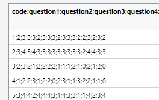

```{r, include = FALSE}
library(tidyverse)
```

# Lösung - Laden, mergen und Syntax (Einheiten 3 und 4)

Bei Bedarf finden sich hier nochmal die Slides zu Einheit 3:

::: {=html}
<iframe src="../01_slides/EH_3.html" width="100%" height="500" style="border:0; display:block; margin: 0 0 2rem 0;">

</iframe>
:::

Und hier die Slides zu Einheit 4:

::: {=html}
<iframe src="../01_slides/EH_4.html" width="100%" height="500" style="border:0; display:block; margin: 0 0 2rem 0;">

</iframe>
:::

# Lernziele dieses Hands-On-Blocks

✅Projekte kennenlernen & verstehen

✅Unterschied zwischen relativen und absoluten Pfaden verstehen

✅Datensätze in R importieren, inspizieren und speichern

✅Datensätze mit `cbind()` und `full_join()` mergen und Vor- und
Nachteile reflektieren

✅Funktionen und ihre Argumente (inkl. Defaults) nutzen

✅Style Conventions umsetzen

# Projekte und Pfade

### Was sind R-Projekte?

👉 [Kapitel 6.2 in R for Data
Science](https://r4ds.hadley.nz/workflow-scripts.html#projects)

Ein **R-Projekt** ist eine Projektdatei mit der Endung (`.Rproj`), die
du in RStudio anlegst oder öffnest.\

Wenn du ein Projekt öffnest, passiert Folgendes automatisch:

-   RStudio setzt das **Working Directory (Arbeitsverzeichnis)** auf den
    Ordner, in dem die `.Rproj`-Datei liegt.\
-   Alle Dateien, Skripte, Daten und Ergebnisse, die du in diesem Ordner
    ablegst, gehören logisch zu diesem Projekt.\
-   Du arbeitest in einer klar definierten, geschlossenen Umgebung.\
-   Du kannst entweder ein neues Projekt erstellen oder ein bestehendes
    Projekt öffnen.\

Du kannst dir ein Projekt wie einen **Container** für ein
Forschungsprojekt vorstellen. Alles, was zu einer Analyse gehört, liegt
gebündelt an einem Ort.

Das ist besonders wichtig für:

```         
- Seminararbeiten
- Reanalysen
- Masterarbeiten
- Kollaborative Projekte
```

#### Warum sollte man mit Projekten arbeiten?

Viele typische Probleme in R entstehen dadurch, dass kein Projekt
verwendet wird:

-   Das Working Directory ist falsch gesetzt.
-   Skripte funktionieren nur auf dem eigenen Laptop.
-   Dateien werden an unterschiedlichen Orten gespeichert -\> kein
    nachvollziehbares Forschungsdatenmanagement.
-   Analysen sind schwer reproduzierbar.

R-Projekte verhindern genau diese Probleme.

#### Woran erkennst du, ob ein Projekt geöffnet ist?

Oben rechts in RStudio siehst du den Namen des aktuellen Projekts.

In diesem Screenshot ist noch kein Projekt geöffnet (Project: (None)).
Wenn ein Projekt aktiv ist, wird dort der entsprechende Projektname
angezeigt.


**Übung:**

Im ZIP-Ordner zum Abschlussprojekt, den ihr von ILIAS heruntergeladen
habt (inklusive Datenanalyseplan und Codebook), haben wir für euch
bereits eine `.Rproj`-Datei angelegt. Diese befindet sich im Ordner
*Grinschgl2020*.

1.  Öffne diese Datei.
2.  Überprüfe oben rechts in RStudio, ob das richtige Projekt aktiv ist.
3.  Schliesse RStudio und öffne es erneut über die `.Rproj`-Datei.

👉 Gewöhne dir an, Analysen immer über die Projektdatei zu starten.

::: {.callout-note collapse="true" title="Bei Fehlermeldungen:"}
„Achtung! Bei Mac-User:innen kann es zu Problemen mit den Berechtigungen
kommen. Falls dir beim Öffnen diese Fehlermeldung angezeigt wird:“


Die Lösung besteht darin, die Berechtigungen für den Ordner anzupassen.
Dafür gehst du auf den ‚r_you_ready‘-Ordner und öffnest das Menü mit
‚Get Info‘.


Die Berechtigungen passt du an, indem du auf das Schloss unten rechts
klickst, dein Passwort eingibst und bei deinem Account ‚Read & Write‘
auswählst. Anschliessend klickst du auf die drei Punkte im Kreis und
führst ‚Apply to enclosed items…‘ aus. Danach solltest du die vollen
Berechtigungen haben.
:::

**Eigenes Projekt erstellen**

Wenn du zukünftig ein eigenes Projekt anlegen möchtest (z.B. für deine
Masterarbeit): 👉[Kapitel 6.2 in R for Data
Science](https://r4ds.hadley.nz/workflow-scripts.html#projects)

------------------------------------------------------------------------

### Absolute vs. relative Pfade

Wenn du in R eine Datei einliest, musst du angeben, **wo** diese Datei
liegt.

Diesen "Weg" zur Datei nennt man einen **Pfad**.

Dabei unterscheidet man zwei Arten von Pfaden:

#### Absolute Pfade

-   Ein **absoluter Pfad** beschreibt den vollständigen Weg zu einer
    Datei, ausgehend vom Wurzelverzeichnis *deines* Computers.

    🔴 Nachteil: Sie sind oft sehr lang und funktionieren nur auf deinem
    Rechner.

    -   Beispiel (Windows):\
        `C:\Users\maxmustermann\Dokumente\r_you_ready\Grinschgl2020\data\raw\Beispieldatei.csv`

Wenn jemand anderes dieses Skript ausführt, wird dieser Pfad nicht
existieren.

#### Relative Pfade

-   Ein **relativer Pfad** beschreibt den Weg zu einer Datei ausgehend
    vom *aktuellen Arbeitsverzeichnis*.

-   Wenn du mit einem R-Projekt arbeitest, ist das Working Directory
    automatisch der Projektordner.

    🟢 Vorteil: Sie sind kürzer, übersichtlicher und funktionieren auf
    jedem Rechner, solange die Projektstruktur gleich bleibt.

    -   Beispiel:

        -   Projektordner = *Grinschgl2020*
        -   Datei liegt in *data/raw/Beispieldatei.csv*
        -   relativer Pfad:

        ```         
        data/raw/Beispieldatei.csv              # relativer Pfad

        read_csv("data/raw/Beispieldatei.csv")  # Einlesen der Datei in R
        ```

Solange die Projektstruktur gleich bleibt, funktioniert dieser Code auf
jedem Computer.

#### Warum ist das wichtig?

In der wissenschaftlichen Praxis sollen Analysen:

```         
- nachvollziehbar
- überprüfbar
- reproduzierbar
```

sein.

Absolute Pfade verhindern dies; relative Pfade ermöglichen es.

# Daten importieren und exportieren

## Import

Bevor wir Daten analysieren können, müssen wir sie in R einlesen.

Die entsprechenden Datensätze liegen im ZIP-Dokument bereits vor und
müssen nicht separat heruntergeladen werden. Arbeiten wir aus dem
R-Projekt dieses Ordners aus, können wir die Dokumente einfach mit einem
relativen Pfad adressieren.

Dabei sind drei Dinge zentral:

-   das richtige **Dateiformat**
-   das passende **Trennzeichen**
-   ein korrekter (relativer) **Dateipfad innerhalb des Projekts**

In diesem Seminar arbeiten wir hauptsächlich mit `.csv`- und
`.xlsx`-Dateien. Wir werden uns mehrere Möglichkeiten anschauen, wie man
diese einlesen kann.

👉 [Kapitel
3.2](https://methodenlehre.github.io/einfuehrung-in-R/chapters/03-data_frames.html#daten-importieren)

👉 [Cheatsheet Datenimport mit
`readr`](https://rstudio.github.io/cheatsheets/html/data-import.html)

#### Wichtige erste Schritte

Stelle sicher, dass das Metapaket **tidyverse** geladen ist:
(`library(tidyverse)`) (siehe Hands-On 1).

Wir verwenden Funktionen aus folgenden Paketen:

```         
- **readr** (für .csv-Dateien)
- **readxl** (für .xlsx-Dateien)
```

`readr` ist Teil von tidyverse, während `readxl` ein separates, aber
kompatibles Paket aus dem tidyverse-Ökosystem ist und bei Bedarf
zusätzlich geladen werden muss: (`library(readxl)`).

Beide Pakete sind zentrale Werkzeuge für einen sauberen und
reproduzierbaren Datenimport in R.

#### Delimiter verstehen

CSV-Dateien enthalten Werte, die durch ein bestimmtes Zeichen getrennt
sind, den sogenannten Delimiter.

Typische Delimiter sind:

```         
- , (Komma)
- ; (Semikolon)
```

Wenn das falsche Trennzeichen gewählt wird, landet der gesamte Inhalt
der Datei in einer einzigen Spalte.

Auszug aus
[Cheatsheet](https://rstudio.github.io/cheatsheets/html/data-import.html):
Die Funktionen read_delim und read_csv:


`read_csv()` ist eine Spezialisierung von `read_delim()`, die
automatisch Komma als Trennzeichen verwendet, während man bei
`read_delim()` das gewünschte Trennzeichen selbst angeben muss.

### Einlesen via Oberfläche (Point & Click)

Gerade zu Beginn kann die Import-Oberfläche im Environement von RStudio
hilfreich sein.

**Übung: data_mmq.csv importieren**

1.  Importiere die Datei `"data_mmq.csv"` über die Point &
    Klick-Oberfläche Im Environment von RStudio. Verwende dafür "From
    Text (readr)"

    1.1. Environment -\> Import Dataset -\> From Text (readr)
    

    1.2. Schau dir den Datensatz an: Mit welchem Trennzeichen sind die
    Daten getrennt? 

    1.3. Stelle in der Oberfläche `"Delimiter"` auf das passende
    Trennzeichen. Was verändert sich in der Vorschau?

**Wichtig: Der erzeugte Code**

Die Oberfläche ist nur ein Hilfsmittel. Entscheidend ist der **Code**,
der dabei generiert wird.

Wenn du im Projekt arbeitest, sollte der Code ungefähr so aussehen:


Achte besonders auf den Pfad: `"data/raw/data_mmq.csv"`

```         
- Das ist ein relativer Pfad innerhalb des Projekts.
```

**Code ins Skript übernehmen**

Wenn du den Code via Klick-Oberfläche eingelesen hast, wirst du den
ausgeführten Code in der Konsole sehen.

👉 Kopiere diesen in dein Skript, damit du ihn in Zukunft
wiederverwenden und anpassen kannst.

::: {.callout-note collapse="true" title="Lösung"}
```{r, include=TRUE, eval=TRUE}
data_mmq <- read_delim("data/raw/data_mmq.csv",
                       delim = ";",
                       escape_double = FALSE,
                       trim_ws = TRUE)
```
:::

**Daten kontrollieren**

Überprüfe die eingelesenen Daten mit `View(data_mmq)`.

Wenn alles korrekt ist, befindet sich in jeder Zelle genau ein Wert.

### Einlesen via Code

Langfristig solltest du Daten **direkt per Code** einlesen können - ohne
Klick-Oberfläche.

#### .CSV Dateien

Lies nun weitere CSV-Datensätze ein:

```         
- `data_cb`
- `data_cvstm`
- `data_pct`
- `data_vp`
```

Verwende dafür eine geeignete Funktion aus dem Paket `readr`.

👉 Tipp: Nutze den zuvor generierten Code und passe nur Variablennamen,
Dateinamen und ggf. Delimiter an.

::: {.callout-note collapse="true" title="Lösung"}
```{r, include=TRUE, eval=TRUE}
# install.packages("readr") # den Code führst du einmalig in deiner Console aus
# wenn du schon das Tidyverse geladen hast, musst du readr nicht extra laden - dieses ist in Tidyverse beinhaltet 
library(readr)

data_cb <- read_delim("data/raw/data_cb.csv", delim = ";")

data_cvstm <- read_delim("data/raw/data_cvstm.csv", delim = ";")

data_pct <- read_delim("data/raw/data_pct.csv", ";")

data_vp <- read_delim("data/raw/data_vp.csv" , ";")
```
:::

#### .XLSX Dateien

Einige Dateien liegen im Excel-Format (`.xlsx`) vor.

Dafür verwenden wir das Paket **readxl** und die Funktion `read_excel()`
(Teil des Tidyverse).

-   Lies damit die Datensätze:

    -   `data_ratings`
    -   `data_strategies`

👉 Achte auch hier darauf, einen relativen Pfad innerhalb des Projektes
zu verwenden.

-   Nutze bei Unsicherheiten `?read_excel` oder das
    [Cheatsheet](https://github.com/rstudio/cheatsheets/blob/main/data-import.pdf).

::: {.callout-note collapse="true" title="Lösung"}
```{r, include=TRUE, eval=TRUE}
# install.packages("readxl") # den Code führst du einmalig in deiner Console aus
library(readxl)

?read_excel() # Aufruf der Dokumentation

data_ratings <- read_excel("data/raw/data_ratings.xlsx") # erstellt über RStudio Environment

data_strategies <- read_excel("data/raw/data_strategies.xlsx") # kopiert und angepasst
```
:::

**Ziel**

Am Ende solltest du **7 verschiedene Datensätze** in deinem Environment
sehen.

::: {.callout-note collapse="true" title="Vertiefung"}
👉Für das Einlesen weiterer Dateiformate (z.B. SPSS-Dateien), siehe
[Kapitel
3.2](https://methodenlehre.github.io/einfuehrung-in-R/chapters/03-data_frames.html#daten-importieren)
:::

#### Kontext: Warum genau diese sieben Datensätze?

Die sieben eingelesenen Dateien sind die Rohdatensätze, die wir für die
Reanalyse des Papers von *Grinschgl et al. (2020)* benötigen.

Diese Datensätze enthalten sämtliche erhobenenen Variablen der Studie,
auf denen alle späteren Analysen aufbauen.

👉 Im nächsten Schritt werden wir diese Datensätze systematisch
zusammenführen (mergen), um eine gemeinsame Analysegrundlage zu
schaffen.

# Daten mergen

***ℹ️ Vertiefung: In Einheit 4 werden wir das Mergen systematisch
behandeln. Hier geht es darum, ein erstes Gefühl für das Problem zu
bekommen.***

Nun befinden sich sieben separate Rohdatensätze in deinem Environment.

Diese Datensätze enthalten unterschiedliche Teile der Studie (z.B.
Performanzdaten, Ratings, Strategien).

Für die Reanalyse benötigen wir jedoch **einen gemeinsamen
Gesamtdatensatz**, in dem alle Variablen pro Versuchsperson
zusammengeführt sind.

Das bedeutet: Wir müssen die einzelnen Datensätze korrekt miteinander
verbinden.

#### Warum ist das nicht trivial?

Damit Datensätze korrekt zusammengeführt werden können, muss klar sein:

```         
- Welche Zeile gehört zu welcher Versuchsperson?
- Gibt es eine eindeutige Identifikationsvariable?
```

In unseren Datensätzen ist diese Schlüsselvariable: **code**

## 1. Naiver Ansatz: `cbind()`

`cbind()` fügt Datensätze einfach spaltenweise nebeneinander.

👉 Wichtig: Es wird dabei **nicht überprüft**, ob die Zeilen inhaltlich
zusammenpassen! Es wird also nicht kontrolliert, ob die Werte jeweils
von derselben Person stammen oder nicht.

**Aufgabe**

Füge alle 7 Datensätze mit der Funktion `cbind()` zusammen.

::: {.callout-note collapse="true" title="Lösung"}
```{r, include=TRUE, eval=TRUE}
dat_cbind <- cbind(data_cb, data_cvstm, data_pct, data_vp, data_ratings, data_strategies)
```
:::

-   Was fällt dir auf?\

    -   Stimmen die Personen wirklich überein?\
    -   Was passiert, wenn die Reihenfolge unterschiedlich ist?\
    -   Was passiert, wenn eine Person in einem Datensatz fehlt?\

💡 Reflektiere: Welche Gefahr entsteht, wenn Daten nur positionsbasiert
zusammengefügt werden?

::: {.callout-note collapse="true" title="Lösung"}
Es entsteht die Gefahr, Erhebungen von unterschiedlichen Personen zu
vermischen. Angenommen alle Messungen wurden in zwei Datensätze
aufgeteilt. In einem Datensatz befinden sich die ersten zwei Messungen,
im anderen Datensatz die letzten beiden Messungen. Die Reihenfolge der
Personen im Datensatz ist vermischt. Werden die Datensätze jetzt
zusammengefügt, indem die Spalten hintereinandergeklebt werden, so
gehört nicht mehr strikt jede Zeile zu einer Versuchsperson, sondern
Zeilen sind gemischt einer und einer anderen Versuchsperson zugeordnet.
Um dies zu vermeiden, muss vor dem "Kleben" sichergestellt sein, dass
die Zeilen über die Datensätze hinweg einheitlich sind.
:::

#### Zentrale Einsicht

`cbind()` basiert auf Positionen (Zeile 1 in Datensatz 1 + Zeile 1 in
Datensatz 2 + Zeile in Datensatz 3 usw.)

Wenn die Reihenfolge der Personen nicht exakt identisch ist, entstehen
falsche Zuordnungen - und damit auch inhaltlich falsche Analysen.

👉 Solche Fehler sind besonders gefährlich, weil sie oft nicht sofort
auffallen!

## 2. Sauberer Ansatz: `full_join()`

`full_join()` verbindet Datensätze anhand einer **Schlüsselvariable**.

Hier:

```         
-`by = "code"`
```

Das bedeutet:

```         
- Personen werden über ihren Identifikationscode zusammengeführt.
- Die Reihenfolge der Zeilen spielt keine Rolle.
- Alle Fälle aus beiden Datensätzen bleiben erhalten.
```

{width="307"}

**Aufgabe**

-   Füge nun alle 7 Datensätze mit `full_join()` zu einem
    Gesamtdatensatz zusammen.

-   Nenne diesen `dat_full`

    -   **Achtung:** `full_join()` funktioniert immer nur mit zwei
        Datensätzen gleichzeitig
    -   Du musst die Funktion also mehrfach anwenden, um alle 7
        Datensätze zusammenzuführen.

    👉 Hinweis: Im Datensatz `data_pct` heisst die ID-Variable der
    Versuchspersonen leicht anders ("code_all" anstelle von "code").
    Wenn du diesen Datensatz mit den anderen Datensätzen zusammenführst,
    musst du deshalb beim Join angeben, welche Variablen
    zusammengehören.

    Verwende deshalb `by = c("code_all" = "code")`.

    Das bedeutet: Die Variable `code_all` aus `data_pct` entspricht der
    Variable `code` im anderen Datensatz.

    ⚠️ Wichtig: Die Reihenfolge der beiden Argumente hängt davon ab,
    welcher Datensatz links bzw. rechts im `full_join()` steht.

::: {.callout-note collapse="true" title="Lösung"}
```{r, include=TRUE, eval=TRUE}
# Sukzessive über Paare mergen
dat_full1 <- full_join(data_cb, data_cvstm, by = "code")
dat_full2 <- full_join(data_vp, data_pct, by = c("code" = "code_all"))
dat_full3 <- full_join(data_ratings, data_strategies, by = "code")
dat_full4 <- full_join(dat_full1, dat_full2, by = "code")
dat_full5 <- full_join(dat_full3, dat_full4, by = "code")
dat_full6 <- full_join(dat_full5, data_mmq, by = "code")

# Altrernativ: Schrittweises Überschreiben von dat_full
dat_full <- full_join(data_cb, data_cvstm, by = "code")
dat_full <- full_join(dat_full, data_vp, by = "code")
dat_full <- full_join(dat_full, data_pct, by = c("code" = "code_all"))
dat_full <- full_join(dat_full, data_ratings, by = "code")
dat_full <- full_join(dat_full, data_strategies, by = "code")
dat_full <- full_join(dat_full, data_mmq, by = "code")

# Alternativ mit der Pipe
dat_full <- full_join(data_cb, data_cvstm, by = "code") |> 
  full_join(data_pct, by = c("code" = "code_all")) |> 
  full_join(data_vp, by = "code") |> 
  full_join(data_ratings, by = "code") |> 
  full_join(data_strategies, by = "code") |> 
  full_join(data_mmq, by = "code")
```

**Vertiefung**: Viele von euch hatten uns nach einem effizienteren Weg
gefragt, alle Datensätze in einem Schritt zu mergen. Das ist anhand
einer selbstgeschriebenen Funktion in Kombination mit reduce() möglich.
Hier die entsprechende Funktion (bei Fragen hierzu wendet euch gerne an
uns):

```{r, include=TRUE, eval=TRUE}
merge_multiple_dfs <- function(df_list, by_column) {
  df_list |> 
    reduce(full_join, by = by_column)
}
```

Damit die Funktion einwandfrei funktioniert müssen noch die Namen aller
ID-Variablen vereinheitlicht werden. Ausserdem muss eine Liste mit allen
Namen der Datensätze definiert werden, welche die Funktion einbziehen
soll:

```{r, include=TRUE, eval=TRUE}
data_pct <- data_pct |> 
  rename("code" = "code_all")

list_of_dfs <- list(data_cb, data_cvstm, data_mmq, data_pct, data_ratings, data_strategies, data_vp)
```

Dann kann die Funktion auf die Liste mit den jeweiligen Datensätzen
angewendet werden:

```{r, include=TRUE, eval=TRUE}
dat_full <- merge_multiple_dfs(list_of_dfs, "code")
```

Beachtet, bei unseren sieben Datensätzen haben wir hiermit lediglich ein
wenig effizienter gearbeitet. Dieser Ansatz wäre aber auch für beliebig
mehr Datensätze anwendbar und würde sich dann umso mehr lohnen!
:::

### Inspiziere deinen zusammengefügten Datensatz "dat_full"

Ein korrekt gemergter Datensatz muss logisch überprüft werden.

#### Struktur prüfen

Überprüfe: Wie viele Zeilen und Spalten hat dein Datensatz?

-   `nrow(dat_full)`

::: {.callout-note collapse="true" title="Lösung"}
```{r, eval=TRUE, include=TRUE}
nrow(dat_full)
```
:::

-   `ncol(dat_full)`

::: {.callout-note collapse="true" title="Lösung"}
```{r, eval=TRUE, include=TRUE}
ncol(dat_full)
```
:::

-   `dim(dat_full)`

::: {.callout-note collapse="true" title="Lösung"}
```{r, eval=TRUE, include=TRUE}
dim(dat_full)
```
:::

-   Entspricht die Zeilenanzahl der Anzahl der Versuchspersonen im
    Paper?

::: {.callout-note collapse="true" title="Lösung"}
Die Zeilenanzahl von 159 entspricht der im Paper berichteten finalen
Stichprobe nach Aussschluss von unvollständigen und ungültigen
Antworten. Die Spaltenanzahl von 36 ergibt sich durch die Summe der
Spaltenanzahl der einzelnen Datensätze minus der Anzahl der Datensätze
(die ID-Variable fällt aus jedem neu hinzugefügten Datensatz weg) plus
einer einzelnen Spalte für die bestehen bleibende ID-Variable.
:::

-   Ist die Spaltenanzahl plausibel?

::: {.callout-note collapse="true" title="Lösung"}
Die Spaltenanzahl von 36 ergibt sich durch die Summe der Spaltenanzahl
der einzelnen Datensätze minus der Anzahl der Datensätze (die
ID-Variable fällt aus jedem neu hinzugefügten Datensatz weg) plus einer
einzelnen Spalte für die bestehen bleibende ID-Variable.
:::

#### Überblick verschaffen

👀Verschaffe dir eine Überblick über deinen Datensatz mit den
Funktionen, die wir schon im letzten Hands On getestet haben:

-   Lasse dir die Variablenamen ausgeben mit `names()`

::: {.callout-note collapse="true" title="Lösung"}
```{r, eval=TRUE, include=TRUE}
names(dat_full)
```
:::

-   `head()`

::: {.callout-note collapse="true" title="Lösung"}
```{r, eval=TRUE, include=TRUE}
head(dat_full)
```
:::

-   `glimpse()`

::: {.callout-note collapse="true" title="Lösung"}
```{r, eval=TRUE, include=TRUE}
glimpse(dat_full)
```
:::

-   `str()`

::: {.callout-note collapse="true" title="Lösung"}
```{r, eval=TRUE, include=TRUE}
str(dat_full)
```
:::

-   `dat_full`

::: {.callout-note collapse="true" title="Lösung"}
```{r, eval=TRUE, include=TRUE}
dat_full
```
:::

-   `summary()`

::: {.callout-note collapse="true" title="Lösung"}
```{r, eval=TRUE, include=TRUE}
summary(dat_full)
```
:::

-   Gibt es redundante oder doppelte Variablen?

::: {.callout-note collapse="true" title="Lösung"}
Idealerweise gibt es keine doppelten Variablen. Falls doch, dann sind
diese meist auf Fehler beim full_join() zurückzuführen. Beinhalten beide
Datensätze Spalten mit einem identsichen Namen und diesen werden nicht
als Schlüssel unter `by` angegeben, dann werden beide in den gemergten
Datensatz aufgenommen und die alten Spaltennamen werden mit mit .x und
.y ergänzt.
:::

-   Gibt es auffällige NA-Muster?

::: {.callout-note collapse="true" title="Lösung"}
Da wir keine NAs in die sieben Rohdaten sollten auch im gemergten
`dat_full`keine solche Werte vorhanden sein. Dies kann über
`sum(is.na(dat_full))` überprüft werden
:::

-   Wirken die Werte plausibel?

::: {.callout-note collapse="true" title="Lösung"}
Hierzu sind die einzelnen Spalten auf ihre minimalen, maximalen und
üblichen Werte mit den jeweils zu erwarteten abzugleichen.
Beispielsweise dürften Spalten wie `vp_propcorrect` per Definition
keinen Wert grösser als 1 aufweisen.
:::

#### Warum dieser Schritt zentral ist?

Die Qualität der gesamten Reanalyse hängt davon ab, ob die Datensätze
korrekt zusammengeführt wurden.

Ein falsches Mergen führt zu:

```         
- falschen Zuordnungen von Variablen
- verzerrten Analysen
- inhaltlich falschen Schlussfolgerungen
```

**Auf einzelne Werte zugreifen:**

-   Greife auf den **ersten Wert der ersten Spalte** zu: Verwende eckige
    Klammern. Der erste Wert in der Klammer steht für die Zeile, der
    zweite für die Spalte.

::: {.callout-note collapse="true" title="Lösung"}
```{r, eval=TRUE, include=TRUE}
dat_full[1,1]
```
:::

-   Greife auf die Werte der **Spalten 1–15 in der ersten Zeile** zu.
    Verwende wieder eckige Klammern und den Bereichsoperator `1:15`.

::: {.callout-note collapse="true" title="Lösung"}
```{r, eval=TRUE, include=TRUE}
dat_full[1,1:15]
```
:::

-   Lasse dir alle Werte der Variable `"mean_rl_all"` ausgeben. Auf
    Variablen greifst du mit `$` zu.

::: {.callout-note collapse="true" title="Lösung"}
```{r, eval=TRUE, include=TRUE}
dat_full$mean_rl_all
```
:::

-   Greife auf die **ersten 10 Werte der Variable `"question1"`** zu.
    Verwende dazu den `$`-Operator in Kombination mit dem
    Bereichsoperator `1:10`.

::: {.callout-note collapse="true" title="Lösung"}
```{r, eval=TRUE, include=TRUE}
dat_full$question1[1:10]
```
:::

# Daten speichern

Nachdem wir die sieben Rohdatensätze korrekt zusammengeführt haben,
liegt nun unser vollständiger Analyse-Datensatz `dat_full` im
Environment.

Damit wir:

```         
- reproduzierbar arbeiten,
- Zwischenschritte dokumentieren,
- und nicht jedes Mal neu mergen müssen,
```

speichern wir den Datensatz nun dauerhaft ab.

**Aufgabe**

Speichere `dat_full` als CSV-Datei in deinem Projektordner, genauer im
Ordner:

`"data/processed"`

Verwende dafür die Funktion `write.csv()`.

Du musst dabei zwei zentrale Argumente angeben:

```         
- Welches Objekt gespeichert werden soll
- Unter welchem Pfad (inkl. Dateiname) es abgelegt wird
```

Bei Unklarheiten schaue dir das
[Cheatsheet](https://rstudio.github.io/cheatsheets/html/data-import.html)
oder die Hilfefunktion an.

-   Überprüfe nach dem Speichern, ob dein Datensatz im richtigen Ordner
    zu finden und der Dateiname korrekt ist.
-   Lässt sich die Datei erneut einlesen?

::: {.callout-note collapse="true" title="Lösung"}
```{r, eval=TRUE, include=TRUE}
# speichern
write.csv(dat_full, "data/processed/dat_full.csv", row.names = FALSE)

#laden
dat_full_processed <- read.csv("data/processed/dat_full.csv")
```

Bei vielen trat beim abspeichern (und darauf folgenden Laden) auf, dass
ganz links eine neue Spalte im Datensatz ergänzt wurde. Diese war auch
noch identisch mit der ID-Variable, welche zuvor ganz links im Datensatz
vorhanden war. Diese Doppelung ist reiner Zufall. Das eigentliche
Problem: Implizit beinhalten Dataframes in R ganz links noch den
Reihenindex. Vor jeder Zeile steht also eigentlich noch eine 1 in der
ersten Reihe, eine 2 in der zweiten usw. Die Funktion write.csv() möchte
diese Information auch abspeichern und erstellt daher für diese eine
weitere Spalte. Da der Dataframe für diese Indizes aber keinen
Spaltennamen hat, wird in der csv keiner abgelegt (vor dem ersten "," in
der ersten Zeile ist nichts definiert). Beim Einlesen ergänzt R dann
automatisch einen Spaltennamen. Es gibt hier zwei mögliche Lösungen.
Entweder wie oben das Argument `row.names = FALSE` setzen. Dieses
hindert `write.csv` daran die Indizes mit abzuspeichern. Oder
andernfalls ausweichen auf die alternative Funktion des Tidyverse:

```{r, eval=TRUE, include=TRUE}
readr::write_csv(dat_full, "data/processed/dat_full.csv")
```
:::

👉 Für diesen zusammengeführten Datensatz werdet ihr das **Codebook**
erstellen.

# Coding Basics: Funktionen

👉 [Kapitel 2.4: Calling
Functions](https://r4ds.hadley.nz/workflow-basics.html)\
👉 [Kapitel 2.3: Funktionen
aufrufen](https://methodenlehre.github.io/einfuehrung-in-R/chapters/02-R-language.html#funktionen-aufrufen)

Wir haben in unseren Übungen bereits einige Funktionen verwendet (z.B.
`sum()` oder `sort()`).\
Eine Funktion besteht aus:

-   einem **Funktionsnamen**
-   **Argumenten**, die der Funktion übergeben werden

Viele Funktionen besitzen **Defaults** (Voreinstellungen).\
Wenn du diese nicht verändern möchtest, musst du sie nicht explizit
angeben.

Die Defaults findest du in der Hilfe: - im Tab *Help* - oder in der
Konsole mit `?Funktionsname` (z.B. `?sort`)

`sort()` hat als Default `decreasing = FALSE`. Deswegen müssen wir, um
die höchsten Werte des Vektors zu bestimmen, diesen Default umstellen.
Argumente ohne Defaults müssen zwingend angegeben werden.

```{r}
first_vector <- c(22342, 4, 5, 6, 7, 23234, 342, 342)

highest_values_1 <- sort(first_vector)[1:2]
highest_values   <- sort(first_vector, decreasing = TRUE)[1:2]
```

## Argumente mit und ohne Namen

Bei vielen Funktionen werden die **Namen der Argumente** weggelassen.

Wenn Argumente **nicht benannt** werden, ist die Reihenfolge
entscheidend.\
Wenn du Argumente explizit benennst, kannst du die Reihenfolge frei
wählen.

### Aufgabe 1

Welche Argumente werden hier übergeben?\
Schreibe die Funktion mit vollständigen Argumentnamen aus.

```{r eval=FALSE}
seq(-4, 11, 3)
```

*Tipp: `?seq`*

::: {.callout-note collapse="true" title="Lösung"}
```{r include=TRUE, eval=TRUE}
seq(from = -4, to = 11, by = 3)
```
:::

### Aufgabe 2

Korrigiere diesen Code so, dass eine Sequenz von **3 bis 12 in
2er-Schritten** erstellt wird.\
Belasse dabei die Reihenfolge der Zahlen.

```{r eval=FALSE}
seq(2, 12, 3)
```

::: {.callout-note collapse="true" title="Lösung"}
```{r, include=TRUE, eval=TRUE}
seq(3, 12, 2)
```
:::

## Funktionen aus bestimmten Paketen

Manche Funktionen existieren in mehreren Paketen (z.B. `filter()`).\
Um sicher die richtige Version zu verwenden, gib auch das entsprechende
Paket an:

```{r eval=FALSE}
dplyr::filter()
```

## Tab Completion

Eine nützliche Funktion von RStudio ist die **Tab Completion**. Wenn du
eine Funktion aufrufst und die Tabulator-Taste drückst, erscheint ein
Menü mit den möglichen Argumenten, die du angeben kannst. Probiere es
mit der Funktion `mean()`. Das funktioniert auch für Funktionen aus
Paketen, wenn du diese mit `::` auswählst, zum Beispiel: `readr::`.

Tippe z.B.:

```{r eval=FALSE}
mean(
```

Drücke dann die **Tab-Taste**, um mögliche Argumente anzeigen zu lassen.

Das funktioniert auch mit:

```{r eval=FALSE}
readr::
```

## Weitere Tasten und Tastenkürzel:

👉[Kapitel
1.4.6](https://methodenlehre.github.io/einfuehrung-in-R/chapters/01-workflow.html#tasten)

In RStudio benötigen wir häufig Zeichen, die wir im Alltag kaum
verwenden. Da wir nicht alle mit dem gleichen Betriebssystem
(Mac/Windows) und auch nicht mit identischen Tastaturen arbeiten, können
wir keine einheitlichen Angaben machen, wo sich diese Zeichen genau
befinden. Versuche daher, die folgenden Zeichen auf deiner eigenen
Tastatur zu finden:

-   `[ ]` Square brackets (eckige Klammern)

-   `{ }` Curly brackets (geschweifte Klammern)

-   `$` Dollar sign (Dollarzeichen – wird für das Auswählen von
    Variablen benötigt)

-   `#` Hash (Rautezeichen – für Kommentare in R-Skripten)

-   `~` Tilde (für Modellnotationen in R; brauchen wir v.a. am Ende des
    Semesters bei den Analysen)

-   `|` Vertical bar (senkrechter Strich – als logischer Operator)

-   `` ` `` Backtick (Gravis – vor allem für Code Chunks, selten manuell
    einzugeben)

## Verschachtelte Funktionen

ℹ️Es ist zwar möglich, mehrere Funktionen ineinander zu verschachteln.
Dies kann jedoch schnell zu Verwirrung führen und den Code unnötig
unübersichtlich machen. Verschachtelte Funktionen werden **von innen
nach aussen** ausgeführt.

❓Stelle dir hier die Frage: Was wird genau gerundet? Die einzelnen
Elemente des Vektors oder der errechnet Durchschnitt?

```{r}
print(mean(round(first_vector)))
```

❗Aufgabe: Zerlege die Verschatelte Funktion in ihre Teilschritte.

```{r eval=FALSE}
# Schritt 1:
# ...

# Schritt 2:
# ...

# Schritt 3:
# ...
```

::: {.callout-note collapse="true" title="Lösung"}
```{r, include=TRUE, eval=TRUE}
# Schritt 1:
fst_vec_round <- round(first_vector)

# Schritt 2:
fst_vec_round_mean <- mean(fst_vec_round)

# Schritt 3:
print(fst_vec_round_mean)

# print() ist in R nicht zwingend notwendig, sofern das auszugebene Objekt in der Environment vorliegt
```
:::

# Style Conventions

Korrigiere diesen Code so, dass er:

-   fehlerfrei läuft
-   leserlich ist
-   keine wichtigen Funktionsnamen überschreibt

```{r eval=FALSE}
Französischschul_NotenSemesester -<(4,5, 6,5,4,  3)
mean <-mean(Französichschul_NotenSemsester
print  ( mittelwert)
```

::: {.callout-note collapse="true" title="Lösung"}
```{r include=TRUE, eval=TRUE}
Französischschul_NotenSemester <- c(4, 5, 6, 5, 4, 3)
mittelwert <- mean(Französischschul_NotenSemester)
print(mittelwert)
```
:::

## Code automatisch formatieren mit `styler`

Installiere das Package `styler` mit `install.packages()` und lade es.
`styler` hat eine sogenannte "Wrapper-Funktion", die du unter "Addins"
aufrufen kannst (evtl. musst du R vor dem Laden neu starten). Verwende
den Default-Style (tidyverse).


```{r eval=FALSE}
install.packages("styler")
library(styler)
```

### Aufgabe

Versuche mit der `Styler` -Funktion, diesen Code zu leserlicher zu
machen (markiere den Code und wähle *Style selection*). (Du musst diesen
ggplot Code nicht verstehen - wir kommen dazu in einer späteren Einheit
noch):

```{r eval=FALSE}
library(palmerpenguins)

ggplot(penguins,aes(x=flipper_length_mm,y=body_mass_g,color=species))+geom_point()+labs(x="flipper",Y="MASS")+theme_minimal()
```

::: {.callout-note collapse="true" title="Lösung"}
```{r include=TRUE, eval=TRUE}
library(palmerpenguins)

ggplot(penguins, aes(x = flipper_length_mm, y = body_mass_g, color = species)) +
  geom_point() +
  labs(x = "flipper", Y = "MASS") +
  theme_minimal()
```
:::

# Am Ende deiner Übungen

✅ Speichere dein Skript ab.
