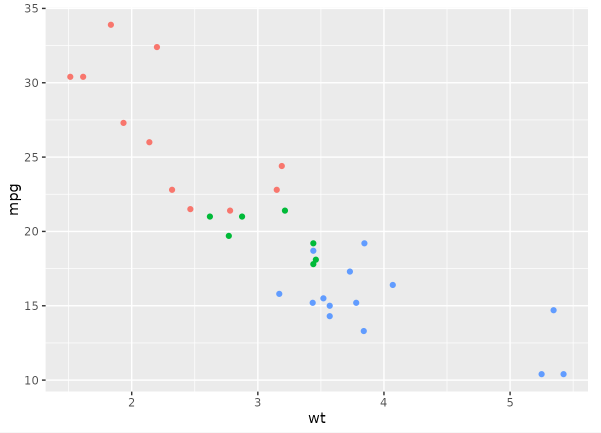
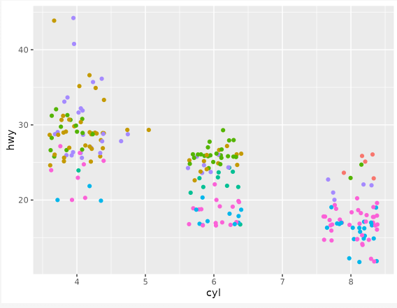
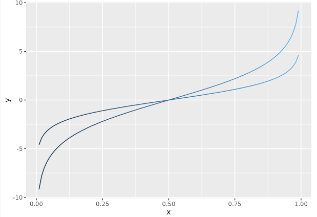
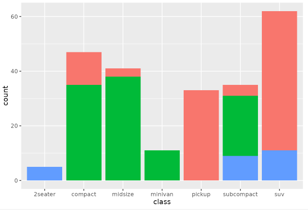
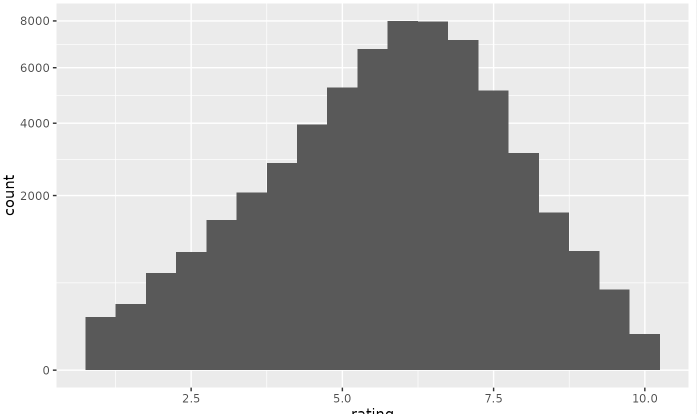
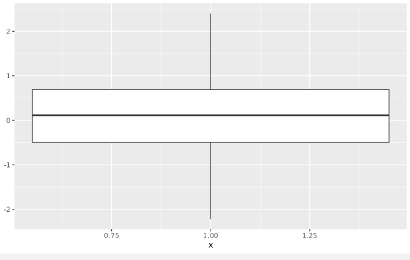

```{r, echo = FALSE, results = 'hide', message= FALSE, warning=FALSE}
library(tidyverse)
library(here)
library(car)

dat_full <- read_csv("data/raw/dat_full.csv")
dat_long <- read_csv(here::here("scripts/02_excercises/data/processed/data_long.csv"))
```

Bei Bedarf finden sich hier nochmal die Slides zur EH11:

::: {=html}
<iframe src="../01_slides/EH_11.html" width="100%" height="500" style="border:0; display:block; margin: 0 0 2rem 0;">

</iframe>
:::

Und hier die Slides zur EH12:

```{=html}
<!--
::: {=html}
<iframe src="../01_slides/EH_12.html" width="100%" height="500" style="border:0; display:block; margin: 0 0 2rem 0;">

</iframe>
:::
--->
```

# Lernziele

✅ Visualisierungen mit `ggplot2` systematisch aufbauen

✅ Gruppenmittelwerte mit Fehlerbalken visualisieren

✅ Zusammenhänge zwischen zwei metrischen Variablen mit `cor.test()` prüfen

✅ einfache und multiple Regressionen mit `lm()` berechnen

✅ zentrale Bestandteile des Regressionsoutputs interpretieren

✅ t-Tests

::: callout-important
Für die heutigen Übungen benötigen wir den **Wide Datensatz** `dat_full` sowie den **Long Datensatz** `dat_long`
:::

------------------------------------------------------------------------

# Teil 1: Visualisieren mit `ggplot2`

In diesem Teil wiederholen wir den Aufbau eines `ggplot()` und reproduzieren zwei Abbildungen aus der Studie von @grinschgl2021.

**Hilfreiche Ressourcen:**

[📚 Einführung in R - Kapitel 5](https://methodenlehre.github.io/einfuehrung-in-R/chapters/05-plotting.html)

[📚 R for Data Science - Kapitel 1](https://r4ds.hadley.nz/data-visualize.html)

[📚R for Data Science - Kapitel 11](https://r4ds.hadley.nz/communication.html)

::: {.callout-note collapse="true"}
### Häufig verwendete Geoms

| Geom | Funktion | Einsatzbereich | Bild / Beispiel |
|----|----|----|----|
| **geom_point()** | Streudiagramm | Zusammenhang zwischen zwei numerischen Variablen (x = Var1, y = Var2) |  |
| **geom_jitter()** | Jitter-Plot | Punkte leicht versetzen, um Überlappung zu vermeiden (v. a. bei kategorialem x) |  |
| **geom_line()** | Liniendiagramm | Verlauf über eine kontinuierliche oder geordnete x-Achse |  |
| **geom_bar()** | Balkendiagramm mit gezählten Häufigkeiten | Häufigkeiten oder Aggregationen für Kategorien (x = Gruppe) |  |
| **geom_histogram()** | Histogramm | Verteilung einer numerischen Variable (x = Wert) |  |
| **geom_boxplot()** | Boxplot | Verteilungen zwischen Gruppen vergleichen (x = Gruppe, y = Wert) |  |
:::

::: {.callout-note collapse="true"}
## Cheatsheet ggplot2

<iframe src="../../PDFs/ggplot.pdf" width="100%" height="500px">

</iframe>
:::

**Im folgenden wollen wir Figure 4 aus @grinschgl2021 reproduzieren:**

```{r, echo = FALSE}

dat_full <- dat_full |> 
  mutate(mmq_mean = rowMeans(select(dat_full, starts_with("question")), # bedingt, dass neben den 18 Variablen vom mmq sonst keinerlei andere Variablen mit "question" starten
                             na.rm = TRUE))

group_summary <- dat_full %>%
  group_by(group_all) %>%
  summarize(
    group_mean_mmq = mean(mmq_mean),
    se_mmq = sd(mmq_mean) / sqrt(n())
  )


group_summary$group_all <- factor(group_summary$group_all,
                                  levels = c("below", "control", "above"))

ggplot(group_summary, aes(x = group_all, y = group_mean_mmq)) +
  geom_col(fill = "gray", color = "black") + 
  geom_errorbar(
    aes(ymin = group_mean_mmq - se_mmq, ymax = group_mean_mmq + se_mmq),  
    width = 0.2,
    color = "black"
  ) +
  labs(
    x = "Feedback Group",
    y = "Mean MMQ Ratings",
    title = "Group Means of Mean MMQ with SE Error Bars"
  ) +
  ylim(0, 4)+
  theme_classic()
```

## Aufgabe 1: Gruppenmittelwerte für den ersten Plot vorbereiten

Bevor wir den Plot erstellen können, müssen wir zunächst einen neuen, kleineren Datensatz vorbereiten. Der Plot soll später **pro Feedback-Gruppe** einen Balken zeigen. Dafür reicht der ursprüngliche Datensatz `dat_full` noch nicht aus, weil darin jede Zeile eine einzelne Person darstellt.

Für den Plot brauchen wir stattdessen einen zusammengefassten Datensatz mit **einer Zeile pro Gruppe.**

Wir möchten also die mittleren MMQ-Ratings für die drei Feedback-Gruppen darstellen. Dafür brauchen wir pro Gruppe:

1.  den Mittelwert von `mmq_mean`

2.  den Standardfehler dieses Mittelwerts

3.  eine sinnvolle Reihenfolge der Gruppen auf der x-Achse

**Instruktionen:**

Im Hands-on Block 4 haben wir bereits mit `dplyr` den MMQ-Skalenwert `mmq_mean` pro Person berechnet.

-   Nutze nun die `dplyr`-Funktionen, insbesondere `group_by()`, um den durchschnittlichen MMQ-Wert pro Gruppe (`group_all`) sowie den Standardfehler zu berechnen.

-   Formel Standardfehler: **SE = SD / √n**

    → Kann so berechnet werden: `se_mmq = sd(mmq_mean) / sqrt(n))`

-   Ergänze den Code unten mit den nötigen Angaben. Lege `group_all` in deinem neuen Datensatz als Faktor fest mit den Levels in der Reihenfolge: "below", "control", "above".

::: {.callout-note collapse="true"}
Der **Standardfehler des Mittelwerts (SE)** beschreibt, **wie stark der geschätzte Stichprobenmittelwert zufällig vom wahren Populationsmittelwert abweichen kann**. Er ist damit ein **Mass für die Präzision** des Mittelwerts.
:::

```{r, echo=TRUE, eval = FALSE}
# mmq_mean pro Experimentalgruppe
group_summary <- dat_full %>%
  group_by(XXXX) %>%
  summarize(
    group_mean_mmq = mean(XXXX, na.rm = TRUE),
    se_mmq = sd(XXXX, na.rm = TRUE) / sqrt(n()),
    .groups = "drop"
  )

# Faktorstufen in der richtigen Reihenfolge definieren
group_summary$group_all <- factor(group_summary$group_all,
                                  levels = c("XXXX", "XXXX", "XXXX"))
```

:::: {.content-visible when-meta="show_solutions"}
::: {.callout-note collapse="true" title="Lösung"}
```{r, echo = TRUE}
group_summary <- dat_full %>%
  group_by(group_all) %>%
  summarize(
    group_mean_mmq = mean(mmq_mean, na.rm = TRUE),
    se_mmq = sd(mmq_mean, na.rm = TRUE) / sqrt(n()),
    .groups = "drop"
  )

group_summary$group_all <- factor(group_summary$group_all,
                                  levels = c("below", "control", "above"))
```
:::
::::

## Aufgabe 2: Balkendiagramm mit Fehlerbalken erstellen

Jetzt erstellen wir den Plot Schritt für Schritt. Ziel ist ein Balkendiagramm, das den mittleren MMQ-Wert pro Feedback-Gruppe inklusive Standardfehler zeigt.

### 2.1 Starte mit `ggplot` und dem Datensatz

Erstelle ein neues `ggplot`-Objekt mit dem Namen `plot_base`. Weise diesem deinen vorhin erstellten Datensatz `group_summary` als Datenbasis zu.

:::: {.content-visible when-meta="show_solutions"}
::: {.callout-note collapse="true" title="Lösung"}
```{r}
plot_base <- group_summary |> 
  ggplot()

plot_base
```
:::
::::

### **2.2 Definiere die Aesthetic Mappings**

Lege fest:

-   `group_all` soll auf der **x-Achse** liegen

-   `group_mean_mmq` soll auf der **y-Achse** liegen

```{r, echo=TRUE, eval = FALSE}
plot_base_updated_1 <- plot_base +
  aes(x = XXXX, y = XXXX)
```

:::: {.content-visible when-meta="show_solutions"}
::: {.callout-note collapse="true" title="Lösung"}
```{r}
plot_base_updated_1 <- plot_base +
  aes(x = group_all, y = group_mean_mmq)

plot_base_updated_1
```
:::
::::

### **2.3 Füge Balken mit `geom_col()` hinzu**

Damit zeichnest du die Balken für die Gruppenmittelwerte. Setze eine graue Füllfarbe und schwarze Konturen.

-   `color =` für Konturen

-   `fill =` für die Füllfarben der Balken

```{r, echo=TRUE, eval = FALSE}
plot_base_updated_2 <- plot_base_updated_1 +
  geom_col(fill = XXXX, color = XXXX)
```

:::: {.content-visible when-meta="show_solutions"}
::: {.callout-note collapse="true" title="Lösung"}
```{r}
plot_base_updated_2 <- plot_base_updated_1 +
  geom_col(fill = "gray", color = "black")

plot_base_updated_2
```
:::
::::

### **2.4 Füge Fehlerbalken hinzu**

Nutze `geom_errorbar()` und definiere innerhalb von `aes()`:

-   `ymin = mean - se` - Füge die passenden Variablen ein.

-   `ymax = mean + se` - Füge die passenden Variablen ein.

Passe die Breite der Fehlerbalken mit `width =` an.

```{r, echo=TRUE, eval = FALSE}
plot_base_updated_3 <- plot_base_updated_2 +
  geom_errorbar(
    aes(ymin = XXXX - XXXX, ymax = XXXX + XXXX),  
    width = XXXX,
    color = "black"
  )
```

:::: {.content-visible when-meta="show_solutions"}
::: {.callout-note collapse="true" title="Lösung"}
```{r}
plot_base_updated_3 <- plot_base_updated_2 +
  geom_errorbar(
    aes(ymin = group_mean_mmq - se_mmq, ymax = group_mean_mmq + se_mmq),  
    width = 0.2,
    color = "black"
  )

plot_base_updated_3
```
:::
::::

### **2.5 Beschrifte den Plot und passe das Design an**

Füge mit `labs()` einen Titel sowie Achsenbeschriftungen hinzu. Ergänze ausserdem `theme_classic()`.

```{r, echo=TRUE, eval = FALSE}
plot_base_updated_4 <- plot_base_updated_3 +
  labs(
    x = "XXXX",
    y = "XXXX",
    title = "XXXX"
  ) +
  XXXX
```

:::: {.content-visible when-meta="show_solutions"}
::: {.callout-note collapse="true" title="Lösung"}
```{r}
plot_base_updated_4 <- plot_base_updated_3 +
  labs(
    x = "Feedback Group",
    y = "Mean MMQ Ratings",
    title = "Group Means of Mean MMQ with SE Error Bars"
  ) +
  theme_classic()
```
:::
::::

### **2.6 Stelle den Wertebereich der y-Achse ein**

Da die MMQ-Ratings von 0 bis 4 reichen, soll die y-Achse den vollständigen Wertebereich zeigen

```{r, echo=TRUE, eval = FALSE}
plot_mmq <- plot_base_updated_4 +
  coord_cartesian(ylim = c(XXXX, XXXX))

# Plot ausgeben lassen
plot_mmq
```

:::: {.content-visible when-meta="show_solutions"}
::: {.callout-note collapse="true" title="Lösung"}
```{r}
plot_mmq <- plot_base_updated_4 +
  coord_cartesian(ylim = c(0, 4))

# Plot ausgeben lassen
plot_mmq
```
:::
::::

### **2.7 Plot abspeichern**

Speichere den Plot als PNG-Datei ab.

:::: {.content-visible when-meta="show_solutions"}
::: {.callout-note collapse="true" title="Lösung"}
```{r}
ggsave(
  "plot_mmq.png",
  plot = plot_mmq,
  width = 10,
  height = 6,
  dpi = 300
)
```
:::
::::

## Aufgabe 3: Verlaufsplot für subjektive Performance Ratings erstellen

Nun reproduzieren wir einen zweiten Plot aus @grinschgl2021. Dafür nutzen wir den Long-Datensatz `dat_long`.

**Ziel:** Die mittleren subjektiven Performance Ratings sollen für jede Feedback-Gruppe über zwei Messzeitpunkte hinweg dargestellt werden.

Dafür brauchen wir pro Feedback-Gruppe und Messzeitpunkt:

1.  die Anzahl gültiger Beobachtungen

2.  den Mittelwert des Ratings

3.  die Standardabweichung

4.  den Standardfehler

**Instruktionen:**

-   Lade zuerst den in der letzten Woche gespeicherten *Long-Datensatz*.

-   Ersetze anschliessend die Platzhalter **"XXXX"** durch die erforderlichen Werte, um den Plot zu reproduzieren.

```{r, echo = TRUE, eval = FALSE}

descriptives <- dat_long |> 
  group_by(XXXX, XXXX) |> 
  summarize(
    N = sum(!is.na(rating)),
    mean_d = mean(XXXX, na.rm = TRUE),
    sd_d   = sd(XXXX, na.rm = TRUE),
    se_d   = sd_d / sqrt(N),
    .groups = "drop"
)

descriptives$group_all <- factor(descriptives$group_all, c("above", "control", "below"))

rate_plot <- descriptives |> 
  ggplot(aes(
    x = XXXX, 
    y = XXXX, 
    group = XXXX)) 

rate_plot +
  geom_line(aes(color = group_all, linetype = group_all), linewidth = 1.2) +
  geom_errorbar(aes(ymin = mean_d - se_d, ymax = mean_d + se_d), width = .1) +
  scale_color_manual(values = c("green4", "red", "black")) +
  theme_classic() +
  labs(
    title = "XXXXX",
    x = "XXXX",
    y = "XXXX"
    ) +
  theme(
    plot.title = element_text(hjust = 0.5, size = 12, face = "bold"), 
    axis.text = element_text(size = 11),
    axis.title = element_text(size = 14)
    )

rate_plot
```

:::: {.content-visible when-meta="show_solutions"}
::: {.callout-note collapse="true" title="Lösung"}
```{r, echo = TRUE, message=TRUE, warning= FALSE}
descriptives <- dat_long |> 
  group_by(group_all, time_rating) |> 
  summarize(
    N = sum(!is.na(rating)),
    mean_d = mean(rating, na.rm = TRUE),
    sd_d   = sd(rating, na.rm = TRUE),
    se_d   = sd_d / sqrt(N),
    .groups = "drop"
)

descriptives$group_all <- factor(descriptives$group_all, c("above", "control", "below"))

rate_plot <- descriptives |> 
  ggplot(aes(
    x = time_rating, 
    y = mean_d, 
    group = group_all)) 

rate_plot +
  geom_line(aes(color = group_all, linetype = group_all), linewidth = 1.2) +
  geom_errorbar(aes(ymin = mean_d - se_d, ymax = mean_d + se_d), width = .1) +
  scale_color_manual(values = c("green4", "red", "black")) +
  theme_classic() +
  labs(
    title = "Subjective Performance Ratings ",
    x = "Time",
    y = "Percentile Rank"
    ) +
  theme(plot.title = element_text(hjust = 0.5, size = 12, face = "bold"), 
        axis.text = element_text(size = 11),
        axis.title = element_text(size = 14))

rate_plot
```
:::
::::

### **3.1 Plot abspeichern**

Speichere den Plot als PNG-Datei ab.

:::: {.content-visible when-meta="show_solutions"}
::: {.callout-note collapse="true" title="Lösung"}
```{r, echo=TRUE, eval=FALSE}
ggsave(
  "rate_plot.png",
  plot = rate_plot,
  width = 10,
  height = 6,
  dpi = 300
)
```
:::
::::

------------------------------------------------------------------------

# Teil 2: Inferenzstatistik

In diesem Teil gehen wir von der Visualisierung zur statistischen Prüfung über. Wir fragen also nicht nur, ob ein Muster in den Daten sichtbar ist, sondern ob ein Zusammenhang statistisch geprüft werden kann.

::: {.callout-note collapse="true"}
## Cheatsheets Statistik

<iframe src="../../PDFs/stat_1.pdf" width="100%" height="500px">

</iframe>

<iframe src="../../PDFs/stat_3.pdf" width="100%" height="500px">

</iframe>
:::

## Aufgabe 4: Korrelationen berechnen und interpretieren

Wir untersuchen den Zusammenhang zwischen zwei metrischen Variablen aus dem Wide-Datensatz:

-   `mean_d1_all`: durchschnittliche Dauer der ersten Fensteröffnung (in Sekunden) über die 20 Test-Trials des PCT hinweg

-   `mean_d_all`: durchschnittliche Trial-Dauer (in Sekunden) über die 20 Test-rials des PCT hinweg

### 4.1 Erstelle zuerst einen Scatterplot

Bevor du eine Korrelation berechnest, visualisiere den Zusammenhang.

```{r, echo = TRUE, eval = FALSE}
dat_full |>
  ggplot(aes(x = XXXX, y = XXXX)) +
  geom_point() +
  geom_smooth(method = "lm", se = FALSE) +
  theme_classic() +
  labs(
    x = "Duration until first opening",
    y = "Total trial duration",
    title = "Association between first opening duration and total trial duration"
  )
```

:::: {.content-visible when-meta="show_solutions"}
::: {.callout-note collapse="true" title="Lösung"}
```{r, echo = TRUE, eval = TRUE}
dat_full |>
  ggplot(aes(x = mean_d1_all, y = mean_d_all)) +
  geom_point() +
  geom_smooth(method = "lm", se = FALSE) +
  theme_classic() +
  labs(
    x = "Duration until first opening",
    y = "Total trial duration",
    title = "Association between first opening duration and total trial duration"
  )
```
:::
::::

### 4.2 Berechne die Pearson-Korrelation

Berechne nun die Korrelation mit `cor.test()`. Du solltest den Code dazu schon aus vorherigen Übungen kennen.

:::: {.content-visible when-meta="show_solutions"}
::: {.callout-note collapse="true" title="Lösung"}
```{r, echo = TRUE, eval = FALSE}

cor.test(dat_full$mean_d1_all, dat_full$mean_d_all)

```
:::
::::

### 4.3 Interpretiere den Output

Beantworte anhand des Outputs:

1.  Ist der Zusammenhang positiv oder negativ?

2.  Wie stark ist der Zusammenhang ungefähr?

3.  Ist der Zusammenhang statistisch signifikant?

4.  Wie viele Freiheitsgrade werden angegeben?

5.  Passt das Ergebnis zu deiner Erwartung aus dem Scatterplot?

:::: {.content-visible when-meta="show_solutions"}
::: {.callout-note collapse="true" title="Lösung"}
In dem von uns gewählten Beispiel wurde die Korrelation von `mean_d1_all` mit `mean_d_all` berechnet. Der Korrelationskoeffizient r beträgt r = 0.78, was auf eine starke positive Korrelation hinweist. Der p-Wert ist p \< 0.001, was darauf hindeutet, dass die Korrelation statistisch signifikant ist. Die Freiheitsgrade (df) betragen 157, was auf die Anzahl der Beobachtungen minus 2 zurückzuführen ist (n-2). Dass die Dauer bis zur ersten Fensteröffnung und die Dauer des gesamten Trials zusammenhängen war inhaltlich zu erwarten.
:::
::::

### 4.4 Berechne eine einseitige Korrelation und eine Spearman-Korrelation

Rufe zunächst die Hilfefunktion auf:

```{r, echo=TRUE, eval=FALSE}
?cor.test
```

Berechne anschliessend (für die gleichen Varialben wie bei Aufgabe 4.2):

1.  eine einseitige Pearson-Korrelation für einen positiven Zusammenhang

2.  eine Spearman-Korrelation als nicht-prametrische Alternative

:::: {.content-visible when-meta="show_solutions"}
::: {.callout-note collapse="true" title="Lösung"}
```{r}
# Für eine einseitige Korrelation kannst du das Argument `alternative` verwenden, z.B. `alternative = "greater"` für eine positive Korrelation.
cor.test(dat_full$mean_d1_all, dat_full$mean_d_all, alternative = "greater")

# Für die Spearman-Methode kannst du das Argument `method` verwenden, z.B. `method = "spearman"`.
cor.test(dat_full$mean_d1_all, dat_full$mean_d_all, method = "spearman")
```
:::
::::

### Kurze Wiederholung: Korrelationen

Eine Korrelation beschreibt den Zusammenhang zwischen zwei Variablen.

-   r \> 0: positiver Zusammenhang

-   r \< 0: negativer Zusammenhang

-   r ≈ 0: kein oder kaum linearer Zusammenhang

Der Korrelationskoeffizient liegt zwischen -1 und +1. Je nöher der Wert an -1 oder +1 liegt, desto stärker ist der Zusammenhang.

Für eine Pearson-Korrelation sollten die Variablen metrisch sein, der Zusammenhang sollte ungefähr linear sein und starke Ausreisser sollten vermieden oder begründet untersucht werden. Wenn diese Annahmen nicht gut erfüllt sind, kann eine Spearman-Korrelation sinnvoller sein.

------------------------------------------------------------------------

## Regressionen

::: {.callout-note collapse="true"}
### **Tabelle: Funktionen für Regressionen und verwandte Analysen in R**

| Funktion | Beschreibung |
|----|----|
| **lm(y \~ x)** | Einfache lineare Regression mit einer abhängigen Variablen *y* und einem Prädiktor *x*. |
| **lm(y \~ x1 + x2)** | Multiple Regression mit einer abhängigen Variablen *y* und zwei Prädiktoren *x1* und *x2*. |
| **summary()** | Gibt die Ergebnisse der Regressionsanalyse für ein Regressionsmodell aus. |
| **confint()** | Konfidenzintervalle für die Regressionskoeffizienten. |
| **fitted()** | Vorhergesagte Werte des Regressionsmodells. |
| **resid()** | Residuen des Regressionsmodells. |
| **predict()** | Vorhergesagte Werte für bestimmte Werte der Prädiktorvariablen. |
| **anova()** | Vergleicht die Determinationskoeffizienten zweier Regressionsmodelle mit einem F-Test. |
| **vif()** \* | Variance Inflation Factors (VIF) für jeden Prädiktor; aus dem *car*-Paket. |

\* aus zusätzlichen Paketen
:::

## Aufgabe 5: Einfache lineare Regression

Eine Korrelation prüft, wie stark zwei Variablen zusammenhängen. Eine Regression formuliert den Zusammenhang gerichteter:

**Kann eine Variable durch eine andere Variable vorhergesagt werden?**

Wir verwenden nun dieselben beiden Variablen wie bei der Korrelation und berechnen eine einfache lineare Regression.

-   Abhängige Variable / Outcome: `mean_d1_all`

-   Prädiktor: `mean_d_all`

### 5.1 Berechne das Regressionsmodell

```{r, echo=TRUE, eval=FALSE}

model_1 <- lm(XXXX ~ XXXX, data = dat_full)
summary(model_1)
```

:::: {.content-visible when-meta="show_solutions"}
::: {.callout-note collapse="true" title="Lösung"}
```{r, eval = TRUE}

model_1 <- lm(mean_d1_all ~ mean_d_all, data = dat_full)

summary(model_1)

```
:::
::::

### 5.2 Interpretiere den Output

Orientiere dich an folgenden Fragen:

1.  Was ist die abhängige Variable?

2.  Was ist der Prädiktor?

3.  Ist der Regressionskoeffizient positiv oder negativ?

4.  Ist der Prädiktor statistisch signifikant?

5.  Wie viel Varianz erklärt das Modell ungefähr? Nutze dafür `Multiple R-squared`.

6.  Wie verhält sich der Determinantionskoeffizient der Regression (R²) zum Korrelationskoeffizienten der Korrelation (aus Übung 2.4)?

:::: {.content-visible when-meta="show_solutions"}
::: {.callout-note collapse="true" title="Lösung"}
```{r, echo = TRUE, eval=FALSE}

Das Regressionsmodell sagt die Variable mean_d1_all durch den Prädiktor mean_d_all vorher.
Der Regressionskoeffizient für mean_d_all ist positiv (b = 0.32). Das bedeutet: Wenn mean_d_all um eine Einheit steigt, steigt mean_d1_all im Durchschnitt um etwa 0.32 Einheitem.
Der Effekt ist statistisch signifikant (p < .001), d.h. der Zusammenhang unterscheidet sich zuverlässig von 0.
Das Modell erklärt etwa 64% der Varianz in mean_d1_all (R² = 0.64), was auf einen starken Zusammenhang hinweist. Ziehst du die Wurzel von R², bekommst du den Korrelationskoeffizenten von Aufgabe 4.2 (mit ein paar Rundungsunterschieden). 

👉 Insgesamt zeigt sich also: Personen mit längerer Gesamtbearbeitungszeit haben tendenziell auch eine längere Zeit der ersten Fensteröffnung. Ist ja logisch :-)
```
:::
::::

## Aufgabe 6: Multiple lineare Regression

Nun ergänzen wir das Modell um einen zweiten Prädiktor. Dadurch prüfen wir, ob beide Prädiktoren gemeinsam zur Vorhersage der abhängigen Variable beitragen.

-   Abhängige Variable / Outcome: `mean_d1_all`

-   Prädiktor 1: `mean_d_all`

-   Prädiktor 2: `mean_rl_all`

### 6.1 Berechne das multiple Regressionsmodell

```{r, echo = TRUE, eval=FALSE}
model_2 <- lm(XXXX ~ XXXX + XXXX, data = dat_full)

summary(model_2)
```

:::: {.content-visible when-meta="show_solutions"}
::: {.callout-note collapse="true" title="Lösung"}
```{r, eval = TRUE}
model_2 <- lm(mean_d1_all ~ mean_d_all + mean_rl_all, data = dat_full)

summary(model_2)
```
:::
::::

### 6.2 Prüfe Multikollinearität mit `vif()`

Bei multipler Regression sollten Prädiktoren nicht zu stark miteinander zusammenhängen. Eine Möglichkeit zur Prüfung ist der Variance Inflation Factor, kurz VIF.

```{r, echo = TRUE, eval=FALSE}
vif(XXXX)
```

:::: {.content-visible when-meta="show_solutions"}
::: {.callout-note collapse="true" title="Lösung"}
```{r, echo = TRUE, eval=TRUE}
vif(model_2)
```
:::
::::

**Wie interpretiert man VIF-Werte?**

Der VIF sollte nicht zu hoch sein. Häufig verwendete Daumenregeln sind:

-   VIF nahe 1: unproblematisch

-   VIF \> 5: mögliche Multikollinearität prüfen

-   VIF \> 10: deutlicher Hinweis auf problematische Multikollinearität

### 6.3 Interpretiere das multiple Modell

Beantworte anhand des Outputs:

1.  Welche Variable wird vorhergesagt?

2.  Welche Prädiktoren sind im Modell enthalten?

3.  Welche Prädiktoren sind statistisch signifikant?

4.  Wie viel Varianz erklärt das Model insgesamt?

5.  Wie unterscheidet sich R² im Vergleich zu `model_1`?

:::: {.content-visible when-meta="show_solutions"}
::: {.callout-note collapse="true" title="Lösung"}
```{r, echo = TRUE, eval=FALSE}
In der multiplen Regression wird mean_d1_all durch die Prädiktoren mean_d_all und mean_rl_all vorhergesagt.

Beide Prädiktoren sind statistisch signifikant (p < .001), d.h. sie tragen jeweils unabhängig zur Vorhersage bei.

mean_d_all hat einen positiven Effekt (b = 0.31): Höhere Gesamtbearbeitungszeit geht mit längerer Zeit bis zur ersten Fensteröffnung einher.

mean_rl_all hat einen negativen Effekt (b = -1.21): Höheres Offloading geht mit kürzerer Zeit bis zur ersten Fensteröffnung einher.

Das Modell erklärt etwa 77% der Varianz (R² = 0.78) und damit mehr als das einfache Modell.

👉 Insgesamt zeigt sich: Beide Prädiktoren liefern zusätzliche, unabhängige Informationen zur Vorhersage von mean_d1_all.
```
:::
::::

### 6.4 Berechne Konfidenzintervalle der Koeffizienten

Berechne nun die 95%-Konfidenzintervalle der Regressionskoeffizienten.

```{r, echo = TRUE, eval=FALSE}
confint(XXXX)
```

:::: {.content-visible when-meta="show_solutions"}
::: {.callout-note collapse="true" title="Lösung"}
```{r, echo = TRUE, eval=TRUE}
confint(model_2)
```
:::
::::

**Wie interpretiert man Konfidenzintervalle?**

Ein 95%-Konfidenzintervall beschreibt einen Bereich plausibler Werte für den wahren Regressionskoeffizienten. Wenn das 95%-KI die 0 nicht enthält, passt das zu einem zweiseitig signifikanten Test auf dem 5%.Niveau.

## Aufgabe 7: Modellvergleich mit `anova()`

Bei der hierarchischen Regression vergleichen wir ein einfacheres Modell mit einem komplexeren Modell. Dadurch prüfen wir, ob zusätzliche Prädiktoren die Vorhersage verbessern.

Vergleiche `model_1` und `model_2` mit `anova().`

**Beantworte:**

-   Wird durch den zusätzlichen Prädiktor signifikant mehr Varianz erklärt?

```{r, echo = TRUE, eval=FALSE}
anova(XXXX, XXXX)
```

:::: {.content-visible when-meta="show_solutions"}
::: {.callout-note collapse="true" title="Lösung"}
```{r, echo = TRUE, eval=TRUE}
anova(model_1, model_2)
```

Der Modellvergleich ist **statistisch signifikant** (*p* \< .001).

Das bedeutet: Das komplexere Modell (mit `mean_rl_all`) erklärt **signifikant mehr Varianz** als das einfachere Modell.

👉 Der zusätzliche Prädiktor `mean_rl_all` verbessert die Vorhersage von `mean_d1_all` deutlich.
:::
::::

## Freiwillige Zusatzaufgabe: Einfache logistische Regression

Diese Aufgabe ist freiwillig und geht über die Inhalte der Einheit hinaus. Sie eignet sich, wenn du bereits sicher mit linearer Regression bist.

**Fragestellung:**

Kann das Offloading-Verhalten (`mean_rl_all)` die Strategiewahl vorhersagen?

👉 Da `glm(..., family = binomial)` eine binäre abhängige Variable benötigt, entfernen wir Strategie 3 und kodieren die verbleibenden Strategien in 0 und 1 um.

```{r, echo = TRUE, eval=FALSE}
# Vorbereiten Daten
log_reg <- dat_full |>
  filter(XXXX != XXXX) |>
  mutate(
    strategy_bin = if_else(XXXX == XXXX, 0, 1)
  )

# Berechnung Modell
model_log <- glm(
  XXXX ~ XXXX,
  data = XXXX,
  family = XXXX
)

summary(model_log)
```

:::: {.content-visible when-meta="show_solutions"}
::: {.callout-note collapse="true" title="Lösung"}
```{r, echo = TRUE, eval=TRUE}
# Vorbereiten Daten
log_reg <- dat_full |>
  filter(strategies != 3) |>
  mutate(
    strategy_bin = if_else(strategies == 1, 0, 1)
  )

# Berechnung Modell
model_log <- glm(
  strategy_bin ~ mean_rl_all,
  data = log_reg,
  family = binomial
)

summary(model_log)
```
:::
::::

# Disclaimer!

Die bisherigen Aufgaben waren rein für Übungszwecke. Für die Reproduktion des Grinschgl et al. Papers in eurem Abschlussprojekt sind keine Korrelationen und Regressionen notwendig

------------------------------------------------------------------------

## *t*-Tests

Während Korrelation und Regression Zusammenhänge untersuchen, prüfen t-Tests **Unterschiede in Mittelwerten.**

::: {.callout-note collapse="true"}
### **Tabelle: Funktionen für *t*-Tests und verwandte Analysen in R**

| Funktion | Beschreibung |
|----|----|
| **t.test** | Allgemeine Funktion für verschiedene t-Tests: Ein-Stichproben-t-Test, t-Test für unabhängige Stichproben und t-Test für abhängige Stichproben. |
| **t.test(av, mu = x)** | Ein-Stichproben-t-Test. **av** = abhängige Variable. **x** = Vergleichswert der Population. |
| **t.test(av \~ uv)** | Welch-t-Test für **unabhängige Stichproben**. **av** = abhängige Variable, **uv** = Gruppenvariable. |
| **t.test(av \~ uv, var.equal = TRUE)** | Klassischer t-Test für unabhängige Stichproben (Varianzgleichheit voraussgesetzt). |
| **t.test(av1, av2, paired = TRUE)** | t-Test für **abhängige Stichproben** (z. B. Prä–Post). **av1** und **av2** = gemessene Variablen. |
| **leveneTest(av, uv)** \* | Levene-Test auf Varianzhomogenität für unabhängige Gruppen. Aus dem `car`-Paket. |
| **effsize::cohen.d()** \* | Berechnet die standardisierte Effektgröße **Cohen’s d** + Konfidenzintervall. Aus dem `effsize`-Paket. |

\* Funktionen aus zusätzlichen Paketen.
:::

-   Paket `„effsize“` installieren und laden.

```{r, echo = FALSE}
library(effsize)
```

## Aufgabe 8: t-Test für unabhängige Stichproben

**Fragestellung:** Unterscheiden sich die `pre4`-Ratings zwischen den Gruppen `above` und `below`?

### 8.1 Daten vorbereiten

Wir betrachten nur die zwei Gruppen `above` und `below`.

```{r}
dat_full_below_above <- dat_full |>
  filter(group_all %in% c("above", "below")) |>
  mutate(group_all = factor(group_all))
```

### 8.2 Varianzhomogenität prüfen (Levene-Test)

Bevor wir den t-Test durchführen, prüfen wir, ob die Varianzen der Gruppen gleich sind.

```{r, echo=TRUE, eval=FALSE}
leveneTest(XXXX ~ XXXX, data = XXXX)
```

:::: {.content-visible when-meta="show_solutions"}
::: {.callout-note collapse="true" title="Lösung"}
```{r, echo = TRUE, eval=TRUE}
leveneTest(pre4 ~ group_all, data = dat_full_below_above)
```

Der Levene Test prüft die Homogenität der Varianzen zwischen den Gruppen. Ein nicht-signifikanter p-Wert (p \> 0.05) deutet darauf hin, dass die Varianzen in den beiden Gruppen als gleich angenommen werden können. Der vorliegende Test ist nicht signifikant (p = 0.09 \> 0.05), was darauf hinweist, dass die Varianzen in den Gruppen `„above“` und `„below“` als homogen betrachtet werden können.
:::
::::

### 8.3 t-Test berechnen

Berechne nun den entsprechenden t-Test mit `t.test()`. Du kannst auch die Hilfefunktion zu Rate ziehen. Versuche dann den Output zu verstehen bzw. das Ergebnis zu interpretieren.

**Tipp:** Wenn die Varianzhomogenität gegeben ist (d.h. der Levene-Test nicht signifikant ist), muss man `var.equal = TRUE` angeben, ansonsten wird ein `Welch t-Test` (bei Varianzungleichheit) berechnet.

:::: {.content-visible when-meta="show_solutions"}
::: {.callout-note collapse="true" title="Lösung"}
```{r, eval = TRUE}

t.test(pre4 ~ group_all, data = dat_full_below_above, var.equal = TRUE)

```

Der students t-Test vergleicht die Mittelwerte der `pre4` Ratings zwischen den Gruppen `„above“` und `„below“`. Der p-Wert weisst auf einen statistisch signifikanten Unterschied der beiden Mittelwerte hin (p \< 0.05). Das 95%-Konfidenzintervall für den Mittelwertunterschied liegt zwischen 2.03 und 3.36. Das dieser Bereich **nicht** die 0 beinhaltet spricht ebenfalls für die Signifikanz der Mittelwertsunterschiede. Unter Einbezug der beiden Gruppenmittelwerte (`mean in group above` = 5.97 und `mean in group below` 3.27) deutet das Ergebnis darauf hin, dass die `„above“` Gruppe signifikant höhere `pre4` Ratings aufweist als die `„below“` Gruppe.
:::
::::

### 8.4 Effektstärke berechnen

Zusätzlich zur Signifikanz berechnen wir die Effektstärke (Cohen's d).

```{r, echo=TRUE, eval=FALSE}
effsize::cohen.d(XXXX ~ XXXX, data = XXXX)
```

:::: {.content-visible when-meta="show_solutions"}
::: {.callout-note collapse="true" title="Lösung"}
```{r, eval = TRUE}
effsize::cohen.d(pre4 ~ group_all, data = dat_full_below_above)
```

Cohen's d beträgt 1.55, was auf einen großen Effekt hinweist.
:::
::::

👉 Und schon haben wir einen der Post-Hoc t-Tests für die 2x3 ANOVA aus Grinschgl et al. (2020) berechnet (notwendig für das Abschlussprojekt)

------------------------------------------------------------------------

## Aufgabe 9: *t*-Tests für abhängige Stichproben

**Fragestellung:** Verändert sich das Rating innerhalb der `control`-Gruppe von `pre1` zu `pre4`?

### 9.1 Daten filtern

```{r}
dat_full_control <- dat_full |>
  filter(group_all == "control")
```

### 9.2 Gepaarten t-Test berechnen

Hier vergleichen wir zwei Messzeitpunkte derselben Personen.

```{r, echo=TRUE, eval=FALSE}
t.test(XXXX$XXXX, XXXXX$XXXX, paired = XXXX)
```

:::: {.content-visible when-meta="show_solutions"}
::: {.callout-note collapse="true" title="Lösung"}
```{r, echo = TRUE, eval=TRUE}
t.test(dat_full_control$pre1, dat_full_control$pre4, paired = TRUE)
```

Der t-Test für abhängige Stichproben (paired = TRUE) vergleicht die Mittelwerte von `pre1` und `pre4` innerhalb der `„control“` Gruppe. Der p-Wert weisst auf einen signifikanten Unterschied zwischen den Mittelwerten dieser beiden Messzeitpunkte hin (p \< 0.05). Das 95%-Konfidenzintervall für den Mittelwertunterschied liegt zwischen 0.39 und 1.06, umschliesst damit nicht die 0, und zeigt dadurch ebenfalls einen signifikanten Mittelwertsunterschied zwsichen den beiden Messzeitpunkten an. Die Angabe `mean_difference` zeigt an, wie stark der Mittelwert von `pre1` auf `pre4`angestiegen ist (mean difference = 0.73).
:::
::::

### 9.3 Gerichteten t-Test berechnen

Wenn wir eine gerichtete Hypothese haben (z.B. `pre4 > pre1`), verwenden wir `alternative = "greater"`.

⚠️ Wichtig: Die Reihenfolge der Variablen bestimmt die Richtung!

```{r, echo=TRUE, eval=FALSE}
t.test(dat_full_control$XXXX, dat_full_control$XXXX, paired = XXXX, alternative = "XXXX")
```

:::: {.content-visible when-meta="show_solutions"}
::: {.callout-note collapse="true" title="Lösung"}
```{r, eval=TRUE}

t.test(dat_full$pre1, dat_full$pre4, paired = TRUE, alternative = "greater")

```

Während der ungerichtete t-test prüft, ob die Mittelwerte von `pre1` und `pre4` ungleich sind, prüft der gerichtete t-test (alternative = "greater") spezifischer, ob der Mittelwert von `pre4` signifikant größer ist als der Mittelwert von `pre1`. Dies ist auch am Ergebnis "alternative hypothesis: true mean difference is greather than 0" erkennen. Der Unterschied im `mean_difference` ist allerdings gleich geblieben, ebenso das Resultat der Signifikanzprüfung.
:::
::::

# Am Ende deiner Übungen - vergiss nicht dein Skript abzuspeichern! 😉
