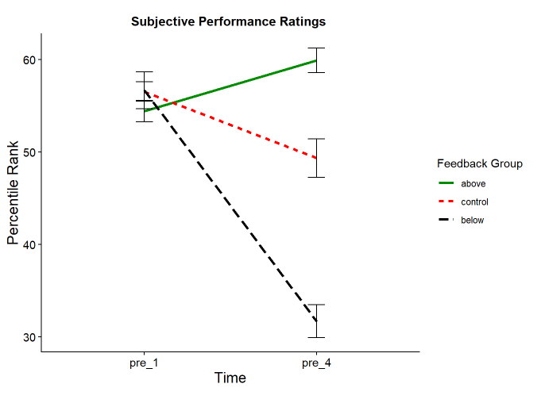
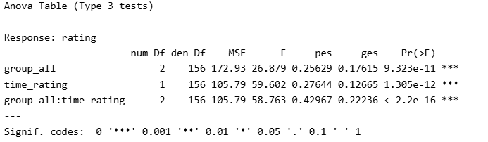
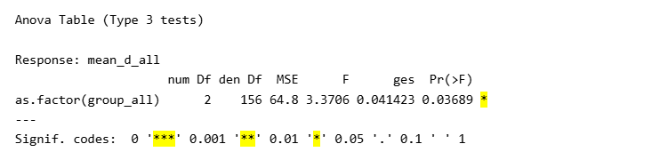
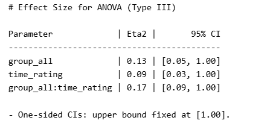
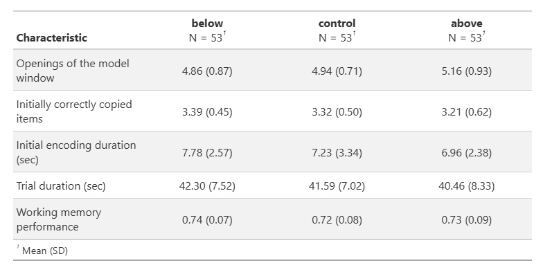
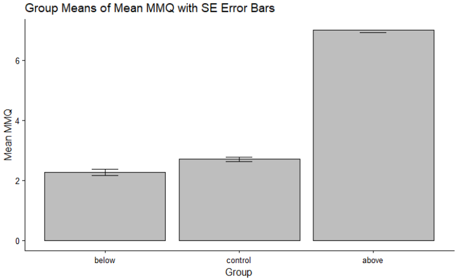

::: {.callout-important appearance="simple"}
## Abgabe

**Deadline:** Sonntag, **14.06.2026**, 23:55 Uhr\
**Abgabe:** ZIP-Datei über ILIAS\
**Benennung der ZIP-Datei:** `vorname_nachname_abschlussarbeit.zip`

Die beiden Quarto-Skripte müssen die vorgegebenen Dateinamen behalten: `processing.qmd` und `analysis.qmd`. Bitte benennt diese Dateien **nicht** um.

Gerenderte Dokumente können als **HTML** oder **PDF** abgegeben werden.
:::

## Ziel der Abschlussarbeit

Ihr arbeitet mit **individuell simulierten Datensätzen**. Jede Person erhält **7 separate Rohdatensätze**, die geprüft, bereinigt und zusammengeführt werden müssen.

Die simulierten Daten stellen realistische mögliche Stichproben des Originalexperiments dar. Das bedeutet:

-   Die Variablen haben denselben Wertebereich wie in der Originalstudie.
-   Die grundlegende Datenstruktur entspricht der Originalstudie.
-   Die Stichproben sind zufällig generiert.

::: {.callout-important appearance="simple"}
## Wichtig für die Interpretation

Eure Ergebnisse werden **nicht identisch** zur Originalstudie sein. Signifikanzen, Mittelwerte, Standardabweichungen und Effektstärken können von den Ergebnissen der Originalstudie abweichen.

Das ist **kein Fehler**, sondern eine realistische Eigenschaft empirischer Daten.
:::

## Daten und Ausgangslage

Ihr erhaltet 7 Rohdatensätze. Diese Rohdaten enthalten gezielt eingebaute Inkonsistenzen und Fehlerquellen. Diese sind Teil der Aufgabe und müssen systematisch identifiziert, bereinigt und nachvollziehbar dokumentiert werden.

Die Datenaufbereitung erfolgt im Skript `processing.qmd`. Ziel ist die Erstellung zweier analysefähiger Datensätze:

-   `dat_full` im Wide-Format
-   `dat_long` im Long-Format

Beide Datensätze werden im Ordner `data/processed` gespeichert.

## Datenaufbereitung im `processing`-Skript

Ziel der Datenaufbereitung ist ein konsistenter, vollständiger und analysefähiger Datensatz. Achtet dabei nicht nur darauf, dass der Code funktioniert, sondern auch darauf, dass eure Bereinigungsschritte inhaltlich sinnvoll und nachvollziehbar sind.

## Systematische Datenprüfung

Die Rohdaten enthalten verschiedene Arten von Inkonsistenzen und Fehlerquellen. Diese können sowohl strukturell als auch inhaltlich auftreten.

Ziel ist es, alle potenziellen Probleme **systematisch zu identifizieren und zu bereinigen**.

### Mögliche Fehlerquellen: Checkliste

Die folgenden Punkte stellen typische Probleme dar, die in den Datensätzen auftreten können. Nicht jeder Fehler tritt in jedem Datensatz auf.

::: {.callout-note appearance="simple"}
#### Vorgehen

Prüft die Datensätze schrittweise und dokumentiert eure Entscheidungen im Code. Ziel ist nicht nur das Finden von Fehlern, sondern ein nachvollziehbarer und begründeter Umgang mit diesen.
:::

#### Datenstruktur und IDs

-   Inkonsistente oder unterschiedlich benannte ID-Variablen ("Participant Identifier")
-   IDs im falschen Datentyp, z. B. als Text statt numerisch
-   Doppelte IDs innerhalb eines Datensatzes

#### Fehlende Werte

-   Vollständig leere Beobachtungen, z.B. leere Zeilen
-   Ungewöhnliche Codierungen fehlender Werte, z. B. spezielle Zahlenwerte

#### Variableninhalte

-   Werte in unerwartetem Format, z. B. Zahlen (numeric) als Text (character)
-   Inkonsistente Schreibweisen innerhalb einer Variable

#### Fragebogen-Items

-   Einzelne Items mit abweichender Kodierung –\> WAS IST DAMIT GEMEINT? GGF WEG
-   Items, die in ihrer Richtung angepasst werden müssen (Reverse Items)

#### Skalierung und Wertebereiche –\> WAS IST DAMIT GEMEINT?

-   Variablen mit unerwartetem Wertebereich
-   Uneinheitliche Skalierung innerhalb eines Konstrukts

#### Variablennamen –\> KANN DAS VORKOMMEN?

-   Unterschiedliche Bezeichnungen derselben Variable
-   Uneinheitliche Schreibweisen oder Formate

#### Redundanz und irrelevante Inhalte

-   Doppelte Variablen, d. h. gleicher Inhalt unter anderem Namen
-   Zusätzliche Variablen ohne inhaltliche Bedeutung

#### Datenkonsistenz über Datensätze hinweg –\> WEGLASSEN?

-   Unterschiede in Struktur oder Variablen zwischen Datensätzen
-   Probleme beim Zusammenführen der Datensätze

### Weitere Verarbeitungsschritte

Nach der Bereinigung der einzelnen Rohdatensätze folgen weitere Verarbeitungsschritte:

-   Zusammenführen der 7 Datensätze
-   Bereinigung redundanter Variablen
-   Umbenennung von Variablen, falls notwendig
-   Berechnung zentraler Variablen, z. B. `mmq_mean`
-   Erstellung eines Long-Datensatzes
-   Speicherung von `dat_full` und `dat_long`

## Dokumentation von Entscheidungen

Alle Schritte der Datenaufbereitung müssen:

-   im Code nachvollziehbar sein,
-   begründet werden können,
-   konsistent umgesetzt werden.

::: {.callout-warning appearance="simple"}
## Hinweis

Es gibt selten nur **eine** richtige Lösung. Entscheidend ist, dass eure Entscheidungen fachlich sinnvoll, konsistent umgesetzt und für andere Personen nachvollziehbar sind.
:::

Die Nutzung von LLMs ist zulässig, muss jedoch transparent in den Quarto-Skripten dokumentiert werden, z. B. durch Kommentare im Code. Die Verantwortung für alle Inhalte liegt vollständig bei den Studierenden.

## Analysen im `analysis`-Skript

Im Skript `analysis.qmd` werden die für die Analysen notwendigen Vorbereitungen durchgeführt, z. B. das Setzen von Faktoren. Anschliessend werden alle Analysen aus dem Datenanalyseplan umgesetzt.

### Durchzuführende Analysen

-   Deskriptive Statistik: Mittelwerte und Standardabweichungen entsprechend Tabelle 1
-   2 × 3 Mixed ANOVA für subjektive Leistungseinschätzungen
    -   inkl. post-hoc t-Tests
    -   inkl. Effektstärken: η² und Cohen’s d
-   One-Way ANOVAs für:
    -   die drei Offloading-Variablen
    -   Trial Duration in der Pattern Copy Task
    -   MMQ, inkl. post-hoc t-Tests
    -   Arbeitsgedächtnisleistung in der Feature Switch Detection Task
-   Bericht der jeweiligen Effektstärken, insbesondere η²
-   Erstellung einer Tabelle oder Abbildung aus der Studie nach Wahl

### Optional: Voraussetzungen testen

Das Testen der Voraussetzungen ist optional. Wenn Voraussetzungen geprüft werden, muss dies im Datenanalyseplan beschrieben werden. Bei Verletzungen der Voraussetzungen soll angemessen reagiert werden.

::: {.callout-important appearance="simple"}
## Post-hoc-Tests

Post-hoc-Tests werden nur für die **2 × 3 Mixed ANOVA** und die **MMQ-ANOVA** erwartet. Sollten andere ANOVAs zufällig signifikant werden, sind dafür keine zusätzlichen Post-hoc-Tests erforderlich.
:::

## Anpassungen im Datenanalyseplan

Folgende Punkte müssen im Datenanalyseplan angepasst werden:

-   Data Collection Procedures
-   Missing Data
-   Unit of Analysis / Data Exclusion

## Anpassungen im Codebook

Folgende Punkte müssen im Codebook angepasst werden:

-   Reverse Coding dokumentieren
-   Umgang mit Missing Data dokumentieren
-   Data Collection Procedures: *Simulierte Daten*

## Ordnerstruktur der Abgabe

Die vorgegebene Ordnerstruktur ist einzuhalten.

``` text
data/
├── raw/              # unveränderte Rohdaten
├── processed/        # bereinigte Datensätze
└── codebook

code/
├── processing.qmd
├── analysis.qmd
└── gerenderte Outputs (HTML oder PDF)

preregistration/
└── Datenanalyseplan
```

::: {.callout-important appearance="simple"}
## Wichtig

Die Rohdaten im Ordner `data/raw` werden nicht verändert. Alle bereinigten Datensätze werden im Ordner `data/processed` gespeichert.
:::

## Self-Check: Plausibilität der Ergebnisse

Die Ergebnisse sollten sich **am Muster der Originalstudie orientieren**, aber nicht identisch sein. Einzelne Abweichungen sind aufgrund der zufällig simulierten Stichproben erwartbar.

### Was ist plausibel?

Plausible Ergebnisse zeigen in der Regel:

-   ähnliche Muster zwischen den Gruppen,
-   vergleichbare Grössenordnungen,
-   dieselbe ungefähre Richtung zentraler Effekte.

### Was kann variieren?

Folgende Abweichungen sind erwartbar und unproblematisch:

-   Signifikanz einzelner Effekte
-   exakte Mittelwerte und Standardabweichungen
-   Effektstärken

::: {.callout-note appearance="simple"}
## Faustregel

Kleine Unterschiede sind normal. Systematische Abweichungen, die das Gesamtbild stark verändern, sollten überprüft werden.
:::

### Wann ist Vorsicht geboten?

Ein Warnsignal liegt vor, wenn:

-   das Gesamtmuster stark von der Originalstudie abweicht,
-   zentrale Effekte vollständig verschwinden oder sich umkehren,
-   Wertebereiche offensichtlich nicht plausibel sind,
-   eine Abbildung oder Tabelle ein komplett anderes Bild vermittelt als erwartet.

In solchen Fällen sollte zuerst die Datenaufbereitung überprüft werden.

### Beispiele für plausible Ergebnisse

Die folgenden Beispiele zeigen, wie Ergebnisse aus einem simulierten Datensatz im Vergleich zur Originalstudie aussehen können. Die Werte müssen nicht identisch sein, das grundlegende Muster sollte aber vergleichbar bleiben.

**Originale Ergebnisse**

{fig-align="center"}

**Beispiel aus einem simulierten Datensatz**

{fig-align="center"}

Auch die statistischen Ergebnisse können ähnlich, aber nicht identisch ausfallen:

{fig-align="center"}

### Erwartbare Abweichungen

Zufällig signifikante Effekte, die in der Originalstudie nicht signifikant waren, sind möglich. Das bedeutet nicht automatisch, dass ein Fehler vorliegt.

{fig-align="center"}

Einzelne Werte, Deskriptiva und Effektstärken können von der Originalstudie abweichen.

{fig-align="center"}

Auch Mittelwerte und Standardabweichungen werden nicht exakt identisch sein.

{fig-align="center"}

### Unplausible Ergebnisse

Ergebnisse, die ein komplett anderes Gesamtbild erzeugen, sind nicht zu erwarten. Solche Resultate sind ein Hinweis darauf, dass in der Datenaufbereitung oder Analyse etwas überprüft werden sollte.

{fig-align="center"}

## Wichtig zum Schluss

Diese Checkliste dient als Orientierung. Sie ersetzt nicht:

-   eigenständiges Denken,
-   systematische Datenprüfung,
-   begründete Entscheidungen.

## Bewertungsperspektive

Eine überzeugende Arbeit zeigt:

-   sorgfältige und systematische Datenaufbereitung,
-   nachvollziehbare Entscheidungen,
-   korrekte Umsetzung der Analysen,
-   sinnvolle Interpretation der Ergebnisse.
