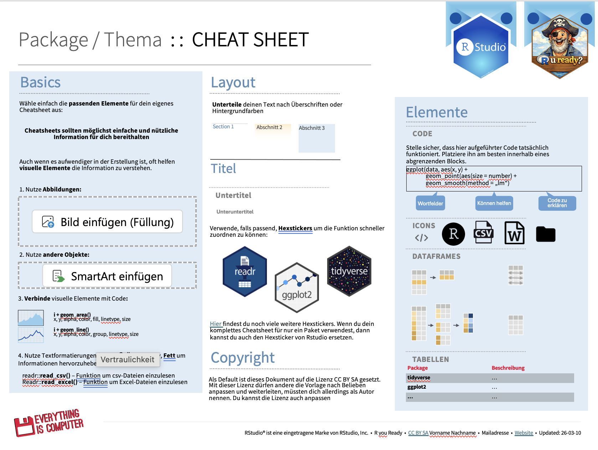

Im Rahmen des Seminars habt ihr die Möglichkeit, freiwillig an einem kleinen Wettbewerb teilzunehmen und dabei **Extrapunkte für eure Abschlussbewertung** zu sammeln.

Die Aufgabe besteht darin, auf Basis einer **Cheatsheet-Vorlage** ein eigenes **R-Cheatsheet** zu erstellen. Die entsprechende Vorlage findet ihr auf **ILIAS**.

------------------------------------------------------------------------

# Ziel der Aufgabe

Das Ziel dieser Übung ist es, euch dazu zu motivieren, euch i**ntensiv mit den im Seminar behandelten R-Befehlen und Analyseprozessen auseinanderzusetzen.** Durch die Erstellung eines eigenen Cheatsheets fasst ihr wichtige Funktionen, Workflows und Beispiele kompakt zusammen.

Idealerweise entsteht dabei ein DOkument, das euch auch **langfristig nützlich** ist, z.B.:

-   bei zukünftigen Projekten

-   bei Datenanalysen im Studium

-   oder später bei der **Masterarbeit**

Ihr dürft selbstverständlich auch **R-Befehle oder Methoden integrieren, die nicht explizit im Seminar behandelt wurden**, wenn ihr sie für hilfreich haltet.

Ziel ist es, dass ihr am Ende ein **persönliches Nachschlagwerk** erstellt, das euch bei der Arbeit mit R unterstützt.

------------------------------------------------------------------------

# Teilnahme und Extrapunkte

Die Teilnahme am Wettbewerb ist **freiwillig**.

Wichtig:

Auch **ohne Teilnahme** kann die **maximale Punktzahl im Seminar erreicht werden!**

Wenn ihr ein Cheatsheet einreicht und dieses die Mindestkriterien erfüllt, erhaltet ihr **bereits für die Teilnahme am Wettbewerb 2 Extrapunkte.**

Am Ende des Semesters wählt ihr zusätzlich das **überzeugendste und nützlichste Cheatsheet.** Die Person mit dem besten Cheatsheet erhält **weitere 2 Extrapunkte.**

➡️ Maximal können also **4 Extrapunkte** erreicht werden.

------------------------------------------------------------------------

# Mindestkriterien

Damit ein Cheatsheet für den Wettbewerb berücksichtigt werden kann, muss es folgende Kriterien erfüllen:

1.  **Strukturierte Gliederung**

Das Cheatsheet sollte klar strukturiert sein, z.B. mit Abschnitten wie:

-   Datenimport

-   Datenbereinigung

-   Datenmanipulation

-   Visualisierung

-   Statistische Modelle

-   Weitere hilfreiche Funktionen

2.  **R-Code mit kurzen Erklärungen**

Der Code sollte nicht nur aufgelistet werden, sondern jeweils mit kurzen Mini-Erklärungen versehen sein, sodass klar wird, was der Code macht und wann er verwendet wird.

3.  **Praktischer Nutzen**

Das Cheatsheet sollte so gestaltet sein, dass auch andere Personen es verstehen und sinnvoll nutzen können.

4.  **Visuell ansprechende Gestaltung**

Das Dokument soll übersichtlich und ansprechend gestaltet sein, z.B. durch:

-   Klare Abschnitte

-   Sinnvolle Formatierung

-   Beispiele

-   Eine gut lesbare Struktur

------------------------------------------------------------------------

# Abgabe

Das fertige Cheatsheet kann **bis zur vorletzten Sitzung (EH13 am 20.05.)** im entsprechenden Abgabeordner auf ILIAS eingereicht werden.

------------------------------------------------------------------------

# Abstimmung im Seminar

In der **letzten Sitzung (EH14 am 27.05.)** werden wir gemeinsam eine **Abstimmung über die eingereichten Cheatsheets** durchführen.

Das Cheatsheet mit den meisten Stimmen erhält die **zusätzlichen 2 Extrapunkte.**

------------------------------------------------------------------------

# Hinweise

-   Das Cheatsheet darf eine oder mehrere Seiten umfassen.

-   Ziel ist nicht ein möglichst langes Dokument, sondern ein kompaktes, übersichtliches und nützliches Nachschlagewerk.
